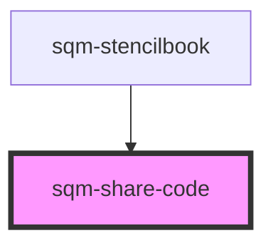

# sqm-share-code

<!-- Auto Generated Below -->

## Properties

| Property          | Attribute           | Description                                                                                                             | Type                                                                                                                                                                                                                                                                                                                                                                                                                                                                                                                                                                        | Default                 |
| ----------------- | ------------------- | ----------------------------------------------------------------------------------------------------------------------- | --------------------------------------------------------------------------------------------------------------------------------------------------------------------------------------------------------------------------------------------------------------------------------------------------------------------------------------------------------------------------------------------------------------------------------------------------------------------------------------------------------------------------------------------------------------------------- | ----------------------- |
| `backgroundColor` | `background-color`  | Background color of share link container                                                                                | `string`                                                                                                                                                                                                                                                                                                                                                                                                                                                                                                                                                                    | `undefined`             |
| `borderColor`     | `border-color`      | Border color of share link container (default is set to 1px solid transparent)                                          | `string`                                                                                                                                                                                                                                                                                                                                                                                                                                                                                                                                                                    | `undefined`             |
| `borderRadius`    | `border-radius`     | The border radius on the share link container (in pixels)                                                               | `string`                                                                                                                                                                                                                                                                                                                                                                                                                                                                                                                                                                    | `undefined`             |
| `buttonStyle`     | `copy-button-style` | Set the copy button style and placement                                                                                 | `"button-below" \| "button-outside" \| "icon"`                                                                                                                                                                                                                                                                                                                                                                                                                                                                                                                              | `"icon"`                |
| `buttonType`      | `button-type`       | The type of the button that is used (primary or secondary).                                                             | `"primary" \| "secondary"`                                                                                                                                                                                                                                                                                                                                                                                                                                                                                                                                                  | `"primary"`             |
| `copyButtonLabel` | `copy-button-label` |                                                                                                                         | `string`                                                                                                                                                                                                                                                                                                                                                                                                                                                                                                                                                                    | `"Copy Code"`           |
| `demoData`        | --                  |                                                                                                                         | `{ loading?: boolean; textColor?: string; buttonType?: "primary" \| "secondary"; copyString?: string; tooltiptext?: string; open?: boolean; copyButtonLabel?: string; disabled?: boolean; textAlign?: "left" \| "right" \| "center"; buttonStyle?: "icon" \| "button-outside" \| "button-below"; error?: boolean; errorText?: string; notificationText?: string; showNotificationText?: boolean; inputPlaceholderText?: string; dateAvailable?: string; isCopied?: boolean; backgroundColor?: string; borderRadius?: string; borderColor?: string; onClick?: () => void; }` | `undefined`             |
| `programId`       | `program-id`        | The ID of the program that should generate the code. Defaults to the program ID in context where this widget is loaded. | `string`                                                                                                                                                                                                                                                                                                                                                                                                                                                                                                                                                                    | `undefined`             |
| `textAlign`       | `text-align`        | Change the text alignment                                                                                               | `"center" \| "left" \| "right"`                                                                                                                                                                                                                                                                                                                                                                                                                                                                                                                                             | `"left"`                |
| `textColor`       | `text-color`        | Color of the text and copy icon                                                                                         | `string`                                                                                                                                                                                                                                                                                                                                                                                                                                                                                                                                                                    | `undefined`             |
| `tooltiplifespan` | `tooltip-lifespan`  | The number of milliseconds that the tooltip appears for                                                                 | `number`                                                                                                                                                                                                                                                                                                                                                                                                                                                                                                                                                                    | `1000`                  |
| `tooltiptext`     | `tooltip-text`      | Shown inside a tooltip after someone has successfully copied the link to their clipboard                                | `string`                                                                                                                                                                                                                                                                                                                                                                                                                                                                                                                                                                    | `"Copied to Clipboard"` |

## Dependencies

### Used by

 - [sqm-stencilbook](../sqm-stencilbook)

### Graph

----------------------------------------------

*Built with [StencilJS](https://stenciljs.com/)*
