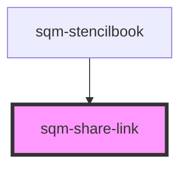

# sqm-share-link

<!-- Auto Generated Below -->

## Properties

| Property          | Attribute              | Description                                                                                                             | Type                                                                                                                                                                                                                                          | Default                 |
| ----------------- | ---------------------- | ----------------------------------------------------------------------------------------------------------------------- | --------------------------------------------------------------------------------------------------------------------------------------------------------------------------------------------------------------------------------------------- | ----------------------- |
| `buttonPosition`  | `copy-button-position` | Set the copy button position                                                                                            | `"below" \| "inside" \| "outside"`                                                                                                                                                                                                            | `"outside"`             |
| `copyButtonLabel` | `copy-button-label`    | Set copy button label                                                                                                   | `string`                                                                                                                                                                                                                                      | `"Copy Link"`           |
| `demoData`        | --                     |                                                                                                                         | `{ copyString?: string; tooltiptext?: string; open?: boolean; copyButtonLabel?: string; disabled?: boolean; isCopyIcon?: boolean; textAlign?: "left" \| "center"; buttonPosition?: "inside" \| "outside" \| "below"; onClick?: () => void; }` | `undefined`             |
| `isCopyIcon`      | `is-copy-icon`         | Set copy button as icon                                                                                                 | `boolean`                                                                                                                                                                                                                                     | `true`                  |
| `programId`       | `program-id`           | The ID of the program that should generate the link. Defaults to the program ID in context where this widget is loaded. | `string`                                                                                                                                                                                                                                      | `undefined`             |
| `textAlign`       | `text-align`           | Change the text alignment                                                                                               | `"center" \| "left"`                                                                                                                                                                                                                          | `"left"`                |
| `tooltiplifespan` | `tooltip-lifespan`     | The number of milliseconds that the tooltip appears for                                                                 | `number`                                                                                                                                                                                                                                      | `1000`                  |
| `tooltiptext`     | `tooltip-text`         | Shown inside a tooltip after someone has successfully copied the link to their clipboard.                               | `string`                                                                                                                                                                                                                                      | `"Copied to Clipboard"` |

## Dependencies

### Used by

 - [sqm-stencilbook](../sqm-stencilbook)

### Graph

----------------------------------------------

*Built with [StencilJS](https://stenciljs.com/)*
