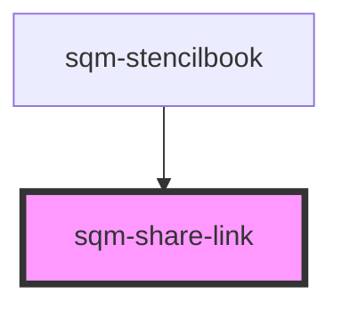

# sqm-share-link

<!-- Auto Generated Below -->

## Properties

| Property          | Attribute           | Description                                                                                                             | Type                                                                                                                                                                                                                                                                                                                                                                                                                                                                                                                                                  | Default                 |
| ----------------- | ------------------- | ----------------------------------------------------------------------------------------------------------------------- | ----------------------------------------------------------------------------------------------------------------------------------------------------------------------------------------------------------------------------------------------------------------------------------------------------------------------------------------------------------------------------------------------------------------------------------------------------------------------------------------------------------------------------------------------------- | ----------------------- |
| `buttonStyle`     | `copy-button-style` | Set the copy button style and placement                                                                                 | `"button-below" \| "button-outside" \| "icon"`                                                                                                                                                                                                                                                                                                                                                                                                                                                                                                        | `"icon"`                |
| `buttonType`      | `button-type`       |                                                                                                                         | `"primary" \| "secondary"`                                                                                                                                                                                                                                                                                                                                                                                                                                                                                                                            | `"primary"`             |
| `copyButtonLabel` | `copy-button-label` |                                                                                                                         | `string`                                                                                                                                                                                                                                                                                                                                                                                                                                                                                                                                              | `"Copy Link"`           |
| `demoData`        | --                  |                                                                                                                         | `{ loading?: boolean; copyString?: string; tooltiptext?: string; open?: boolean; copyButtonLabel?: string; disabled?: boolean; textAlign?: "left" \| "right" \| "center"; buttonStyle?: "icon" \| "button-outside" \| "button-below"; error?: boolean; errorText?: string; notificationText?: string; showNotificationText?: boolean; inputPlaceholderText?: string; dateAvailable?: string; isCopied?: boolean; backgroundColor?: string; textColor?: string; borderRadius?: string; buttonType?: "primary" \| "secondary"; onClick?: () => void; }` | `undefined`             |
| `programId`       | `program-id`        | The ID of the program that should generate the link. Defaults to the program ID in context where this widget is loaded. | `string`                                                                                                                                                                                                                                                                                                                                                                                                                                                                                                                                              | `undefined`             |
| `textAlign`       | `text-align`        | Change the text alignment                                                                                               | `"center" \| "left" \| "right"`                                                                                                                                                                                                                                                                                                                                                                                                                                                                                                                       | `"left"`                |
| `tooltiplifespan` | `tooltip-lifespan`  | The number of milliseconds that the tooltip appears for                                                                 | `number`                                                                                                                                                                                                                                                                                                                                                                                                                                                                                                                                              | `1000`                  |
| `tooltiptext`     | `tooltip-text`      | Shown inside a tooltip after someone has successfully copied the link to their clipboard                                | `string`                                                                                                                                                                                                                                                                                                                                                                                                                                                                                                                                              | `"Copied to Clipboard"` |

## Dependencies

### Used by

 - [sqm-stencilbook](../sqm-stencilbook)

### Graph

----------------------------------------------

*Built with [StencilJS](https://stenciljs.com/)*
