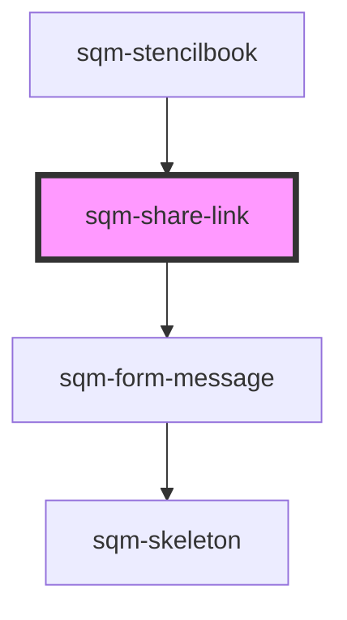

# sqm-share-link

<!-- Auto Generated Below -->

## Properties

| Property                            | Attribute                              | Description                                                                                                             | Type                                                                                                                                                                                                                                                                                                                                                                                                                                                                                                                                                                                                                                                                                                                                     | Default                                                                       |
| ----------------------------------- | -------------------------------------- | ----------------------------------------------------------------------------------------------------------------------- | ---------------------------------------------------------------------------------------------------------------------------------------------------------------------------------------------------------------------------------------------------------------------------------------------------------------------------------------------------------------------------------------------------------------------------------------------------------------------------------------------------------------------------------------------------------------------------------------------------------------------------------------------------------------------------------------------------------------------------------------- | ----------------------------------------------------------------------------- |
| `allowCustomization`                | `allow-customization`                  | Let advocates customize their share links up to 5 times.                                                                | `boolean`                                                                                                                                                                                                                                                                                                                                                                                                                                                                                                                                                                                                                                                                                                                                | `false`                                                                       |
| `backgroundColor`                   | `background-color`                     | Background color of share link container                                                                                | `string`                                                                                                                                                                                                                                                                                                                                                                                                                                                                                                                                                                                                                                                                                                                                 | `undefined`                                                                   |
| `borderColor`                       | `border-color`                         | Border color of share link container                                                                                    | `string`                                                                                                                                                                                                                                                                                                                                                                                                                                                                                                                                                                                                                                                                                                                                 | `undefined`                                                                   |
| `borderRadius`                      | `border-radius`                        | The border radius on the share link container (in pixels)                                                               | `string`                                                                                                                                                                                                                                                                                                                                                                                                                                                                                                                                                                                                                                                                                                                                 | `undefined`                                                                   |
| `buttonStyle`                       | `copy-button-style`                    | Set the copy button style and placement                                                                                 | `"button-below" \| "button-outside" \| "icon"`                                                                                                                                                                                                                                                                                                                                                                                                                                                                                                                                                                                                                                                                                           | `"icon"`                                                                      |
| `buttonType`                        | `button-type`                          | The type of the button that is used (primary or secondary).                                                             | `"primary" \| "secondary"`                                                                                                                                                                                                                                                                                                                                                                                                                                                                                                                                                                                                                                                                                                               | `"primary"`                                                                   |
| `cancelLabelText`                   | `cancel-label-text`                    | Text for the cancel button in editing mode                                                                              | `string`                                                                                                                                                                                                                                                                                                                                                                                                                                                                                                                                                                                                                                                                                                                                 | `"Cancel"`                                                                    |
| `copyButtonLabel`                   | `copy-button-label`                    |                                                                                                                         | `string`                                                                                                                                                                                                                                                                                                                                                                                                                                                                                                                                                                                                                                                                                                                                 | `"Copy Link"`                                                                 |
| `customizeDisabledTooltip`          | `customize-disabled-tooltip`           | Tooltip text shown when link customization is disabled                                                                  | `string`                                                                                                                                                                                                                                                                                                                                                                                                                                                                                                                                                                                                                                                                                                                                 | `"Link customization is not available."`                                      |
| `customizeLinkButtonLabel`          | `customize-link-button-label`          | Displayed below the share link.                                                                                         | `string`                                                                                                                                                                                                                                                                                                                                                                                                                                                                                                                                                                                                                                                                                                                                 | `"Customize Link"`                                                            |
| `demoData`                          | --                                     |                                                                                                                         | `{ copyTextViewProps?: CopyTextViewProps; allowCustomization?: boolean; customizeLinkLabel?: string; saveLabelText?: string; cancelLabelText?: string; isEditing?: boolean; editValue?: string; domainPrefix?: string; editsRemaining?: number; maxEdits?: number; limitReached?: boolean; validationError?: ValidationErrorInfo; isValidating?: boolean; isSaving?: boolean; characterLimit?: number; minCharacters?: number; charactersRemaining?: number; editLimitText?: string; editLimitReachedText?: string; supportLinkText?: string; customizeDisabled?: boolean; customizeDisabledTooltip?: string; onCustomizeClick?: () => void; onEditValueChange?: (value: string) => void; onSave?: () => void; onCancel?: () => void; }` | `undefined`                                                                   |
| `editLimitReachedText`              | `edit-limit-reached-text`              | Message shown when the URL has been edited 5 times. To display a clickable link, use {supportLink} as a placeholder.    | `string`                                                                                                                                                                                                                                                                                                                                                                                                                                                                                                                                                                                                                                                                                                                                 | `"5 edit limit reached. To make more changes, please contact {supportLink}."` |
| `editLimitText`                     | `edit-limit-text`                      | Subtext shown while the user is customizing their URL.                                                                  | `string`                                                                                                                                                                                                                                                                                                                                                                                                                                                                                                                                                                                                                                                                                                                                 | `"You can edit your link up to {editsRemaining} more times."`                 |
| `editsRemaining`                    | `edits-remaining`                      |                                                                                                                         | `number`                                                                                                                                                                                                                                                                                                                                                                                                                                                                                                                                                                                                                                                                                                                                 | `undefined`                                                                   |
| `invalidCharactersErrorDescription` | `invalid-characters-error-description` | Description text shown when the link contains invalid special characters.                                               | `string`                                                                                                                                                                                                                                                                                                                                                                                                                                                                                                                                                                                                                                                                                                                                 | `"Special characters can break the link when sharing."`                       |
| `invalidCharactersErrorTitle`       | `invalid-characters-error-title`       | Title of the error message shown when the link contains invalid special characters.                                     | `string`                                                                                                                                                                                                                                                                                                                                                                                                                                                                                                                                                                                                                                                                                                                                 | `"Please use only letters, numbers, dashes and underscores"`                  |
| `linkTakenErrorDescription`         | `link-taken-error-description`         | Description text shown when the link has already been taken                                                             | `string`                                                                                                                                                                                                                                                                                                                                                                                                                                                                                                                                                                                                                                                                                                                                 | `"Try adding numbers, a dash or underscore to create a unique link."`         |
| `linkTakenErrorTitle`               | `link-taken-error-title`               | Title of the error message shown when the link has already been taken                                                   | `string`                                                                                                                                                                                                                                                                                                                                                                                                                                                                                                                                                                                                                                                                                                                                 | `"This link is already taken"`                                                |
| `programId`                         | `program-id`                           | The ID of the program that should generate the link. Defaults to the program ID in context where this widget is loaded. | `string`                                                                                                                                                                                                                                                                                                                                                                                                                                                                                                                                                                                                                                                                                                                                 | `undefined`                                                                   |
| `restrictedWordsErrorDescription`   | `restricted-words-error-description`   | Description text shown when the link contains profanity or brand names.                                                 | `string`                                                                                                                                                                                                                                                                                                                                                                                                                                                                                                                                                                                                                                                                                                                                 | `"This link contains a restricted word."`                                     |
| `restrictedWordsErrorTitle`         | `restricted-words-error-title`         | Title of the error message shown when the link contains profanity or brand names.                                       | `string`                                                                                                                                                                                                                                                                                                                                                                                                                                                                                                                                                                                                                                                                                                                                 | `"Please try a different link"`                                               |
| `saveLabelText`                     | `save-label-text`                      | Text for the save button in editing mode                                                                                | `string`                                                                                                                                                                                                                                                                                                                                                                                                                                                                                                                                                                                                                                                                                                                                 | `"Save"`                                                                      |
| `supportLinkText`                   | `support-link-text`                    | Display text for the support link in the edit limit reached message                                                     | `string`                                                                                                                                                                                                                                                                                                                                                                                                                                                                                                                                                                                                                                                                                                                                 | `"Support"`                                                                   |
| `textAlign`                         | `text-align`                           | Change the text alignment                                                                                               | `"center" \| "left" \| "right"`                                                                                                                                                                                                                                                                                                                                                                                                                                                                                                                                                                                                                                                                                                          | `"left"`                                                                      |
| `textColor`                         | `text-color`                           | Color of the text and copy icon                                                                                         | `string`                                                                                                                                                                                                                                                                                                                                                                                                                                                                                                                                                                                                                                                                                                                                 | `undefined`                                                                   |
| `tooltiplifespan`                   | `tooltip-lifespan`                     | The number of milliseconds that the tooltip appears for                                                                 | `number`                                                                                                                                                                                                                                                                                                                                                                                                                                                                                                                                                                                                                                                                                                                                 | `1000`                                                                        |
| `tooltiptext`                       | `tooltip-text`                         | Shown inside a tooltip after someone has successfully copied the link to their clipboard                                | `string`                                                                                                                                                                                                                                                                                                                                                                                                                                                                                                                                                                                                                                                                                                                                 | `"Copied to Clipboard"`                                                       |

## Dependencies

### Used by

 - [sqm-stencilbook](../sqm-stencilbook)

### Depends on

- [sqm-form-message](../sqm-form-message)

### Graph

```mermaid
graph TD;
  sqm-share-link --> sqm-form-message
  sqm-form-message --> sqm-skeleton
  sqm-stencilbook --> sqm-share-link
  style sqm-share-link fill:#f9f,stroke:#333,stroke-width:4px
```

----------------------------------------------

*Built with [StencilJS](https://stenciljs.com/)*
