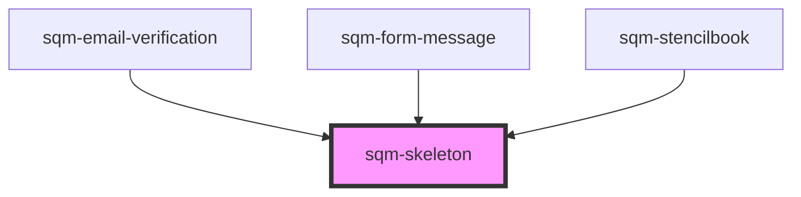

# sqm-skeleton

<!-- Auto Generated Below -->

## Properties

| Property | Attribute | Description | Type     | Default  |
| -------- | --------- | ----------- | -------- | -------- |
| `height` | `height`  |             | `string` | `"100%"` |
| `width`  | `width`   |             | `string` | `"100%"` |

## Dependencies

### Used by

 - [sqm-email-verification](../sqm-widget-verification/sqm-email-verification)
 - [sqm-form-message](../sqm-form-message)
 - [sqm-stencilbook](../sqm-stencilbook)

### Graph

----------------------------------------------

*Built with [StencilJS](https://stenciljs.com/)*
