# sqm-skeleton

<!-- Auto Generated Below -->

## Properties

| Property | Attribute | Description | Type     | Default  |
| -------- | --------- | ----------- | -------- | -------- |
| `height` | `height`  |             | `string` | `"100%"` |
| `width`  | `width`   |             | `string` | `"100%"` |

## Dependencies

### Used by

 - [sqm-email-verification](../sqm-widget-verification/sqm-email-verification)
 - [sqm-form-message](../sqm-form-message)
 - [sqm-invoice-table](../sqm-invoice-table)
 - [sqm-leaderboard](../sqm-leaderboard)
 - [sqm-payout-details-card](../tax-and-cash/sqm-payout-details-card)
 - [sqm-qr-code](../sqm-qr-code)
 - [sqm-referral-codes](../sqm-referral-codes)
 - [sqm-referral-table](../sqm-referral-table)
 - [sqm-reward-exchange-list](../sqm-reward-exchange-list)
 - [sqm-rewards-table](../sqm-rewards-table)
 - [sqm-stencilbook](../sqm-stencilbook)
 - [sqm-task-card](../sqm-task-card)
 - [sqm-tax-and-cash](../tax-and-cash/sqm-tax-and-cash)
 - [sqm-tax-and-cash-dashboard](../tax-and-cash/sqm-tax-and-cash-dashboard)
 - [sqm-user-info-form](../tax-and-cash/sqm-user-info-form)

### Graph

```mermaid
graph TD;
  sqm-email-verification --> sqm-skeleton
  sqm-form-message --> sqm-skeleton
  sqm-invoice-table --> sqm-skeleton
  sqm-leaderboard --> sqm-skeleton
  sqm-payout-details-card --> sqm-skeleton
  sqm-qr-code --> sqm-skeleton
  sqm-referral-codes --> sqm-skeleton
  sqm-referral-table --> sqm-skeleton
  sqm-reward-exchange-list --> sqm-skeleton
  sqm-rewards-table --> sqm-skeleton
  sqm-stencilbook --> sqm-skeleton
  sqm-task-card --> sqm-skeleton
  sqm-tax-and-cash --> sqm-skeleton
  sqm-tax-and-cash-dashboard --> sqm-skeleton
  sqm-user-info-form --> sqm-skeleton
  style sqm-skeleton fill:#f9f,stroke:#333,stroke-width:4px
```

----------------------------------------------

*Built with [StencilJS](https://stenciljs.com/)*
