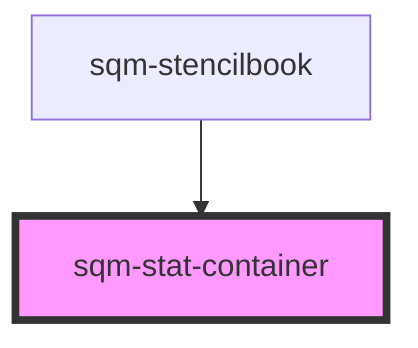

# sqm-stat-container

<!-- Auto Generated Below -->

## Properties

| Property  | Attribute | Description | Type                                                                                                                                           | Default       |
| --------- | --------- | ----------- | ---------------------------------------------------------------------------------------------------------------------------------------------- | ------------- |
| `display` | `display` |             | `"flex" \| "grid"`                                                                                                                             | `"grid"`      |
| `space`   | `space`   |             | `"large" \| "medium" \| "none" \| "small" \| "x-large" \| "x-small" \| "xx-large" \| "xx-small" \| "xxx-large" \| "xxx-small" \| "xxxx-large"` | `"xxx-large"` |

## Dependencies

### Used by

 - [sqm-stencilbook](../sqm-stencilbook)

### Graph

----------------------------------------------

*Built with [StencilJS](https://stenciljs.com/)*
