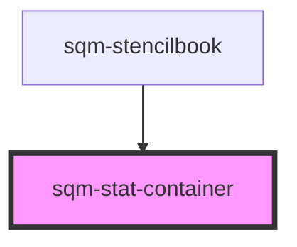

# sqm-stat-container

<!-- Auto Generated Below -->

## Properties

| Property     | Attribute     | Description                              | Type                                                                                                                                           | Default       |
| ------------ | ------------- | ---------------------------------------- | ---------------------------------------------------------------------------------------------------------------------------------------------- | ------------- |
| `alignment`  | `alignment`   | Controls the alignment of the flexbox    | `"center" \| "left" \| "right"`                                                                                                                | `"center"`    |
| `display`    | `display`     |                                          | `"flex" \| "grid"`                                                                                                                             | `"flex"`      |
| `gap`        | `gap`         |                                          | `"large" \| "medium" \| "none" \| "small" \| "x-large" \| "x-small" \| "xx-large" \| "xx-small" \| "xxx-large" \| "xxx-small" \| "xxxx-large"` | `"x-large"`   |
| `hideBorder` | `hide-border` | Hide the seperating border between stats | `boolean`                                                                                                                                      | `undefined`   |
| `space`      | `space`       |                                          | `"large" \| "medium" \| "none" \| "small" \| "x-large" \| "x-small" \| "xx-large" \| "xx-small" \| "xxx-large" \| "xxx-small" \| "xxxx-large"` | `"xxx-large"` |

## Dependencies

### Used by

 - [sqm-stencilbook](../sqm-stencilbook)

### Graph

----------------------------------------------

*Built with [StencilJS](https://stenciljs.com/)*
