# sqm-stencilbook

<!-- Auto Generated Below -->

## Dependencies

### Depends on

- [sqm-share-button](../sqm-share-button)
- [sqm-empty](../sqm-empty)
- [sqm-share-link](../sqm-share-link)
- [sqm-stat-container](../sqm-stat-container)
- [sqm-big-stat](../sqm-big-stat)
- [sqm-text](../sqm-text)
- [sqm-router](../sqm-router)
- [sqm-hook-story-container](../sqm-hook-story-container)
- [sqm-navigation-menu](../sqm-navigation-menu)
- [sqm-portal-frame](../sqm-portal-frame)
- [sqm-edit-profile](../sqm-edit-profile)
- [sqm-form-message](../sqm-form-message)
- [sqm-divided-layout](../sqm-divided-layout)
- [sqm-leaderboard](../sqm-leaderboard)
- [sqm-reward-exchange-list](../sqm-reward-exchange-list)
- [sqm-rewards-table](../sqm-rewards-table)
- [sqm-rewards-table-reward-column](../sqm-rewards-table/columns)
- [sqm-rewards-table-source-column](../sqm-rewards-table/columns)
- [sqm-rewards-table-status-column](../sqm-rewards-table/columns)
- [sqm-rewards-table-date-column](../sqm-rewards-table/columns)
- [sqm-task-card](../sqm-task-card)
- [sqm-card-feed](../sqm-card-feed)
- [sqm-password-field](../sqm-password-field)
- [sqm-portal-register](../sqm-portal-register)
- [sqm-table-row](../sqm-table-row)
- [sqm-table-cell](../sqm-table-cell)
- [sqm-referral-table-user-cell](../sqm-referral-table/cells)
- [sqm-referral-table-date-cell](../sqm-referral-table/cells)
- [sqm-referral-table-cell](../sqm-referral-table/cells)
- [sqm-referral-table-status-cell](../sqm-referral-table/cells)
- [sqm-referral-table](../sqm-referral-table)
- [sqm-referral-table-rewards-cell](../sqm-referral-table/cells)
- [sqm-user-name](../sqm-user-name)
- [sqm-program-menu](../sqm-program-menu)
- [sqm-portal-login](../sqm-portal-login)
- [sqm-portal-change-password](../sqm-portal-change-password)
- [sqm-referral-iframe](../sqm-referral-iframe)
- [sqm-checkbox-field](../sqm-checkbox-field)
- [sqm-name-fields](../sqm-name-fields)
- [sqm-dropdown-field](../sqm-dropdown-field)
- [sqm-input-field](../sqm-input-field)
- [sqm-program-explainer](../sqm-program-explainer)
- [sqm-program-explainer-step](../sqm-program-explainer-step)
- [sqm-brand](../sqm-brand)
- [sqm-portal-container](../sqm-portal-container)
- [sqm-scroll](../sqm-scroll)
- [sqm-rewards-table-reward-cell](../sqm-rewards-table/cells)
- [sqm-rewards-table-source-cell](../sqm-rewards-table/cells)
- [sqm-rewards-table-status-cell](../sqm-rewards-table/cells)
- [sqm-rewards-table-date-cell](../sqm-rewards-table/cells)
- [sqm-rewards-table-customer-note-cell](../sqm-rewards-table/cells)
- [sqm-referral-table-user-column](../sqm-referral-table/columns)
- [sqm-referral-table-status-column](../sqm-referral-table/columns)
- [sqm-referral-table-date-column](../sqm-referral-table/columns)
- [sqm-referral-table-rewards-column](../sqm-referral-table/columns)
- [sqm-hero-image](../sqm-hero-image)
- [sqm-share-code](../sqm-share-code)
- [sqm-timeline](../sqm-timeline)
- [sqm-timeline-entry](../sqm-timeline)
- [sqm-referral-card](../sqm-referral-card)
- [sqm-image](../sqm-image)
- [sqm-titled-section](../sqm-titled-section)

### Graph

```mermaid
graph TD;
  sqm-stencilbook --> sqm-share-button
  sqm-stencilbook --> sqm-empty
  sqm-stencilbook --> sqm-share-link
  sqm-stencilbook --> sqm-stat-container
  sqm-stencilbook --> sqm-big-stat
  sqm-stencilbook --> sqm-text
  sqm-stencilbook --> sqm-router
  sqm-stencilbook --> sqm-hook-story-container
  sqm-stencilbook --> sqm-navigation-menu
  sqm-stencilbook --> sqm-portal-frame
  sqm-stencilbook --> sqm-edit-profile
  sqm-stencilbook --> sqm-form-message
  sqm-stencilbook --> sqm-divided-layout
  sqm-stencilbook --> sqm-leaderboard
  sqm-stencilbook --> sqm-reward-exchange-list
  sqm-stencilbook --> sqm-rewards-table
  sqm-stencilbook --> sqm-rewards-table-reward-column
  sqm-stencilbook --> sqm-rewards-table-source-column
  sqm-stencilbook --> sqm-rewards-table-status-column
  sqm-stencilbook --> sqm-rewards-table-date-column
  sqm-stencilbook --> sqm-task-card
  sqm-stencilbook --> sqm-card-feed
  sqm-stencilbook --> sqm-password-field
  sqm-stencilbook --> sqm-portal-register
  sqm-stencilbook --> sqm-table-row
  sqm-stencilbook --> sqm-table-cell
  sqm-stencilbook --> sqm-referral-table-user-cell
  sqm-stencilbook --> sqm-referral-table-date-cell
  sqm-stencilbook --> sqm-referral-table-cell
  sqm-stencilbook --> sqm-referral-table-status-cell
  sqm-stencilbook --> sqm-referral-table
  sqm-stencilbook --> sqm-referral-table-rewards-cell
  sqm-stencilbook --> sqm-user-name
  sqm-stencilbook --> sqm-program-menu
  sqm-stencilbook --> sqm-portal-login
  sqm-stencilbook --> sqm-portal-change-password
  sqm-stencilbook --> sqm-referral-iframe
  sqm-stencilbook --> sqm-checkbox-field
  sqm-stencilbook --> sqm-name-fields
  sqm-stencilbook --> sqm-dropdown-field
  sqm-stencilbook --> sqm-input-field
  sqm-stencilbook --> sqm-program-explainer
  sqm-stencilbook --> sqm-program-explainer-step
  sqm-stencilbook --> sqm-brand
  sqm-stencilbook --> sqm-portal-container
  sqm-stencilbook --> sqm-scroll
  sqm-stencilbook --> sqm-rewards-table-reward-cell
  sqm-stencilbook --> sqm-rewards-table-source-cell
  sqm-stencilbook --> sqm-rewards-table-status-cell
  sqm-stencilbook --> sqm-rewards-table-date-cell
  sqm-stencilbook --> sqm-rewards-table-customer-note-cell
  sqm-stencilbook --> sqm-referral-table-user-column
  sqm-stencilbook --> sqm-referral-table-status-column
  sqm-stencilbook --> sqm-referral-table-date-column
  sqm-stencilbook --> sqm-referral-table-rewards-column
  sqm-stencilbook --> sqm-hero-image
  sqm-stencilbook --> sqm-share-code
  sqm-stencilbook --> sqm-timeline
  sqm-stencilbook --> sqm-timeline-entry
  sqm-stencilbook --> sqm-referral-card
  sqm-stencilbook --> sqm-image
  sqm-stencilbook --> sqm-titled-section
  sqm-empty --> sqm-portal-container
  sqm-empty --> sqm-image
  sqm-empty --> sqm-titled-section
  sqm-empty --> sqm-text
  sqm-edit-profile --> sqm-form-message
  sqm-leaderboard --> sqm-empty
  sqm-reward-exchange-list --> sqm-empty
  sqm-rewards-table --> sqm-empty
  sqm-rewards-table --> sqm-table-row
  sqm-rewards-table --> sqm-table-cell
  sqm-rewards-table-reward-column --> sqm-rewards-table-reward-cell
  sqm-rewards-table-source-column --> sqm-rewards-table-source-cell
  sqm-rewards-table-status-column --> sqm-rewards-table-status-cell
  sqm-rewards-table-date-column --> sqm-rewards-table-date-cell
  sqm-portal-register --> sqm-form-message
  sqm-portal-register --> sqm-password-field
  sqm-referral-table --> sqm-empty
  sqm-referral-table --> sqm-table-row
  sqm-referral-table --> sqm-table-cell
  sqm-portal-login --> sqm-form-message
  sqm-portal-change-password --> sqm-form-message
  sqm-portal-change-password --> sqm-password-field
  sqm-referral-table-user-column --> sqm-referral-table-user-cell
  sqm-referral-table-status-column --> sqm-referral-table-status-cell
  sqm-referral-table-date-column --> sqm-referral-table-date-cell
  sqm-referral-table-rewards-column --> sqm-referral-table-rewards-cell
  style sqm-stencilbook fill:#f9f,stroke:#333,stroke-width:4px
```

----------------------------------------------

*Built with [StencilJS](https://stenciljs.com/)*
