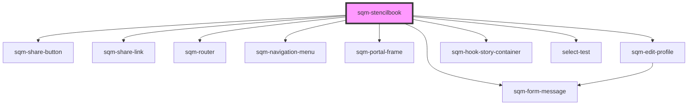

# stencil-storybook

<!-- Auto Generated Below -->

## Dependencies

### Depends on

- [sqm-share-button](../share-button)
- [sqm-share-link](../share-link)
- [sqm-router](../router)
- [sqm-navigation-menu](../navigation-menu)
- [sqm-portal-frame](../portal-frame)
- [sqm-edit-profile](../edit-profile)
- [sqm-form-message](../sqm-form-message)
- [sqm-hook-story-container](../sqm-hook-story-container)
- [select-test](../select-test)

### Graph

----------------------------------------------

*Built with [StencilJS](https://stenciljs.com/)*
