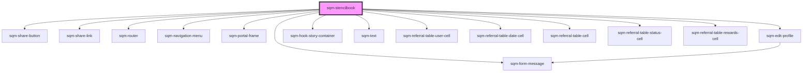

# sqm-stencilbook

<!-- Auto Generated Below -->

## Dependencies

### Depends on

- [sqm-share-button](../sqm-share-button)
- [sqm-share-link](../sqm-share-link)
- [sqm-router](../sqm-router)
- [sqm-navigation-menu](../sqm-navigation-menu)
- [sqm-portal-frame](../sqm-portal-frame)
- [sqm-edit-profile](../sqm-edit-profile)
- [sqm-form-message](../sqm-form-message)
- [sqm-hook-story-container](../sqm-hook-story-container)
- [sqm-text](../sqm-text)
- [sqm-referral-table-user-cell](../sqm-referral-table/cells)
- [sqm-referral-table-date-cell](../sqm-referral-table/cells)
- [sqm-referral-table-cell](../sqm-referral-table/cells)
- [sqm-referral-table-status-cell](../sqm-referral-table/cells)
- [sqm-referral-table-rewards-cell](../sqm-referral-table/cells)

### Graph

----------------------------------------------

*Built with [StencilJS](https://stenciljs.com/)*
