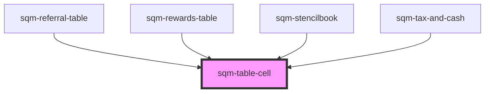

# sqm-table-cell

<!-- Auto Generated Below -->

## Properties

| Property  | Attribute | Description | Type     | Default       |
| --------- | --------- | ----------- | -------- | ------------- |
| `colspan` | `colspan` |             | `number` | `1`           |
| `padding` | `padding` |             | `string` | `"15px 10px"` |

## Dependencies

### Used by

 - [sqm-referral-table](../sqm-referral-table)
 - [sqm-rewards-table](../sqm-rewards-table)
 - [sqm-stencilbook](../sqm-stencilbook)
 - [sqm-tax-and-cash](../tax-and-cash/sqm-tax-and-cash)

### Graph

----------------------------------------------

*Built with [StencilJS](https://stenciljs.com/)*
