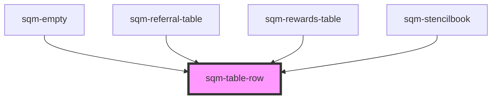

# sqm-table-row

<!-- Auto Generated Below -->

## Properties

| Property | Attribute | Description | Type     | Default               |
| -------- | --------- | ----------- | -------- | --------------------- |
| `border` | `border`  |             | `string` | `"1px solid #EAEAEA"` |

## Dependencies

### Used by

 - [sqm-empty](../sqm-empty)
 - [sqm-referral-table](../sqm-referral-table)
 - [sqm-rewards-table](../sqm-rewards-table)
 - [sqm-stencilbook](../sqm-stencilbook)

### Graph

----------------------------------------------

*Built with [StencilJS](https://stenciljs.com/)*
