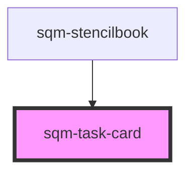

# sqm-task-card

<!-- Auto Generated Below -->

## Properties

| Property          | Attribute           | Description                                                                        | Type      | Default                                              |
| ----------------- | ------------------- | ---------------------------------------------------------------------------------- | --------- | ---------------------------------------------------- |
| `buttonLink`      | `button-link`       |                                                                                    | `string`  | `"https://example.com/"`                             |
| `buttonText`      | `button-text`       |                                                                                    | `string`  | `"Complete Action"`                                  |
| `cardTitle`       | `card-title`        |                                                                                    | `string`  | `"Title Text"`                                       |
| `description`     | `description`       |                                                                                    | `string`  | `"Description Text"`                                 |
| `finite`          | `finite`            |                                                                                    | `number`  | `0`                                                  |
| `goal`            | `goal`              |                                                                                    | `number`  | `1`                                                  |
| `openNewTab`      | `open-new-tab`      |                                                                                    | `boolean` | `false`                                              |
| `progressBarUnit` | `progress-bar-unit` |                                                                                    | `string`  | `undefined`                                          |
| `repeatable`      | `repeatable`        |                                                                                    | `boolean` | `false`                                              |
| `rewardAmount`    | `reward-amount`     |                                                                                    | `string`  | `"0"`                                                |
| `rewardDuration`  | `reward-duration`   |                                                                                    | `string`  | `"/"`                                                |
| `rewardUnit`      | `reward-unit`       |                                                                                    | `string`  | `"Points"`                                           |
| `showExpiry`      | `show-expiry`       |                                                                                    | `boolean` | `false`                                              |
| `showProgressBar` | `show-progress-bar` |                                                                                    | `boolean` | `false`                                              |
| `statType`        | `stat-type`         | Select what type of stat to display for the goal. Manual paths are also supported. | `string`  | `"/programGoals/count/Referral-Started%2Freferrals"` |
| `steps`           | `steps`             |                                                                                    | `boolean` | `false`                                              |

## Dependencies

### Used by

 - [sqm-stencilbook](../sqm-stencilbook)

### Graph

----------------------------------------------

*Built with [StencilJS](https://stenciljs.com/)*
