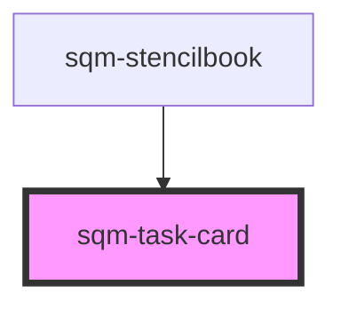

# sqm-task-card

<!-- Auto Generated Below -->

## Properties

| Property          | Attribute           | Description                                                                                                                                  | Type      | Default                                                                                                                     |
| ----------------- | ------------------- | -------------------------------------------------------------------------------------------------------------------------------------------- | --------- | --------------------------------------------------------------------------------------------------------------------------- |
| `buttonLink`      | `button-link`       |                                                                                                                                              | `string`  | `undefined`                                                                                                                 |
| `buttonText`      | `button-text`       |                                                                                                                                              | `string`  | `"Complete Action"`                                                                                                         |
| `cardTitle`       | `card-title`        |                                                                                                                                              | `string`  | `"Title Text"`                                                                                                              |
| `completedText`   | `completed-text`    | Displays the amount of times that a user has completed a repeatable task.                                                                    | `string`  | `"Completed {finite, select, 0 {{count, plural, =1 {{count} time} other {{count} times}}} other {{count}/{finite} times}}"` |
| `demoData`        | --                  |                                                                                                                                              | `{}`      | `undefined`                                                                                                                 |
| `description`     | `description`       |                                                                                                                                              | `string`  | `""`                                                                                                                        |
| `displayDuration` | `display-duration`  | Task cards are hidden from users outside of the duration. They are always displayed if no duration is configured.                            | `string`  | `undefined`                                                                                                                 |
| `endedMessage`    | `ended-message`     | Shown to users after the end of the task duration.                                                                                           | `string`  | `"Ended {endDate}"`                                                                                                         |
| `eventKey`        | `event-key`         | Optionally send an event to SaaSquatch when a user clicks the button. Enter your event key into this field.                                  | `string`  | `undefined`                                                                                                                 |
| `expiryMessage`   | `expiry-message`    | Displayed when a user views a task card after the reward duration interval.                                                                  | `string`  | `"Ends {endDate}"`                                                                                                          |
| `finite`          | `finite`            | The number of times a reward can be earned.  Use zero for no limit (the default).                                                            | `number`  | `0`                                                                                                                         |
| `goal`            | `goal`              | Sets the goal for users progress to know when a task has been completed. If repeatable is checked, repeatable goals is an increment of this. | `number`  | `1`                                                                                                                         |
| `openNewTab`      | `open-new-tab`      | Button Link Opens in New Tab                                                                                                                 | `boolean` | `false`                                                                                                                     |
| `programId`       | `program-id`        | The ID of the program that is used to scope the task card. Defaults to the program context when no ID is specified.                          | `string`  | `undefined`                                                                                                                 |
| `progressBarUnit` | `progress-bar-unit` | The unit displayed to the right of steps and progress numbers on the progress bar. Ex: $ for dollars                                         | `string`  | `""`                                                                                                                        |
| `repeatable`      | `repeatable`        |                                                                                                                                              | `boolean` | `false`                                                                                                                     |
| `rewardAmount`    | `reward-amount`     |                                                                                                                                              | `string`  | `"0"`                                                                                                                       |
| `rewardDuration`  | `reward-duration`   | Task cards are disabled to users outside of the duration. They are not disabled if no duration is configured.                                | `string`  | `undefined`                                                                                                                 |
| `rewardUnit`      | `reward-unit`       |                                                                                                                                              | `string`  | `"Points"`                                                                                                                  |
| `showProgressBar` | `show-progress-bar` |                                                                                                                                              | `boolean` | `false`                                                                                                                     |
| `startsOnMessage` | `starts-on-message` | Shown to users before the start of the task duration.                                                                                        | `string`  | `"Starts {startDate}"`                                                                                                      |
| `statType`        | `stat-type`         | Select what type of stat to display for the goal. Manual paths are also supported.                                                           | `string`  | `undefined`                                                                                                                 |
| `steps`           | `steps`             |                                                                                                                                              | `boolean` | `false`                                                                                                                     |

## Dependencies

### Used by

 - [sqm-stencilbook](../sqm-stencilbook)

### Graph

----------------------------------------------

*Built with [StencilJS](https://stenciljs.com/)*
