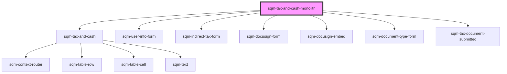

# sqm-tax-and-cash-monolith

<!-- Auto Generated Below -->

## Properties

| Property                               | Attribute                                   | Description                                                                                                | Type     | Default                                                                                                                                                                     |
| -------------------------------------- | ------------------------------------------- | ---------------------------------------------------------------------------------------------------------- | -------- | --------------------------------------------------------------------------------------------------------------------------------------------------------------------------- |
| `allowBankingCollection`               | `allow-banking-collection`                  | Label text for tax and banking collection checkbox                                                         | `string` | `"I agree to the terms"`                                                                                                                                                    |
| `allowBankingCollectionError`          | `allow-banking-collection-error`            | Error text shown at the bottom of the tax and banking collection checkbox                                  | `string` | `"This field is required"`                                                                                                                                                  |
| `backButton`                           | `back-button`                               | Text shown inside of back button                                                                           | `string` | `"Back"`                                                                                                                                                                    |
| `businessEntity`                       | `business-entity`                           | Label text for the business entity radio button                                                            | `string` | `"I represent a business entity"`                                                                                                                                           |
| `country`                              | `country`                                   | Label text for country input                                                                               | `string` | `"Country"`                                                                                                                                                                 |
| `countryError`                         | `country-error`                             | Error text shown at the bottom of the country input                                                        | `string` | `"Select a country"`                                                                                                                                                        |
| `currency`                             | `currency`                                  | Label text for currency input                                                                              | `string` | `"Currency"`                                                                                                                                                                |
| `currencyError`                        | `currency-error`                            | Error text shown at the bottom of the currency input                                                       | `string` | `"Select a currency"`                                                                                                                                                       |
| `email`                                | `email`                                     | Label text for email input                                                                                 | `string` | `"Email"`                                                                                                                                                                   |
| `emailError`                           | `email-error`                               | Error text shown at the bottom of the email input                                                          | `string` | `"Enter a valid email"`                                                                                                                                                     |
| `firstName`                            | `first-name`                                | Label text for first name input                                                                            | `string` | `"First name"`                                                                                                                                                              |
| `firstNameError`                       | `first-name-error`                          | Error text shown at the bottom of the first name input                                                     | `string` | `"Enter a first name"`                                                                                                                                                      |
| `formStep`                             | `form-step`                                 | Sub text shown at the top of the page, used to show the current step of the tax form.                      | `string` | `"Step 1 of 4"`                                                                                                                                                             |
| `generalErrorDescription`              | `general-error-description`                 | The error message shown at the top of the page in an error banner                                          | `string` | `"Please review your information and try again. If this problem continues, contact Support."`                                                                               |
| `generalErrorTitle`                    | `general-error-title`                       | The title for error message shown at the top of the page in an error banner                                | `string` | `"There was a problem submitting your information"`                                                                                                                         |
| `individualParticipant`                | `individual-participant`                    | Label text for the individual participant radio button                                                     | `string` | `"I am an individual participant"`                                                                                                                                          |
| `isPartnerAlertDescription`            | `is-partner-alert-description`              | Alert description text shown in alert if user is already a registered partner                              | `string` | `"If you don’t recognize this referral program provider or believe this is a mistake, please contact Support or sign up for this referral program with a different email."` |
| `isPartnerAlertHeader`                 | `is-partner-alert-header`                   | Alert header text shown in alert if user is already a registered partner                                   | `string` | `"An account with this email already exists with our referral program provider, impact.com"`                                                                                |
| `lastName`                             | `last-name`                                 | Label text for last name input                                                                             | `string` | `"Last name"`                                                                                                                                                               |
| `lastNameError`                        | `last-name-error`                           | Error text shown at the bottom of the last name input                                                      | `string` | `"Enter a last name"`                                                                                                                                                       |
| `participantType`                      | `participant-type`                          | Heading text for the participant type radio buttons                                                        | `string` | `"Participant type"`                                                                                                                                                        |
| `participantTypeError`                 | `participant-type-error`                    | Error text shown at the bottom of the participant type checkbox                                            | `string` | `"Select a participant type"`                                                                                                                                               |
| `personalInformation`                  | `personal-information`                      | Heading text shown above the forms inputs.                                                                 | `string` | `"Personal Information"`                                                                                                                                                    |
| `step2BackButton`                      | `step-2-back-button`                        | Text shown inside of back button                                                                           | `string` | `"Back"`                                                                                                                                                                    |
| `step2FormStep`                        | `step-2-form-step`                          | Sub text shown at the top of the page, used to show the current step of the tax form.                      | `string` | `"Step 2 of 4"`                                                                                                                                                             |
| `step2GeneralErrorDescription`         | `step-2-general-error-description`          | The error message shown at the top of the page in an error banner                                          | `string` | `"Please review your information and try again. If this problem continues, contact Support."`                                                                               |
| `step2GeneralErrorTitle`               | `step-2-general-error-title`                | The title for error message shown at the top of the page in an error banner                                | `string` | `"There was a problem submitting your information"`                                                                                                                         |
| `step2HstCanada`                       | `step-2-hst-canada`                         | Label text for the HST Canada radio button                                                                 | `string` | `"I am registered for HST in Canada"`                                                                                                                                       |
| `step2IndirectTax`                     | `step-2-indirect-tax`                       | Heading text shown at the top of the page                                                                  | `string` | `"Indirect Tax"`                                                                                                                                                            |
| `step2IndirectTaxDescription`          | `step-2-indirect-tax-description`           | Subtext shown at the top of the page                                                                       | `string` | `"Indirect Taxes (e.g. VAT, HST, GST) are transactional based taxes that are required to be levied by service providers by most tax authorities."`                          |
| `step2IndirectTaxDetails`              | `step-2-indirect-tax-details`               | Heading text shown above the tax details radio buttons                                                     | `string` | `"Indirect Tax Details"`                                                                                                                                                    |
| `step2IndirectTaxDetailsDescription`   | `step-2-indirect-tax-details-description`   | Sub text shown above the tax details radio buttons                                                         | `string` | `"Not sure if you are registered for indirect tax? Contact our Support team to find out more."`                                                                             |
| `step2IndirectTaxNumber`               | `step-2-indirect-tax-number`                | Label text for the Indirect Tax Number input                                                               | `string` | `"Indirect Tax"`                                                                                                                                                            |
| `step2IndirectTaxNumberError`          | `step-2-indirect-tax-number-error`          | Error text shown below the Indirect Tax Number select input                                                | `string` | `"Indirect Tax is required"`                                                                                                                                                |
| `step2IsPartnerAlertDescription`       | `step-2-is-partner-alert-description`       | Alert description text shown in alert if user is already a registered partner                              | `string` | `"If you don’t recognize this referral program provider or believe this is a mistake, please contact Support or sign up for this referral program with a different email."` |
| `step2IsPartnerAlertHeader`            | `step-2-is-partner-alert-header`            | Alert header text shown in alert if user is already a registered partner                                   | `string` | `"An account with this email already exists with our referral program provider, impact.com"`                                                                                |
| `step2NotRegistered`                   | `step-2-not-registered`                     | Label text for the not registered radio button                                                             | `string` | `"I am not registered for Indirect Tax"`                                                                                                                                    |
| `step2OtherRegion`                     | `step-2-other-region`                       | Label text for the other region radio button                                                               | `string` | `"I am registered for Indirect Tax in a different Country / Region"`                                                                                                        |
| `step2Province`                        | `step-2-province`                           | Label text for the Province select input                                                                   | `string` | `"Province"`                                                                                                                                                                |
| `step2ProvinceError`                   | `step-2-province-error`                     | Error text shown below the Selected Region select input                                                    | `string` | `"Province is required"`                                                                                                                                                    |
| `step2SelectedRegion`                  | `step-2-selected-region`                    | Label text for the Selected Region select input                                                            | `string` | `"Country / Region of Indirect Tax"`                                                                                                                                        |
| `step2SelectedRegionError`             | `step-2-selected-region-error`              | Error text shown below the Selected Region select input                                                    | `string` | `"Country is required"`                                                                                                                                                     |
| `step2SubmitButton`                    | `step-2-submit-button`                      | Text shown inside of submit button                                                                         | `string` | `"Continue"`                                                                                                                                                                |
| `step2TaxDetailsError`                 | `step-2-tax-details-error`                  | Error text shown below the tax details radio buttons                                                       | `string` | `"This field is required"`                                                                                                                                                  |
| `step2VatNumber`                       | `step-2-vat-number`                         | Label text for the VAT Number input                                                                        | `string` | `"VAT number"`                                                                                                                                                              |
| `step2VatNumberError`                  | `step-2-vat-number-error`                   | Error text shown below the VAT Number input                                                                | `string` | `"VAT number is required"`                                                                                                                                                  |
| `step3Banner`                          | `step-3-banner`                             | Text shown in the banner above the document                                                                | `string` | `"For your security, we automatically end your session when you have not interacted with the form after 20 minutes."`                                                       |
| `step3CheckboxDescription`             | `step-3-checkbox-description`               | Label text for the form submission checkbox                                                                | `string` | `"I have completed and submitted my tax form"`                                                                                                                              |
| `step3CheckboxLabel`                   | `step-3-checkbox-label`                     | Heading text for the form submission checkbox                                                              | `string` | `"Form submission"`                                                                                                                                                         |
| `step3FormStep`                        | `step-3-form-step`                          | Sub text shown at the top of the page, used to show the current step of the tax form.                      | `string` | `"Step 3 of 4"`                                                                                                                                                             |
| `step3FormSubmissionError`             | `step-3-form-submission-error`              | The error message shown at the bottom of the page if the user has not checked the form submission checkbox | `string` | `"This field is required"`                                                                                                                                                  |
| `step3GeneralErrorDescription`         | `step-3-general-error-description`          | The error message shown at the top of the page in an error banner                                          | `string` | `"Please review your information and try again. If this problem continues, contact Support."`                                                                               |
| `step3GeneralErrorTitle`               | `step-3-general-error-title`                | The title for error message shown at the top of the page in an error banner                                | `string` | `"There was a problem submitting your information"`                                                                                                                         |
| `step3SubmitButton`                    | `step-3-submit-button`                      | Text shown inside of submit button                                                                         | `string` | `"Continue"`                                                                                                                                                                |
| `step3TaxForm`                         | `step-3-tax-form`                           | Heading text shown at the top of the page                                                                  | `string` | `"Tax form"`                                                                                                                                                                |
| `step3TaxFormDescription`              | `step-3-tax-form-description`               | Subtext shown at the top of the page next to the document type text                                        | `string` | `"Participants based in the US and partnering with US-based brands need to submit a {documentType} form."`                                                                  |
| `step3TaxFormLabel`                    | `step-3-tax-form-label`                     | Text shown at the top of the page next to the document type text                                           | `string` | `"{documentType} Tax Form"`                                                                                                                                                 |
| `step3bBackButton`                     | `step-3b-back-button`                       | Text shown inside of back button                                                                           | `string` | `"Back"`                                                                                                                                                                    |
| `step3bFormLabel`                      | `step-3b-form-label`                        | Sub text shown above form selection radio buttons                                                          | `string` | `"Select a tax form"`                                                                                                                                                       |
| `step3bFormStep`                       | `step-3b-form-step`                         | Sub text shown at the top of the page, used to show the current step of the tax form.                      | `string` | `"Step 3 of 4"`                                                                                                                                                             |
| `step3bGeneralErrorDescription`        | `step-3b-general-error-description`         | The error message shown at the top of the page in an error banner                                          | `string` | `"Please review your information and try again. If this problem continues, contact Support."`                                                                               |
| `step3bGeneralErrorTitle`              | `step-3b-general-error-title`               | The title for error message shown at the top of the page in an error banner                                | `string` | `"There was a problem submitting your information"`                                                                                                                         |
| `step3bSubmitButton`                   | `step-3b-submit-button`                     | Text shown inside of submit button                                                                         | `string` | `"Continue"`                                                                                                                                                                |
| `step3bTaxForm`                        | `step-3b-tax-form`                          | Heading text shown at the top of the top of page                                                           | `string` | `"Tax form"`                                                                                                                                                                |
| `step3bW8Description`                  | `step-3b-w-8-description`                   | Subtext for the W8 radio button                                                                            | `string` | `"W8-BEN For individuals residing outside of the US, joining the referral program of a US-based company."`                                                                  |
| `step3bW8EDescription`                 | `step-3b-w-8-e-description`                 | Subtext for the W8E radio button                                                                           | `string` | `"W8-BEN-E For participants residing outside of the US who represent a business entity, joining the referral program of a US-based company."`                               |
| `step3bW8ELabel`                       | `step-3b-w-8-e-label`                       | Label text for the W8E radio button                                                                        | `string` | `"W8-BEN-E"`                                                                                                                                                                |
| `step3bW8Label`                        | `step-3b-w-8-label`                         | Label text for the W8 radio button                                                                         | `string` | `"W8-Ben"`                                                                                                                                                                  |
| `step3bW9Description`                  | `step-3b-w-9-description`                   | Subtext for the W9 radio button                                                                            | `string` | `"W9 For participants based in the US, joining the referral program of a US-based company."`                                                                                |
| `step3bW9Label`                        | `step-3b-w-9-label`                         | Label text for the W9 radio button                                                                         | `string` | `"W9"`                                                                                                                                                                      |
| `step4BadgeTextAwaitingReview`         | `step-4-badge-text-awaiting-review`         | Description text which appears beside badge showing the form is awaiting review                            | `string` | `"Awaiting review. Submitted on {dateSubmitted}."`                                                                                                                          |
| `step4BadgeTextExpiredOn`              | `step-4-badge-text-expired-on`              | Description text which appears beside badge showing the form has expired                                   | `string` | `"Expired on {dateExpired}."`                                                                                                                                               |
| `step4BadgeTextExpiringSoon`           | `step-4-badge-text-expiring-soon`           | Description text which appears beside badge showing the form expiring soon                                 | `string` | `", expiring on {dateExpired}."`                                                                                                                                            |
| `step4BadgeTextSubmittedOn`            | `step-4-badge-text-submitted-on`            | Description text which appears beside badge showing when the form was submitted                            | `string` | `"Submitted on {dateSubmitted}"`                                                                                                                                            |
| `step4BankingInformationSectionHeader` | `step-4-banking-information-section-header` | Header text displayed above the banking information card                                                   | `string` | `"Banking Information"`                                                                                                                                                     |
| `step4GeneralErrorDescription`         | `step-4-general-error-description`          | The error message shown at the top of the page in an error banner                                          | `string` | `"Please review your information and try again. If this problem continues, contact Support."`                                                                               |
| `step4GeneralErrorTitle`               | `step-4-general-error-title`                | The title for error message shown at the top of the page in an error banner                                | `string` | `"There was a problem submitting your information"`                                                                                                                         |
| `step4InvalidForm`                     | `step-4-invalid-form`                       | Description text displayed next to the badge in the tax documents status                                   | `string` | `"Ensure your information matches your profile and resubmit a new document."`                                                                                               |
| `step4NewFormButton`                   | `step-4-new-form-button`                    | Text displayed in the submit new document button at the bottom of the page                                 | `string` | `"Submit New document"`                                                                                                                                                     |
| `step4NoFormNeededSubtext`             | `step-4-no-form-needed-subtext`             | Subtext displayed at the bottom of the page if there are no tax documents to show                          | `string` | `"Tax documents are only required if you are based in the US. If your country of residence has changed, please contact Support."`                                           |
| `step4StatusTextActive`                | `step-4-status-text-active`                 | Status text displayed in badge when tax document is Active                                                 | `string` | `"Active"`                                                                                                                                                                  |
| `step4StatusTextExpired`               | `step-4-status-text-expired`                | Status text displayed in badge when tax document is Expired                                                | `string` | `"Expired"`                                                                                                                                                                 |
| `step4StatusTextNotActive`             | `step-4-status-text-not-active`             | Status text displayed in badge when tax document is Not Active                                             | `string` | `"Invalid Tax Form"`                                                                                                                                                        |
| `step4StatusTextNotVerified`           | `step-4-status-text-not-verified`           | Status text displayed in badge when tax document is Not Verified                                           | `string` | `"Not Verified"`                                                                                                                                                            |
| `step4TaxAlertHeaderExpiredOn`         | `step-4-tax-alert-header-expired-on`        | Header displayed in alert header at the top of the page.                                                   | `string` | `"Your {documentType} tax form has expired."`                                                                                                                               |
| `step4TaxAlertHeaderExpiringSoon`      | `step-4-tax-alert-header-expiring-soon`     | Header displayed in alert header at the top of the page.                                                   | `string` | `"Your {documentType} tax form expires on {dateExpired}"`                                                                                                                   |
| `step4TaxAlertHeaderNotActive`         | `step-4-tax-alert-header-not-active`        | Header displayed in alert header at the top of the page.                                                   | `string` | `"Your {documentType} tax form has personal information that doesn't match your profile."`                                                                                  |
| `step4TaxAlertMessage`                 | `step-4-tax-alert-message`                  | Description text displayed in alert body at the top of the page.                                           | `string` | `"Please resubmit a new {documentType} form."`                                                                                                                              |
| `step4TaxAlertMessageExpiringSoon`     | `step-4-tax-alert-message-expiring-soon`    | Description text displayed in alert body at the top of the page.                                           | `string` | `"Please submit a new {documentType} form to continue receiving your rewards"`                                                                                              |
| `step4TaxDocumentSectionHeader`        | `step-4-tax-document-section-header`        | Header text displayed above the tax documents status                                                       | `string` | `"Tax documents"`                                                                                                                                                           |
| `step4TaxDocumentSectionSubHeader`     | `step-4-tax-document-section-sub-header`    | Sub header text displayed above the tax documents status                                                   | `string` | `"{documentType} Tax Form"`                                                                                                                                                 |
| `stop3NotBasedInUS`                    | `stop-3-not-based-in-u-s`                   | Text shown in the link to the form for non US residents                                                    | `string` | `"Not based in the US?"`                                                                                                                                                    |
| `submitButton`                         | `submit-button`                             | Text shown inside of submit button                                                                         | `string` | `"Continue"`                                                                                                                                                                |
| `taxAndBankingCollection`              | `tax-and-banking-collection`                | Heading text for the tax and banking collection checkbox                                                   | `string` | `"Continue"`                                                                                                                                                                |

## Dependencies

### Depends on

- [sqm-tax-and-cash](../tax-and-cash/sqm-tax-and-cash)
- [sqm-user-info-form](../tax-and-cash/sqm-user-info-form)
- [sqm-indirect-tax-form](../tax-and-cash/sqm-indirect-tax-form)
- [sqm-docusign-form](../tax-and-cash/sqm-docusign-form)
- [sqm-docusign-embed](../sqm-docusign-embed)
- [sqm-document-type-form](../tax-and-cash/sqm-document-type-form)
- [sqm-tax-document-submitted](../tax-and-cash/sqm-tax-document-submitted)

### Graph

----------------------------------------------

*Built with [StencilJS](https://stenciljs.com/)*
