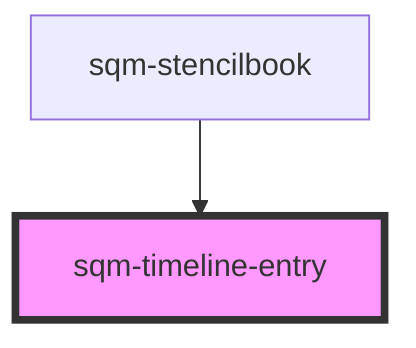

# sqm-timeline-entry

<!-- Auto Generated Below -->

## Properties

| Property    | Attribute    | Description                     | Type                 | Default     |
| ----------- | ------------ | ------------------------------- | -------------------- | ----------- |
| `desc`      | `desc`       |                                 | `string`             | `undefined` |
| `icon`      | `icon`       |                                 | `"circle" \| "gift"` | `undefined` |
| `lineColor` | `line-color` | Color of timeline               | `string`             | `undefined` |
| `reward`    | `reward`     |                                 | `string`             | `undefined` |
| `textColor` | `text-color` | Color of the text and copy icon | `string`             | `undefined` |
| `unit`      | `unit`       |                                 | `string`             | `undefined` |

## Methods

### `setIcon(value: "gift" | "circle") => Promise<void>`

#### Returns

Type: `Promise<void>`

## Dependencies

### Used by

 - [sqm-stencilbook](../sqm-stencilbook)

### Graph

----------------------------------------------

*Built with [StencilJS](https://stenciljs.com/)*
