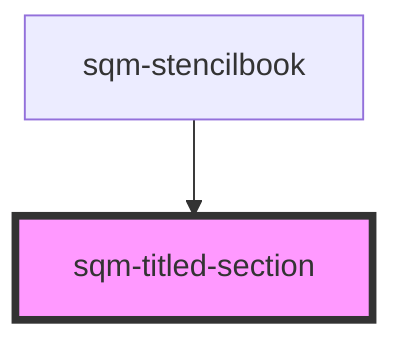

# sqm-sidebar-item

<!-- Auto Generated Below -->

## Properties

| Property      | Attribute      | Description | Type                                                                                                                                           | Default     |
| ------------- | -------------- | ----------- | ---------------------------------------------------------------------------------------------------------------------------------------------- | ----------- |
| `align`       | `align`        |             | `"center" \| "left" \| "right"`                                                                                                                | `"left"`    |
| `label`       | `label`        |             | `string`                                                                                                                                       | `undefined` |
| `labelMargin` | `label-margin` |             | `"large" \| "medium" \| "none" \| "small" \| "x-large" \| "x-small" \| "xx-large" \| "xx-small" \| "xxx-large" \| "xxx-small" \| "xxxx-large"` | `"small"`   |
| `padding`     | `padding`      |             | `"large" \| "medium" \| "none" \| "small" \| "x-large" \| "x-small" \| "xx-large" \| "xx-small" \| "xxx-large" \| "xxx-small" \| "xxxx-large"` | `"none"`    |

## Dependencies

### Used by

 - [sqm-stencilbook](../sqm-stencilbook)

### Graph

----------------------------------------------

*Built with [StencilJS](https://stenciljs.com/)*
