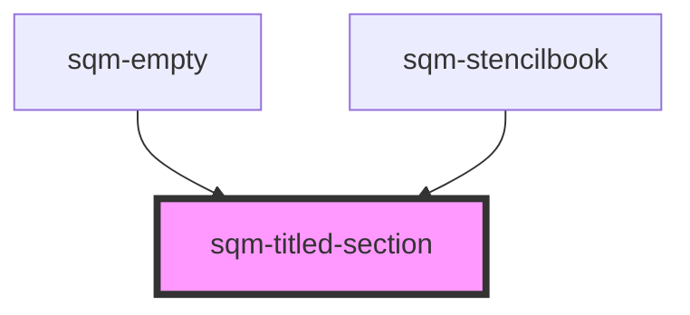

# sqm-titled-section

<!-- Auto Generated Below -->

## Properties

| Property      | Attribute      | Description                                            | Type                                                                                                                                           | Default     |
| ------------- | -------------- | ------------------------------------------------------ | ---------------------------------------------------------------------------------------------------------------------------------------------- | ----------- |
| `label`       | `label`        | Text value shown when there is no label slot declared. | `string`                                                                                                                                       | `undefined` |
| `labelMargin` | `label-margin` | Margin applied to the bottom of the label slot         | `"large" \| "medium" \| "none" \| "small" \| "x-large" \| "x-small" \| "xx-large" \| "xx-small" \| "xxx-large" \| "xxx-small" \| "xxxx-large"` | `"small"`   |
| `padding`     | `padding`      | Padding applied to all 4 sides of the container        | `"large" \| "medium" \| "none" \| "small" \| "x-large" \| "x-small" \| "xx-large" \| "xx-small" \| "xxx-large" \| "xxx-small" \| "xxxx-large"` | `"none"`    |
| `textAlign`   | `text-align`   |                                                        | `"center" \| "left" \| "right"`                                                                                                                | `"left"`    |

## Dependencies

### Used by

 - [sqm-empty](../sqm-empty)
 - [sqm-stencilbook](../sqm-stencilbook)

### Graph

----------------------------------------------

*Built with [StencilJS](https://stenciljs.com/)*
