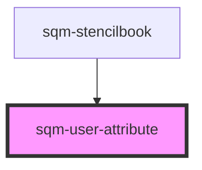

# sqm-sidebar-item

<!-- Auto Generated Below -->

## Properties

| Property      | Attribute      | Description                                             | Type                                                           | Default     |
| ------------- | -------------- | ------------------------------------------------------- | -------------------------------------------------------------- | ----------- |
| `demoData`    | --             |                                                         | `{ loading?: boolean; value?: string; loadingText?: string; }` | `undefined` |
| `loadingText` | `loading-text` | Text displayed while the participant’s name is loading. | `string`                                                       | `"..."`     |
| `value`       | `value`        | The custom field key to display.                        | `string`                                                       | `undefined` |

## Dependencies

### Used by

 - [sqm-stencilbook](../sqm-stencilbook)

### Graph

----------------------------------------------

*Built with [StencilJS](https://stenciljs.com/)*
