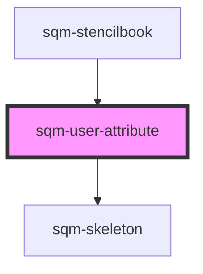

# sqm-user-attribute

<!-- Auto Generated Below -->

## Properties

| Property     | Attribute     | Description                      | Type                                                                                             | Default     |
| ------------ | ------------- | -------------------------------- | ------------------------------------------------------------------------------------------------ | ----------- |
| `color`      | `color`       |                                  | `string`                                                                                         | `undefined` |
| `demoData`   | --            |                                  | `{ loading?: boolean; value?: string; fontSize?: number; color?: string; fontWeight?: number; }` | `undefined` |
| `fontSize`   | `font-size`   | Number in pixels.                | `number`                                                                                         | `undefined` |
| `fontWeight` | `font-weight` | Font weight                      | `number`                                                                                         | `undefined` |
| `value`      | `value`       | The custom field key to display. | `number \| string`                                                                               | `undefined` |

## Dependencies

### Used by

 - [sqm-stencilbook](../sqm-stencilbook)

### Depends on

- [sqm-skeleton](../sqm-skeleton)

### Graph

----------------------------------------------

*Built with [StencilJS](https://stenciljs.com/)*
