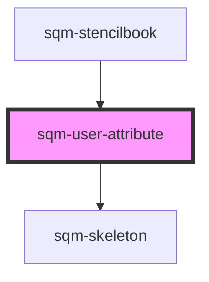

# sqm-sidebar-item

<!-- Auto Generated Below -->

## Properties

| Property     | Attribute    | Description                      | Type                                                                                             | Default     |
| ------------ | ------------ | -------------------------------- | ------------------------------------------------------------------------------------------------ | ----------- |
| `color`      | `color`      |                                  | `string`                                                                                         | `undefined` |
| `demoData`   | --           |                                  | `{ loading?: boolean; value?: string; fontsize?: string; color?: string; fontweight?: string; }` | `undefined` |
| `fontsize`   | `fontsize`   | Font size in pixels.             | `string`                                                                                         | `undefined` |
| `fontweight` | `fontweight` |                                  | `string`                                                                                         | `undefined` |
| `value`      | `value`      | The custom field key to display. | `string`                                                                                         | `undefined` |

## Dependencies

### Used by

 - [sqm-stencilbook](../sqm-stencilbook)

### Depends on

- [sqm-skeleton](../sqm-skeleton)

### Graph

----------------------------------------------

*Built with [StencilJS](https://stenciljs.com/)*
