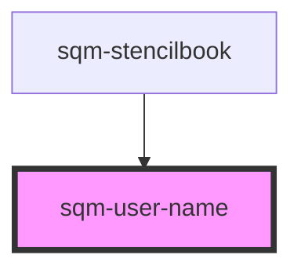

# sqm-sidebar-item

<!-- Auto Generated Below -->

## Properties

| Property      | Attribute      | Description | Type                                                              | Default            |
| ------------- | -------------- | ----------- | ----------------------------------------------------------------- | ------------------ |
| `demoData`    | --             |             | `{ loading?: boolean; loadingText?: string; username?: string; }` | `undefined`        |
| `fallback`    | `fallback`     |             | `string`                                                          | `"Anonymous User"` |
| `loadingText` | `loading-text` |             | `string`                                                          | `"..."`            |

## Dependencies

### Used by

 - [sqm-stencilbook](../sqm-stencilbook)

### Graph

----------------------------------------------

*Built with [StencilJS](https://stenciljs.com/)*
