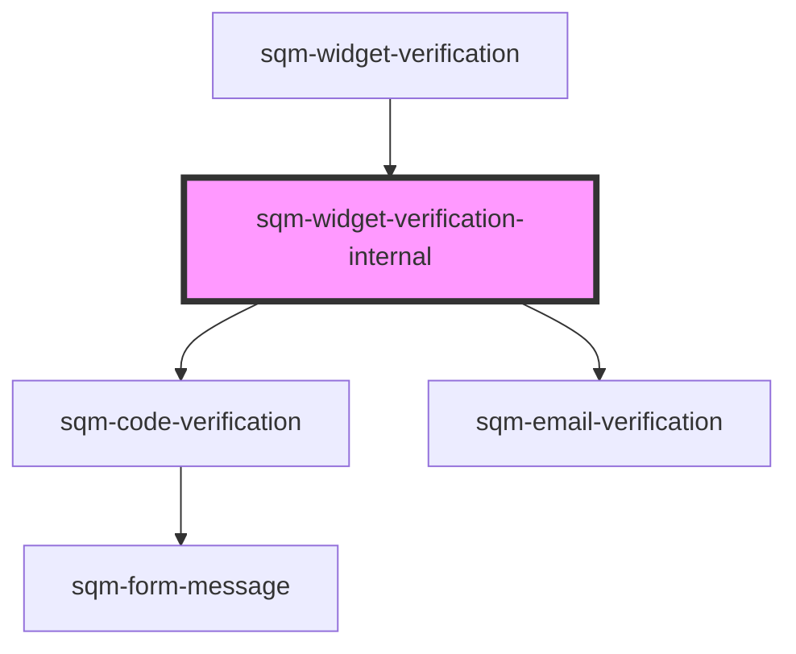

# sqm-widget-verification

<!-- Auto Generated Below -->

## Properties

| Property                              | Attribute                                 | Description | Type     | Default     |
| ------------------------------------- | ----------------------------------------- | ----------- | -------- | ----------- |
| `codeStep_codeResentSuccessfullyText` | `code-step_code-resent-successfully-text` |             | `string` | `undefined` |
| `codeStep_invalidCodeText`            | `code-step_invalid-code-text`             |             | `string` | `undefined` |
| `codeStep_networkErrorMessage`        | `code-step_network-error-message`         |             | `string` | `undefined` |
| `codeStep_resendCodeLabel`            | `code-step_resend-code-label`             |             | `string` | `undefined` |
| `codeStep_resendCodeText`             | `code-step_resend-code-text`              |             | `string` | `undefined` |
| `codeStep_reverifyCodeHeaderText`     | `code-step_reverify-code-header-text`     |             | `string` | `undefined` |
| `codeStep_verifyCodeHeaderText`       | `code-step_verify-code-header-text`       |             | `string` | `undefined` |
| `codeStep_verifyText`                 | `code-step_verify-text`                   |             | `string` | `undefined` |
| `emailStep_emailLabel`                | `email-step_email-label`                  |             | `string` | `undefined` |
| `emailStep_emailValidationErrorText`  | `email-step_email-validation-error-text`  |             | `string` | `undefined` |
| `emailStep_sendCodeErrorDescription`  | `email-step_send-code-error-description`  |             | `string` | `undefined` |
| `emailStep_sendCodeErrorHeader`       | `email-step_send-code-error-header`       |             | `string` | `undefined` |
| `emailStep_sendCodeText`              | `email-step_send-code-text`               |             | `string` | `undefined` |
| `emailStep_verifyEmailHeaderText`     | `email-step_verify-email-header-text`     |             | `string` | `undefined` |

## Dependencies

### Used by

 - [sqm-widget-verification](.)

### Depends on

- [sqm-code-verification](sqm-code-verification)
- [sqm-email-verification](sqm-email-verification)

### Graph

----------------------------------------------

*Built with [StencilJS](https://stenciljs.com/)*
