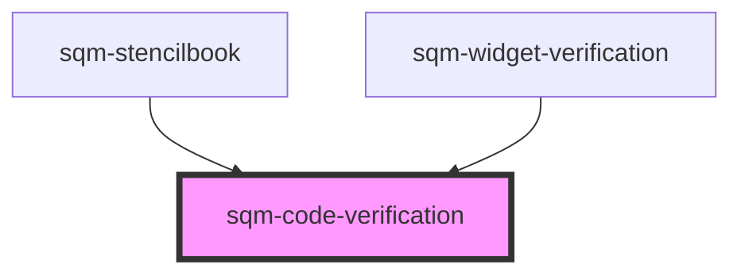

# sqm-code-verification

<!-- Auto Generated Below -->

## Properties

| Property                    | Attribute                       | Description | Type                                                                                                          | Default                                                                                  |
| --------------------------- | ------------------------------- | ----------- | ------------------------------------------------------------------------------------------------------------- | ---------------------------------------------------------------------------------------- |
| `cashVerifyHeaderText`      | `cash-verify-header-text`       |             | `string`                                                                                                      | `"Cash Payouts"`                                                                         |
| `demoData`                  | --                              |             | `{ states?: { loading: boolean; email: string; verifyFailed?: boolean; }; refs?: { codeWrapperRef: any; }; }` | `undefined`                                                                              |
| `email`                     | `email`                         |             | `string`                                                                                                      | `"Email"`                                                                                |
| `invalidCodeText`           | `invalid-code-text`             |             | `string`                                                                                                      | `"The code you have entered is invalid."`                                                |
| `networkErrorMessage`       | `network-error-message`         |             | `string`                                                                                                      | `"An error occurred while verifying your email. Please refresh the page and try again."` |
| `resendVerifyCodeText`      | `resend-verify-code-text`       |             | `string`                                                                                                      | `"Didn't receive your code? Resend Code"`                                                |
| `reverifyCodeSubHeaderText` | `reverify-code-sub-header-text` |             | `string`                                                                                                      | `"Enter the code sent to {email} from our referral provider, impact.com."`               |
| `useDifferentEmailText`     | `use-different-email-text`      |             | `string`                                                                                                      | `"Use a different email"`                                                                |
| `verifyCodeSubHeaderText`   | `verify-code-sub-header-text`   |             | `string`                                                                                                      | `"Enter the code sent to {email}."`                                                      |
| `verifyText`                | `verify-text`                   |             | `string`                                                                                                      | `"Verify"`                                                                               |

## Dependencies

### Used by

 - [sqm-stencilbook](../../sqm-stencilbook)
 - [sqm-widget-verification](..)

### Graph

----------------------------------------------

*Built with [StencilJS](https://stenciljs.com/)*
