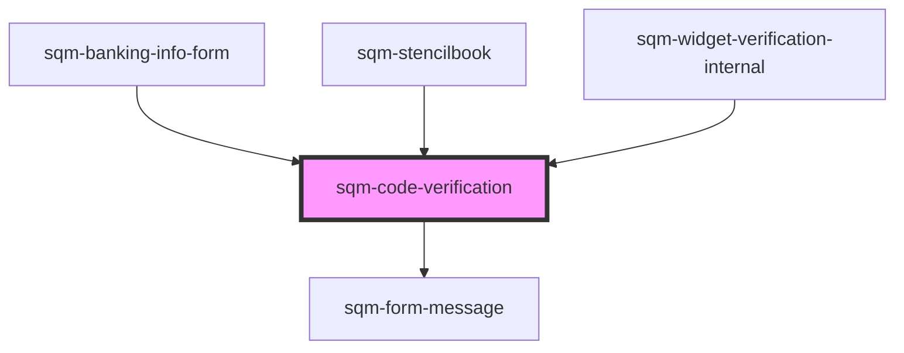

# sqm-code-verification

<!-- Auto Generated Below -->

## Properties

| Property                     | Attribute                       | Description                                                                                                      | Type                                                                                                                                | Default                                                                                            |
| ---------------------------- | ------------------------------- | ---------------------------------------------------------------------------------------------------------------- | ----------------------------------------------------------------------------------------------------------------------------------- | -------------------------------------------------------------------------------------------------- |
| `codeResentSuccessfullyText` | `code-resent-successfully-text` | Link text displayed under verify button                                                                          | `string`                                                                                                                            | `"Another code has been sent to {email}"`                                                          |
| `demoData`                   | --                              |                                                                                                                  | `{ states?: { loading: boolean; email: string; verifyFailed?: boolean; emailResent: boolean; }; refs?: { codeWrapperRef: any; }; }` | `undefined`                                                                                        |
| `invalidCodeText`            | `invalid-code-text`             | Error text displayed under verification input                                                                    | `string`                                                                                                                            | `"Please check your code and try again. If you’re still having trouble, try resending your code."` |
| `networkErrorMessage`        | `network-error-message`         | Displayed when the email verification fails due to a network error. The participant can try refreshing the page. | `string`                                                                                                                            | `"An error occurred while verifying your email. Please refresh the page and try again."`           |
| `resendCodeLabel`            | `resend-code-label`             | The link that appears in the resend code link                                                                    | `string`                                                                                                                            | `"Resend code"`                                                                                    |
| `resendCodeText`             | `resend-code-text`              | Text displayed under verify button                                                                               | `string`                                                                                                                            | `"Didn't receive your code? {resendCodeLink}"`                                                     |
| `reverifyCodeHeaderText`     | `reverify-code-header-text`     |                                                                                                                  | `string`                                                                                                                            | `"Enter the code sent to {email} from our referral provider, impact.com."`                         |
| `verifyCodeHeaderText`       | `verify-code-header-text`       |                                                                                                                  | `string`                                                                                                                            | `"Enter the code sent to {email} from our referral provider, impact.com."`                         |
| `verifyText`                 | `verify-text`                   |                                                                                                                  | `string`                                                                                                                            | `"Verify"`                                                                                         |

## Dependencies

### Used by

 - [sqm-banking-info-form](../../tax-and-cash/sqm-banking-info-form)
 - [sqm-stencilbook](../../sqm-stencilbook)
 - [sqm-widget-verification-internal](..)

### Depends on

- [sqm-form-message](../../sqm-form-message)

### Graph

----------------------------------------------

*Built with [StencilJS](https://stenciljs.com/)*
