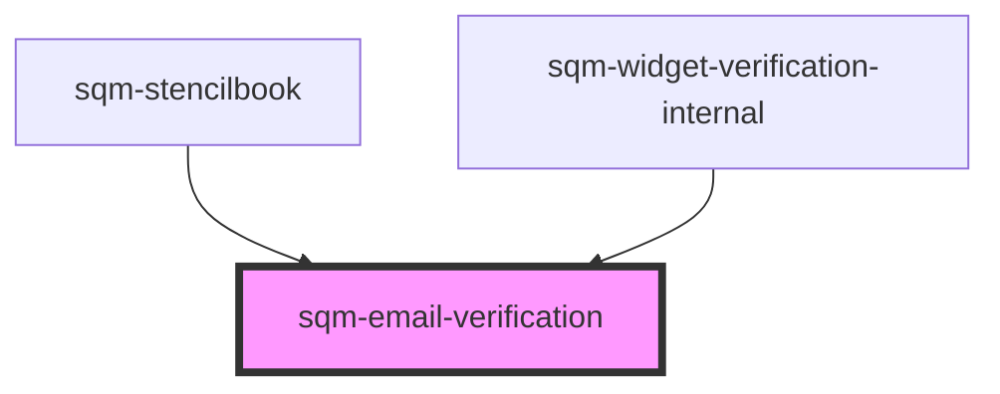

# sqm-email-verification

<!-- Auto Generated Below -->

## Properties

| Property                   | Attribute                     | Description | Type                                                                                                                  | Default                                                                                             |
| -------------------------- | ----------------------------- | ----------- | --------------------------------------------------------------------------------------------------------------------- | --------------------------------------------------------------------------------------------------- |
| `demoData`                 | --                            |             | `{ states?: { error: boolean; initialLoading: boolean; loading: boolean; email: string; sendCodeError: boolean; }; }` | `undefined`                                                                                         |
| `emailLabel`               | `email-label`                 |             | `string`                                                                                                              | `"Email"`                                                                                           |
| `emailValidationErrorText` | `email-validation-error-text` |             | `string`                                                                                                              | `"Please enter a valid email"`                                                                      |
| `sendCodeErrorDescription` | `send-code-error-description` |             | `string`                                                                                                              | `"Please try again. If this problem continues, contact our program {supportLink}."`                 |
| `sendCodeErrorHeader`      | `send-code-error-header`      |             | `string`                                                                                                              | `"There was an error sending your code"`                                                            |
| `sendCodeText`             | `send-code-text`              |             | `string`                                                                                                              | `"Send code"`                                                                                       |
| `supportLink`              | `support-link`                |             | `string`                                                                                                              | `"support team"`                                                                                    |
| `verifyEmailHeaderText`    | `verify-email-header-text`    |             | `string`                                                                                                              | `"Start by verifying your email. We’ll send you a code through our referral provider, impact.com."` |

## Dependencies

### Used by

 - [sqm-stencilbook](../../sqm-stencilbook)
 - [sqm-widget-verification-internal](..)

### Graph

----------------------------------------------

*Built with [StencilJS](https://stenciljs.com/)*
