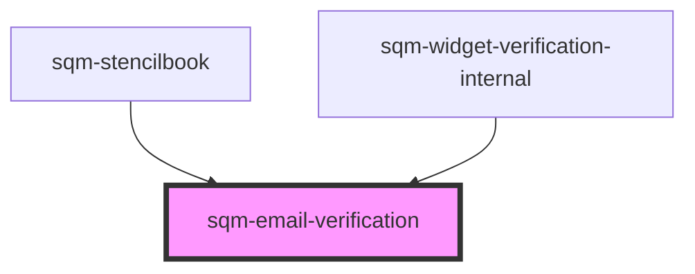

# sqm-email-verification

<!-- Auto Generated Below -->

## Properties

| Property                | Attribute                  | Description | Type                                                                | Default                                                                                             |
| ----------------------- | -------------------------- | ----------- | ------------------------------------------------------------------- | --------------------------------------------------------------------------------------------------- |
| `demoData`              | --                         |             | `{ states?: { error: string; loading: boolean; email: string; }; }` | `undefined`                                                                                         |
| `emailLabel`            | `email-label`              |             | `string`                                                            | `"Email"`                                                                                           |
| `errorText`             | `error-text`               |             | `string`                                                            | `"Failed to send an email. If this continues, contact Support with impact.com"`                     |
| `sendCodeText`          | `send-code-text`           |             | `string`                                                            | `"Send code"`                                                                                       |
| `verifyEmailHeaderText` | `verify-email-header-text` |             | `string`                                                            | `"Start by verifying your email. We’ll send you a code through our referral provider, impact.com."` |

## Dependencies

### Used by

 - [sqm-stencilbook](../../sqm-stencilbook)
 - [sqm-widget-verification-internal](..)

### Graph

----------------------------------------------

*Built with [StencilJS](https://stenciljs.com/)*
