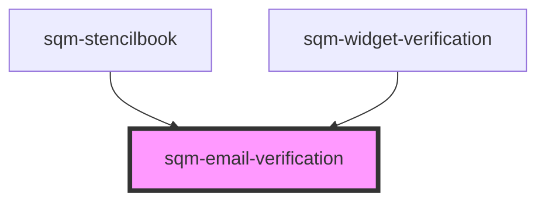

# sqm-email-verification

<!-- Auto Generated Below -->

## Properties

| Property                  | Attribute                     | Description | Type                                                 | Default                                                                                                      |
| ------------------------- | ----------------------------- | ----------- | ---------------------------------------------------- | ------------------------------------------------------------------------------------------------------------ |
| `cashVerifyHeaderText`    | `cash-verify-header-text`     |             | `string`                                             | `"Cash Payouts"`                                                                                             |
| `cashVerifySubHeaderText` | `cash-verify-sub-header-text` |             | `string`                                             | `"To receive your cash payouts, we’ll send a code to your email through our referral provider, impact.com."` |
| `demoData`                | --                            |             | `{ states?: { error: string; loading: boolean; }; }` | `undefined`                                                                                                  |
| `email`                   | `email`                       |             | `string`                                             | `"Email"`                                                                                                    |
| `sendCodeText`            | `send-code-text`              |             | `string`                                             | `"Send code"`                                                                                                |

## Dependencies

### Used by

 - [sqm-stencilbook](../../sqm-stencilbook)
 - [sqm-widget-verification](..)

### Graph

----------------------------------------------

*Built with [StencilJS](https://stenciljs.com/)*
