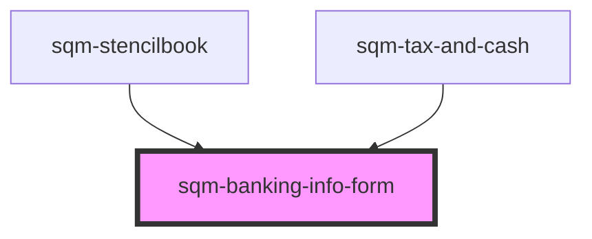

# sqm-cash-form

<!-- Auto Generated Below -->

## Properties

| Property                   | Attribute                     | Description | Type                                      | Default                                                                                 |
| -------------------------- | ----------------------------- | ----------- | ----------------------------------------- | --------------------------------------------------------------------------------------- |
| `demoData`                 | --                            |             | `{ [x: string]: any; [x: number]: any; }` | `undefined`                                                                             |
| `directlyToBankAccount`    | `directly-to-bank-account`    |             | `string`                                  | `"Directly to my bank account"`                                                         |
| `formStep`                 | `form-step`                   |             | `string`                                  | `"Step 4 of 4"`                                                                         |
| `paymentMethod`            | `payment-method`              |             | `string`                                  | `"Payment Method"`                                                                      |
| `submitButton`             | `submit-button`               |             | `string`                                  | `"Save"`                                                                                |
| `taxAndPayouts`            | `tax-and-payouts`             |             | `string`                                  | `"Tax and Payouts"`                                                                     |
| `taxAndPayoutsDescription` | `tax-and-payouts-description` |             | `string`                                  | `"Submit your tax documents and add your banking information to receive your rewards."` |
| `toPaypalAccount`          | `to-paypal-account`           |             | `string`                                  | `"To my PayPal account"`                                                                |

## Dependencies

### Used by

 - [sqm-stencilbook](../../sqm-stencilbook)
 - [sqm-tax-and-cash](../sqm-tax-and-cash)

### Graph

----------------------------------------------

*Built with [StencilJS](https://stenciljs.com/)*
