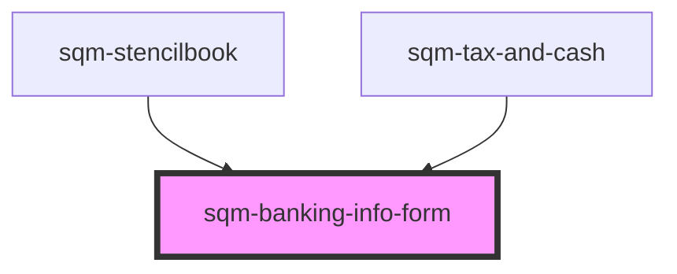

# sqm-cash-form

<!-- Auto Generated Below -->

## Properties

| Property                              | Attribute                                   | Description                                                                             | Type                                      | Default                                                                                                                                                                     |
| ------------------------------------- | ------------------------------------------- | --------------------------------------------------------------------------------------- | ----------------------------------------- | --------------------------------------------------------------------------------------------------------------------------------------------------------------------------- |
| `agencyCodeLabel`                     | `agency-code-label`                         | Label text for the agency code input field                                              | `string`                                  | `"Agency Code"`                                                                                                                                                             |
| `bankAccountNumberLabel`              | `bank-account-number-label`                 | Label text for the bank account number input field                                      | `string`                                  | `"Bank Account Number"`                                                                                                                                                     |
| `bankAccountTypeLabel`                | `bank-account-type-label`                   | Label text for the bank account type input field                                        | `string`                                  | `"Bank Account Type"`                                                                                                                                                       |
| `bankAddressLabel`                    | `bank-address-label`                        | Label text for the Bank Address input                                                   | `string`                                  | `"Bank Address"`                                                                                                                                                            |
| `bankCityLabel`                       | `bank-city-label`                           | Label text for the Bank City input                                                      | `string`                                  | `"Bank City"`                                                                                                                                                               |
| `bankLocationLabel`                   | `bank-location-label`                       | Label text for the bank country location input field                                    | `string`                                  | `"Bank Country Location"`                                                                                                                                                   |
| `bankNameLabel`                       | `bank-name-label`                           | Label text for the bank name input field                                                | `string`                                  | `"Bank Name"`                                                                                                                                                               |
| `bankPostalCodeLabel`                 | `bank-postal-code-label`                    | Label text for the Bank Postal Code                                                     | `string`                                  | `"Bank Postal Code"`                                                                                                                                                        |
| `bankProvinceStateLabel`              | `bank-province-state-label`                 | Label text for the Bank Province State input                                            | `string`                                  | `"Bank Province State"`                                                                                                                                                     |
| `beneficiaryAccountNameLabel`         | `beneficiary-account-name-label`            | Label text for the beneficiary account name input field                                 | `string`                                  | `"Beneficiary Account Name"`                                                                                                                                                |
| `branchCodeLabel`                     | `branch-code-label`                         | Label text for the branch code input field                                              | `string`                                  | `"Branch Code"`                                                                                                                                                             |
| `businessSelectItemLabel`             | `business-select-item-label`                | Label text for the business select item                                                 | `string`                                  | `"Business"`                                                                                                                                                                |
| `checkingSelectItemLabel`             | `checking-select-item-label`                | Label text for the checking account type select item                                    | `string`                                  | `"Checking"`                                                                                                                                                                |
| `classificationCPFLabel`              | `classification-c-p-f-label`                | Label text for the classification CPF input field                                       | `string`                                  | `"Classification CPF"`                                                                                                                                                      |
| `classificationEntityLabel`           | `classification-entity-label`               | Label text for the classification entity input field                                    | `string`                                  | `"Classification Entity"`                                                                                                                                                   |
| `classificationLabel`                 | `classification-label`                      | Label text for the classification input field                                           | `string`                                  | `"Classification"`                                                                                                                                                          |
| `demoData`                            | --                                          |                                                                                         | `{ [x: string]: any; [x: number]: any; }` | `undefined`                                                                                                                                                                 |
| `directlyToBankAccount`               | `directly-to-bank-account`                  | Text for the option to receive payments directly to a bank account                      | `string`                                  | `"Directly to my bank account"`                                                                                                                                             |
| `foreignSelectItemLabel`              | `foreign-select-item-label`                 | Label text for the foreign select item                                                  | `string`                                  | `"Foreign"`                                                                                                                                                                 |
| `formStep`                            | `form-step`                                 | Subtext shown at the top of the page, used to show the current step of the tax form.    | `string`                                  | `"Step 3 of 4"`                                                                                                                                                             |
| `generalErrorDescription`             | `general-error-description`                 | Description text for a general form submission error                                    | `string`                                  | `"Please review your information and try again. If this problem continues, contact Support."`                                                                               |
| `generalErrorTitle`                   | `general-error-title`                       | Title text for a general form submission error                                          | `string`                                  | `"There was a problem submitting your information"`                                                                                                                         |
| `ibanLabel`                           | `iban-label`                                | Label text for the IBAN input field                                                     | `string`                                  | `"IBAN"`                                                                                                                                                                    |
| `individualSelectItemLabel`           | `individual-select-item-label`              | Label text for the individual select item                                               | `string`                                  | `"Individual"`                                                                                                                                                              |
| `isPartnerAlertDescription`           | `is-partner-alert-description`              | Description text for the alert when the user is identified as a partner                 | `string`                                  | `"If you don’t recognize this referral program provider or believe this is a mistake, please contact Support or sign up for this referral program with a different email."` |
| `isPartnerAlertHeader`                | `is-partner-alert-header`                   | Header text for the alert when the user is identified as a partner                      | `string`                                  | `"An account with this email already exists with our referral program provider, impact.com"`                                                                                |
| `patronymicNameLabel`                 | `patronymic-name-label`                     | Label text for the patronymic name input field                                          | `string`                                  | `"Patronymic Name"`                                                                                                                                                         |
| `payPalInputLabel`                    | `pay-pal-input-label`                       | Label text for the PayPal email input field                                             | `string`                                  | `"PayPal Email"`                                                                                                                                                            |
| `paymentDayFifteenthOfMonthLabelText` | `payment-day-fifteenth-of-month-label-text` | Label text for the payment day select option for the fifteenth of the month             | `string`                                  | `"15th of the month"`                                                                                                                                                       |
| `paymentDayFirstOfMonthLabelText`     | `payment-day-first-of-month-label-text`     | Label text for the payment day select option for the first of the month                 | `string`                                  | `"1st of the month"`                                                                                                                                                        |
| `paymentDaySelectLabel`               | `payment-day-select-label`                  | Label text for the payment day select                                                   | `string`                                  | `"Payment Day"`                                                                                                                                                             |
| `paymentMethod`                       | `payment-method`                            | Heading text for the payment method section                                             | `string`                                  | `"Payment Method"`                                                                                                                                                          |
| `paymentMethodSubtext`                | `payment-method-subtext`                    | Subtext for the payment method section                                                  | `string`                                  | `"Payouts will be sent on the first day of each month from our referral program provider, impact.com."`                                                                     |
| `paymentSchedule`                     | `payment-schedule`                          | Heading text for the payment schedule section                                           | `string`                                  | `"Payment Schedule"`                                                                                                                                                        |
| `paymentScheduleBalanceThreshold`     | `payment-schedule-balance-threshold`        | Text for the option to receive payments at a specific balance threshold                 | `string`                                  | `"Pay me when my balance reaches a threshold"`                                                                                                                              |
| `paymentScheduleFixedDay`             | `payment-schedule-fixed-day`                | Text for the option to receive payments on a specific day of the month                  | `string`                                  | `"Pay me on a fixed day of the month"`                                                                                                                                      |
| `paymentThresholdSelectLabel`         | `payment-threshold-select-label`            | Label text for the payment day select                                                   | `string`                                  | `"Payment Threshold"`                                                                                                                                                       |
| `routingCodeLabel`                    | `routing-code-label`                        | Label text for the routing code input field                                             | `string`                                  | `"Routing Code"`                                                                                                                                                            |
| `savingsSelectItemLabel`              | `savings-select-item-label`                 | Label text for the savings account type select item                                     | `string`                                  | `"Savings"`                                                                                                                                                                 |
| `submitButton`                        | `submit-button`                             | Text for the save button in the form                                                    | `string`                                  | `"Save"`                                                                                                                                                                    |
| `swiftCodeLabel`                      | `swift-code-label`                          | Label text for the SWIFT code input field                                               | `string`                                  | `"SWIFT Code"`                                                                                                                                                              |
| `taxAndPayouts`                       | `tax-and-payouts`                           | Heading text shown at the top of the page                                               | `string`                                  | `"Tax and Payouts"`                                                                                                                                                         |
| `taxAndPayoutsDescription`            | `tax-and-payouts-description`               | Text shown at the top of the page next to the tax and payouts label text                | `string`                                  | `"Submit your tax documents and add your banking information to receive your rewards."`                                                                                     |
| `taxPayerIdLabel`                     | `tax-payer-id-label`                        | Label text for the Taxpayer ID input field                                              | `string`                                  | `"Taxpayer ID"`                                                                                                                                                             |
| `toPayPalAccount`                     | `to-pay-pal-account`                        | Text for the option to receive payments to a PayPal account with processing fee details | `string`                                  | `"PayPal (2% processing fee capped to {feeCap})"`                                                                                                                           |
| `voCodeLabel`                         | `vo-code-label`                             | Label text for the VO code input field                                                  | `string`                                  | `"VO Code"`                                                                                                                                                                 |

## Dependencies

### Used by

 - [sqm-stencilbook](../../sqm-stencilbook)
 - [sqm-tax-and-cash](../sqm-tax-and-cash)

### Graph

----------------------------------------------

*Built with [StencilJS](https://stenciljs.com/)*
