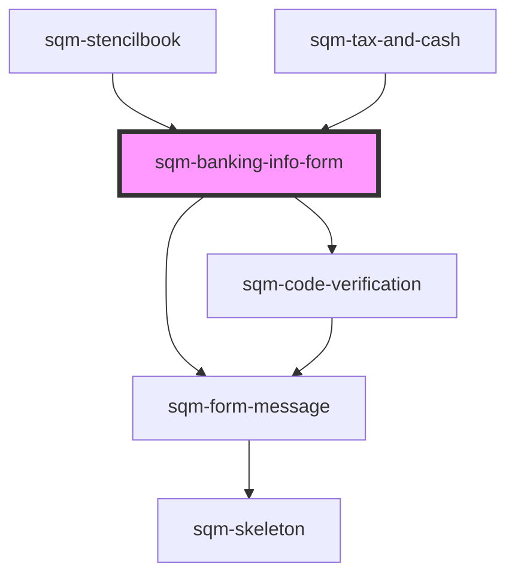

# sqm-cash-form

<!-- Auto Generated Below -->

## Properties

| Property                              | Attribute                                   | Description                                                                                                                                                                                                                          | Type                                                                                                                                                                                                                                                                                                                                                                                                                                                                                                                                                                                                                                                                                                                                                                                                                                                                                                                                                                                                                                                                                                                                                                                                                                                                                                               | Default                                                                                                                                                                                                                                                                                                                                                                                                                                                                                                                                                                                                                                                                        |
| ------------------------------------- | ------------------------------------------- | ------------------------------------------------------------------------------------------------------------------------------------------------------------------------------------------------------------------------------------ | ------------------------------------------------------------------------------------------------------------------------------------------------------------------------------------------------------------------------------------------------------------------------------------------------------------------------------------------------------------------------------------------------------------------------------------------------------------------------------------------------------------------------------------------------------------------------------------------------------------------------------------------------------------------------------------------------------------------------------------------------------------------------------------------------------------------------------------------------------------------------------------------------------------------------------------------------------------------------------------------------------------------------------------------------------------------------------------------------------------------------------------------------------------------------------------------------------------------------------------------------------------------------------------------------------------------ | ------------------------------------------------------------------------------------------------------------------------------------------------------------------------------------------------------------------------------------------------------------------------------------------------------------------------------------------------------------------------------------------------------------------------------------------------------------------------------------------------------------------------------------------------------------------------------------------------------------------------------------------------------------------------------ |
| `agencyCodeError`                     | `agency-code-error`                         | Error messages for the agency code field. Supports error codes: empty, alphanumeric, tooShort                                                                                                                                        | `string`                                                                                                                                                                                                                                                                                                                                                                                                                                                                                                                                                                                                                                                                                                                                                                                                                                                                                                                                                                                                                                                                                                                                                                                                                                                                                                           | `"{errorCode, select, empty {Agency code is required} alphanumeric {Agency code must contain only letters and numbers} tooShort {Agency code must be at least 5 characters} other {{errorCode}}}"`                                                                                                                                                                                                                                                                                                                                                                                                                                                                             |
| `agencyCodeLabel`                     | `agency-code-label`                         |                                                                                                                                                                                                                                      | `string`                                                                                                                                                                                                                                                                                                                                                                                                                                                                                                                                                                                                                                                                                                                                                                                                                                                                                                                                                                                                                                                                                                                                                                                                                                                                                                           | `"Agency code"`                                                                                                                                                                                                                                                                                                                                                                                                                                                                                                                                                                                                                                                                |
| `backButton`                          | `back-button`                               | Text for the back button in the form                                                                                                                                                                                                 | `string`                                                                                                                                                                                                                                                                                                                                                                                                                                                                                                                                                                                                                                                                                                                                                                                                                                                                                                                                                                                                                                                                                                                                                                                                                                                                                                           | `"Back"`                                                                                                                                                                                                                                                                                                                                                                                                                                                                                                                                                                                                                                                                       |
| `bankAccountNumberError`              | `bank-account-number-error`                 | Error messages for the bank account number / IBAN field. Supports error codes: empty, invalidUk, invalid, ibanEmpty, ibanAlphanumeric, ibanInvalid, ibanCountryMismatch                                                              | `string`                                                                                                                                                                                                                                                                                                                                                                                                                                                                                                                                                                                                                                                                                                                                                                                                                                                                                                                                                                                                                                                                                                                                                                                                                                                                                                           | `"{errorCode, select, empty {Account number is required} invalidUk {Please enter a valid UK account number} invalid {Account number is invalid} ibanEmpty {IBAN is required} ibanAlphanumeric {IBAN must contain only letters and numbers} ibanInvalid {IBAN is invalid} ibanCountryMismatch {UK accounts must use an IBAN starting with GB} other {{errorCode}}}"`                                                                                                                                                                                                                                                                                                            |
| `bankAccountNumberLabel`              | `bank-account-number-label`                 |                                                                                                                                                                                                                                      | `string`                                                                                                                                                                                                                                                                                                                                                                                                                                                                                                                                                                                                                                                                                                                                                                                                                                                                                                                                                                                                                                                                                                                                                                                                                                                                                                           | `"Bank account number"`                                                                                                                                                                                                                                                                                                                                                                                                                                                                                                                                                                                                                                                        |
| `bankAccountTypeError`                | `bank-account-type-error`                   | Error messages for the bank account type field. Supports error codes: empty                                                                                                                                                          | `string`                                                                                                                                                                                                                                                                                                                                                                                                                                                                                                                                                                                                                                                                                                                                                                                                                                                                                                                                                                                                                                                                                                                                                                                                                                                                                                           | `"{errorCode, select, empty {Bank account type is required} other {{errorCode}}}"`                                                                                                                                                                                                                                                                                                                                                                                                                                                                                                                                                                                             |
| `bankAccountTypeLabel`                | `bank-account-type-label`                   |                                                                                                                                                                                                                                      | `string`                                                                                                                                                                                                                                                                                                                                                                                                                                                                                                                                                                                                                                                                                                                                                                                                                                                                                                                                                                                                                                                                                                                                                                                                                                                                                                           | `"Bank account type"`                                                                                                                                                                                                                                                                                                                                                                                                                                                                                                                                                                                                                                                          |
| `bankAddressError`                    | `bank-address-error`                        | Error messages for the bank address field. Supports error codes: empty                                                                                                                                                               | `string`                                                                                                                                                                                                                                                                                                                                                                                                                                                                                                                                                                                                                                                                                                                                                                                                                                                                                                                                                                                                                                                                                                                                                                                                                                                                                                           | `"{errorCode, select, empty {Bank address is required} other {{errorCode}}}"`                                                                                                                                                                                                                                                                                                                                                                                                                                                                                                                                                                                                  |
| `bankAddressLabel`                    | `bank-address-label`                        |                                                                                                                                                                                                                                      | `string`                                                                                                                                                                                                                                                                                                                                                                                                                                                                                                                                                                                                                                                                                                                                                                                                                                                                                                                                                                                                                                                                                                                                                                                                                                                                                                           | `"Bank address"`                                                                                                                                                                                                                                                                                                                                                                                                                                                                                                                                                                                                                                                               |
| `bankCityError`                       | `bank-city-error`                           | Error messages for the bank city field. Supports error codes: empty                                                                                                                                                                  | `string`                                                                                                                                                                                                                                                                                                                                                                                                                                                                                                                                                                                                                                                                                                                                                                                                                                                                                                                                                                                                                                                                                                                                                                                                                                                                                                           | `"{errorCode, select, empty {Bank city is required} other {{errorCode}}}"`                                                                                                                                                                                                                                                                                                                                                                                                                                                                                                                                                                                                     |
| `bankCityLabel`                       | `bank-city-label`                           |                                                                                                                                                                                                                                      | `string`                                                                                                                                                                                                                                                                                                                                                                                                                                                                                                                                                                                                                                                                                                                                                                                                                                                                                                                                                                                                                                                                                                                                                                                                                                                                                                           | `"Bank city"`                                                                                                                                                                                                                                                                                                                                                                                                                                                                                                                                                                                                                                                                  |
| `bankLocationLabel`                   | `bank-location-label`                       |                                                                                                                                                                                                                                      | `string`                                                                                                                                                                                                                                                                                                                                                                                                                                                                                                                                                                                                                                                                                                                                                                                                                                                                                                                                                                                                                                                                                                                                                                                                                                                                                                           | `"Bank country location"`                                                                                                                                                                                                                                                                                                                                                                                                                                                                                                                                                                                                                                                      |
| `bankNameError`                       | `bank-name-error`                           | Error messages for the bank name field. Supports error codes: empty                                                                                                                                                                  | `string`                                                                                                                                                                                                                                                                                                                                                                                                                                                                                                                                                                                                                                                                                                                                                                                                                                                                                                                                                                                                                                                                                                                                                                                                                                                                                                           | `"{errorCode, select, empty {Bank name is required} other {{errorCode}}}"`                                                                                                                                                                                                                                                                                                                                                                                                                                                                                                                                                                                                     |
| `bankNameLabel`                       | `bank-name-label`                           |                                                                                                                                                                                                                                      | `string`                                                                                                                                                                                                                                                                                                                                                                                                                                                                                                                                                                                                                                                                                                                                                                                                                                                                                                                                                                                                                                                                                                                                                                                                                                                                                                           | `"Bank Name"`                                                                                                                                                                                                                                                                                                                                                                                                                                                                                                                                                                                                                                                                  |
| `bankPostalCodeError`                 | `bank-postal-code-error`                    | Error messages for the bank postal code field. Supports error codes: empty                                                                                                                                                           | `string`                                                                                                                                                                                                                                                                                                                                                                                                                                                                                                                                                                                                                                                                                                                                                                                                                                                                                                                                                                                                                                                                                                                                                                                                                                                                                                           | `"{errorCode, select, empty {Bank postal code is required} other {{errorCode}}}"`                                                                                                                                                                                                                                                                                                                                                                                                                                                                                                                                                                                              |
| `bankPostalCodeLabel`                 | `bank-postal-code-label`                    |                                                                                                                                                                                                                                      | `string`                                                                                                                                                                                                                                                                                                                                                                                                                                                                                                                                                                                                                                                                                                                                                                                                                                                                                                                                                                                                                                                                                                                                                                                                                                                                                                           | `"Bank postal code"`                                                                                                                                                                                                                                                                                                                                                                                                                                                                                                                                                                                                                                                           |
| `bankStateError`                      | `bank-state-error`                          | Error messages for the bank province/state field. Supports error codes: empty                                                                                                                                                        | `string`                                                                                                                                                                                                                                                                                                                                                                                                                                                                                                                                                                                                                                                                                                                                                                                                                                                                                                                                                                                                                                                                                                                                                                                                                                                                                                           | `"{errorCode, select, empty {Bank province/state is required} other {{errorCode}}}"`                                                                                                                                                                                                                                                                                                                                                                                                                                                                                                                                                                                           |
| `bankStateLabel`                      | `bank-state-label`                          |                                                                                                                                                                                                                                      | `string`                                                                                                                                                                                                                                                                                                                                                                                                                                                                                                                                                                                                                                                                                                                                                                                                                                                                                                                                                                                                                                                                                                                                                                                                                                                                                                           | `"Bank province/state"`                                                                                                                                                                                                                                                                                                                                                                                                                                                                                                                                                                                                                                                        |
| `beneficiaryAccountNameDescription`   | `beneficiary-account-name-description`      |                                                                                                                                                                                                                                      | `string`                                                                                                                                                                                                                                                                                                                                                                                                                                                                                                                                                                                                                                                                                                                                                                                                                                                                                                                                                                                                                                                                                                                                                                                                                                                                                                           | `"The beneficiary name of your bank account. Ensure this matches the name on your tax form."`                                                                                                                                                                                                                                                                                                                                                                                                                                                                                                                                                                                  |
| `beneficiaryAccountNameError`         | `beneficiary-account-name-error`            | Error messages for the beneficiary / account holder name field. Supports error codes: empty, invalidCharacters, numeric, tooLong, nonEnglish, businessNameMismatch, nameMismatch, businessPayeeMismatch, payeeMismatch               | `string`                                                                                                                                                                                                                                                                                                                                                                                                                                                                                                                                                                                                                                                                                                                                                                                                                                                                                                                                                                                                                                                                                                                                                                                                                                                                                                           | `"{errorCode, select, empty {Account holder name is required} invalidCharacters {Account holder name contains invalid characters} numeric {Account holder name cannot be purely numeric} tooLong {Account holder name must be 70 characters or fewer} nonEnglish {Account holder name must contain only English characters for this currency} businessNameMismatch {Beneficiary name must match the name on your tax document} nameMismatch {Beneficiary name must match the name on your tax document} businessPayeeMismatch {Payee name must match the name on your tax document} payeeMismatch {Payee name must match the name on your tax document} other {{errorCode}}}"` |
| `beneficiaryAccountNameLabel`         | `beneficiary-account-name-label`            |                                                                                                                                                                                                                                      | `string`                                                                                                                                                                                                                                                                                                                                                                                                                                                                                                                                                                                                                                                                                                                                                                                                                                                                                                                                                                                                                                                                                                                                                                                                                                                                                                           | `"Account holder name"`                                                                                                                                                                                                                                                                                                                                                                                                                                                                                                                                                                                                                                                        |
| `branchCodeError`                     | `branch-code-error`                         | Error messages for the branch code field. Supports error codes: invalid                                                                                                                                                              | `string`                                                                                                                                                                                                                                                                                                                                                                                                                                                                                                                                                                                                                                                                                                                                                                                                                                                                                                                                                                                                                                                                                                                                                                                                                                                                                                           | `"{errorCode, select, invalid {Branch code is invalid} other {{errorCode}}}"`                                                                                                                                                                                                                                                                                                                                                                                                                                                                                                                                                                                                  |
| `branchCodeLabel`                     | `branch-code-label`                         |                                                                                                                                                                                                                                      | `string`                                                                                                                                                                                                                                                                                                                                                                                                                                                                                                                                                                                                                                                                                                                                                                                                                                                                                                                                                                                                                                                                                                                                                                                                                                                                                                           | `"Branch code"`                                                                                                                                                                                                                                                                                                                                                                                                                                                                                                                                                                                                                                                                |
| `branchNameError`                     | `branch-name-error`                         | Error messages for the branch name field. Supports error codes: empty                                                                                                                                                                | `string`                                                                                                                                                                                                                                                                                                                                                                                                                                                                                                                                                                                                                                                                                                                                                                                                                                                                                                                                                                                                                                                                                                                                                                                                                                                                                                           | `"{errorCode, select, empty {Branch name is required} other {{errorCode}}}"`                                                                                                                                                                                                                                                                                                                                                                                                                                                                                                                                                                                                   |
| `businessSelectItemLabel`             | `business-select-item-label`                | One of three options listed for the classification field                                                                                                                                                                             | `string`                                                                                                                                                                                                                                                                                                                                                                                                                                                                                                                                                                                                                                                                                                                                                                                                                                                                                                                                                                                                                                                                                                                                                                                                                                                                                                           | `"Business"`                                                                                                                                                                                                                                                                                                                                                                                                                                                                                                                                                                                                                                                                   |
| `checkingSelectItemLabel`             | `checking-select-item-label`                |                                                                                                                                                                                                                                      | `string`                                                                                                                                                                                                                                                                                                                                                                                                                                                                                                                                                                                                                                                                                                                                                                                                                                                                                                                                                                                                                                                                                                                                                                                                                                                                                                           | `"Checking"`                                                                                                                                                                                                                                                                                                                                                                                                                                                                                                                                                                                                                                                                   |
| `classificationCPFLabel`              | `classification-c-p-f-label`                |                                                                                                                                                                                                                                      | `string`                                                                                                                                                                                                                                                                                                                                                                                                                                                                                                                                                                                                                                                                                                                                                                                                                                                                                                                                                                                                                                                                                                                                                                                                                                                                                                           | `"Classification CPF"`                                                                                                                                                                                                                                                                                                                                                                                                                                                                                                                                                                                                                                                         |
| `classificationCodeError`             | `classification-code-error`                 | Error messages for the classification code field. Supports error codes: empty, invalidKzt                                                                                                                                            | `string`                                                                                                                                                                                                                                                                                                                                                                                                                                                                                                                                                                                                                                                                                                                                                                                                                                                                                                                                                                                                                                                                                                                                                                                                                                                                                                           | `"{errorCode, select, empty {Classification code is required} invalidKzt {Classification code must be exactly 2 characters} other {{errorCode}}}"`                                                                                                                                                                                                                                                                                                                                                                                                                                                                                                                             |
| `classificationEntityLabel`           | `classification-entity-label`               |                                                                                                                                                                                                                                      | `string`                                                                                                                                                                                                                                                                                                                                                                                                                                                                                                                                                                                                                                                                                                                                                                                                                                                                                                                                                                                                                                                                                                                                                                                                                                                                                                           | `"Classification Entity"`                                                                                                                                                                                                                                                                                                                                                                                                                                                                                                                                                                                                                                                      |
| `classificationLabel`                 | `classification-label`                      | Label text for the classification input field                                                                                                                                                                                        | `string`                                                                                                                                                                                                                                                                                                                                                                                                                                                                                                                                                                                                                                                                                                                                                                                                                                                                                                                                                                                                                                                                                                                                                                                                                                                                                                           | `"Classification"`                                                                                                                                                                                                                                                                                                                                                                                                                                                                                                                                                                                                                                                             |
| `continueButton`                      | `continue-button`                           |                                                                                                                                                                                                                                      | `string`                                                                                                                                                                                                                                                                                                                                                                                                                                                                                                                                                                                                                                                                                                                                                                                                                                                                                                                                                                                                                                                                                                                                                                                                                                                                                                           | `"Save"`                                                                                                                                                                                                                                                                                                                                                                                                                                                                                                                                                                                                                                                                       |
| `demoData`                            | --                                          |                                                                                                                                                                                                                                      | `{ states?: { showVerification: boolean; step?: string; locale?: string; loading: boolean; saveLoading?: boolean; disabled: boolean; saveDisabled: boolean; hideSteps?: boolean; hasPayPal: boolean; hideBanking?: boolean; hidePayPal?: boolean; hideBalanceThreshold?: boolean; hideFixedDay?: boolean; hideBackButton: boolean; feeCap?: string; isPartner: boolean; paymentMethodFeeLabel?: string; loadingError: boolean; formState: BankingInfoFormData & { paymentMethodChecked?: "toBankAccount" \| "toPayPalAccount"; paymentScheduleChecked?: "BALANCE_THRESHOLD" \| "FIXED_DAY"; errors?: { general?: boolean; inputErrors?: { [field: string]: { type: "required" \| "invalid"; errorCode?: string; }; }; }; }; bitset?: number; currency?: string; thresholds: string[]; countries?: { countryCode: string; displayName: string; }[]; allCountries?: { countryCode: string; displayName: string; }[]; currentPaymentOption?: any; showInputs?: boolean; bankCountry?: string; countrySearch?: string; email?: string; showModal: boolean; }; slots?: { verificationDialogSlot?: VNode; formInputsSlot?: VNode[]; countryInputSlot?: VNode; paymentMethodSlot?: VNode; paymentThresholdSelectSlot?: VNode; paymentFixedDaySelectSlot?: VNode; paypalInputSlot?: VNode; }; refs?: { formRef: any; }; }` | `undefined`                                                                                                                                                                                                                                                                                                                                                                                                                                                                                                                                                                                                                                                                    |
| `directlyToBankAccount`               | `directly-to-bank-account`                  |                                                                                                                                                                                                                                      | `string`                                                                                                                                                                                                                                                                                                                                                                                                                                                                                                                                                                                                                                                                                                                                                                                                                                                                                                                                                                                                                                                                                                                                                                                                                                                                                                           | `"Directly to my bank account"`                                                                                                                                                                                                                                                                                                                                                                                                                                                                                                                                                                                                                                                |
| `eftWithdrawalLabel`                  | `eft-withdrawal-label`                      | Default payment method to the participants’ bank account.                                                                                                                                                                            | `string`                                                                                                                                                                                                                                                                                                                                                                                                                                                                                                                                                                                                                                                                                                                                                                                                                                                                                                                                                                                                                                                                                                                                                                                                                                                                                                           | `"EFT withdrawal (free)"`                                                                                                                                                                                                                                                                                                                                                                                                                                                                                                                                                                                                                                                      |
| `fieldInvalidError`                   | `field-invalid-error`                       | Displayed under a field when it has an invalid entry.                                                                                                                                                                                | `string`                                                                                                                                                                                                                                                                                                                                                                                                                                                                                                                                                                                                                                                                                                                                                                                                                                                                                                                                                                                                                                                                                                                                                                                                                                                                                                           | `"{fieldName} is invalid"`                                                                                                                                                                                                                                                                                                                                                                                                                                                                                                                                                                                                                                                     |
| `fieldRequiredError`                  | `field-required-error`                      | Displayed under a field that is missing required information.                                                                                                                                                                        | `string`                                                                                                                                                                                                                                                                                                                                                                                                                                                                                                                                                                                                                                                                                                                                                                                                                                                                                                                                                                                                                                                                                                                                                                                                                                                                                                           | `"{fieldName} is required"`                                                                                                                                                                                                                                                                                                                                                                                                                                                                                                                                                                                                                                                    |
| `foreignSelectItemLabel`              | `foreign-select-item-label`                 | One of three options listed for the classification field                                                                                                                                                                             | `string`                                                                                                                                                                                                                                                                                                                                                                                                                                                                                                                                                                                                                                                                                                                                                                                                                                                                                                                                                                                                                                                                                                                                                                                                                                                                                                           | `"Foreign"`                                                                                                                                                                                                                                                                                                                                                                                                                                                                                                                                                                                                                                                                    |
| `formStep`                            | `form-step`                                 |                                                                                                                                                                                                                                      | `string`                                                                                                                                                                                                                                                                                                                                                                                                                                                                                                                                                                                                                                                                                                                                                                                                                                                                                                                                                                                                                                                                                                                                                                                                                                                                                                           | `"Step {step} of {count}"`                                                                                                                                                                                                                                                                                                                                                                                                                                                                                                                                                                                                                                                     |
| `fxWireProcessingFeeLabel`            | `fx-wire-processing-fee-label`              |                                                                                                                                                                                                                                      | `string`                                                                                                                                                                                                                                                                                                                                                                                                                                                                                                                                                                                                                                                                                                                                                                                                                                                                                                                                                                                                                                                                                                                                                                                                                                                                                                           | `"FX Wire (Processing Fee {currency}{defaultFxFee}.00)"`                                                                                                                                                                                                                                                                                                                                                                                                                                                                                                                                                                                                                       |
| `generalErrorDescription`             | `general-error-description`                 | Part of the alert displayed at the top of the page.                                                                                                                                                                                  | `string`                                                                                                                                                                                                                                                                                                                                                                                                                                                                                                                                                                                                                                                                                                                                                                                                                                                                                                                                                                                                                                                                                                                                                                                                                                                                                                           | `"Please review your information and try again. If this problem continues, contact our {supportLink}."`                                                                                                                                                                                                                                                                                                                                                                                                                                                                                                                                                                        |
| `generalErrorTitle`                   | `general-error-title`                       | Part of the alert displayed at the top of the page.                                                                                                                                                                                  | `string`                                                                                                                                                                                                                                                                                                                                                                                                                                                                                                                                                                                                                                                                                                                                                                                                                                                                                                                                                                                                                                                                                                                                                                                                                                                                                                           | `"There was a problem submitting your information"`                                                                                                                                                                                                                                                                                                                                                                                                                                                                                                                                                                                                                            |
| `ibanLabel`                           | `iban-label`                                |                                                                                                                                                                                                                                      | `string`                                                                                                                                                                                                                                                                                                                                                                                                                                                                                                                                                                                                                                                                                                                                                                                                                                                                                                                                                                                                                                                                                                                                                                                                                                                                                                           | `"IBAN"`                                                                                                                                                                                                                                                                                                                                                                                                                                                                                                                                                                                                                                                                       |
| `individualSelectItemLabel`           | `individual-select-item-label`              | One of three options listed for the classification field                                                                                                                                                                             | `string`                                                                                                                                                                                                                                                                                                                                                                                                                                                                                                                                                                                                                                                                                                                                                                                                                                                                                                                                                                                                                                                                                                                                                                                                                                                                                                           | `"Individual"`                                                                                                                                                                                                                                                                                                                                                                                                                                                                                                                                                                                                                                                                 |
| `isPartnerAlertDescription`           | `is-partner-alert-description`              | Part of the alert displayed at the top of the page if the participant is already a registered partner on impact.com.                                                                                                                 | `string`                                                                                                                                                                                                                                                                                                                                                                                                                                                                                                                                                                                                                                                                                                                                                                                                                                                                                                                                                                                                                                                                                                                                                                                                                                                                                                           | `"If you don’t recognize this referral program provider or believe this is a mistake, please contact our {supportLink} or sign up for this referral program with a different email."`                                                                                                                                                                                                                                                                                                                                                                                                                                                                                          |
| `isPartnerAlertHeader`                | `is-partner-alert-header`                   | Part of the alert displayed at the top of the page if the participant is already a registered partner on impact.com.                                                                                                                 | `string`                                                                                                                                                                                                                                                                                                                                                                                                                                                                                                                                                                                                                                                                                                                                                                                                                                                                                                                                                                                                                                                                                                                                                                                                                                                                                                           | `"An account with this email already exists with our referral program provider, impact.com"`                                                                                                                                                                                                                                                                                                                                                                                                                                                                                                                                                                                   |
| `loadingErrorAlertDescription`        | `loading-error-alert-description`           | Part of the alert displayed at the top of the page.                                                                                                                                                                                  | `string`                                                                                                                                                                                                                                                                                                                                                                                                                                                                                                                                                                                                                                                                                                                                                                                                                                                                                                                                                                                                                                                                                                                                                                                                                                                                                                           | `"Please refresh the page and try again. If this problem continues, contact Support."`                                                                                                                                                                                                                                                                                                                                                                                                                                                                                                                                                                                         |
| `loadingErrorAlertHeader`             | `loading-error-alert-header`                | Part of the alert displayed at the top of the page.                                                                                                                                                                                  | `string`                                                                                                                                                                                                                                                                                                                                                                                                                                                                                                                                                                                                                                                                                                                                                                                                                                                                                                                                                                                                                                                                                                                                                                                                                                                                                                           | `"There was a problem loading your form"`                                                                                                                                                                                                                                                                                                                                                                                                                                                                                                                                                                                                                                      |
| `modalButtonText`                     | `modal-button-text`                         |                                                                                                                                                                                                                                      | `string`                                                                                                                                                                                                                                                                                                                                                                                                                                                                                                                                                                                                                                                                                                                                                                                                                                                                                                                                                                                                                                                                                                                                                                                                                                                                                                           | `"I understand, update my information"`                                                                                                                                                                                                                                                                                                                                                                                                                                                                                                                                                                                                                                        |
| `modalDescription`                    | `modal-description`                         |                                                                                                                                                                                                                                      | `string`                                                                                                                                                                                                                                                                                                                                                                                                                                                                                                                                                                                                                                                                                                                                                                                                                                                                                                                                                                                                                                                                                                                                                                                                                                                                                                           | `"Updating payment information places your account and payouts on hold for up to 48 hours while we verify your change. Payments scheduled during the hold period are skipped."`                                                                                                                                                                                                                                                                                                                                                                                                                                                                                                |
| `modalTitle`                          | `modal-title`                               |                                                                                                                                                                                                                                      | `string`                                                                                                                                                                                                                                                                                                                                                                                                                                                                                                                                                                                                                                                                                                                                                                                                                                                                                                                                                                                                                                                                                                                                                                                                                                                                                                           | `"Important Note"`                                                                                                                                                                                                                                                                                                                                                                                                                                                                                                                                                                                                                                                             |
| `patronymicNameError`                 | `patronymic-name-error`                     | Error messages for the patronymic name field. Supports error codes: empty, alphanumeric                                                                                                                                              | `string`                                                                                                                                                                                                                                                                                                                                                                                                                                                                                                                                                                                                                                                                                                                                                                                                                                                                                                                                                                                                                                                                                                                                                                                                                                                                                                           | `"{errorCode, select, empty {Patronymic name is required} alphanumeric {Patronymic name must contain only letters and numbers} other {{errorCode}}}"`                                                                                                                                                                                                                                                                                                                                                                                                                                                                                                                          |
| `patronymicNameLabel`                 | `patronymic-name-label`                     |                                                                                                                                                                                                                                      | `string`                                                                                                                                                                                                                                                                                                                                                                                                                                                                                                                                                                                                                                                                                                                                                                                                                                                                                                                                                                                                                                                                                                                                                                                                                                                                                                           | `"Patronymic name"`                                                                                                                                                                                                                                                                                                                                                                                                                                                                                                                                                                                                                                                            |
| `payPalInputLabel`                    | `pay-pal-input-label`                       | Displayed to participants who choose PayPal as their payout method                                                                                                                                                                   | `string`                                                                                                                                                                                                                                                                                                                                                                                                                                                                                                                                                                                                                                                                                                                                                                                                                                                                                                                                                                                                                                                                                                                                                                                                                                                                                                           | `"PayPal email"`                                                                                                                                                                                                                                                                                                                                                                                                                                                                                                                                                                                                                                                               |
| `paymentDayError`                     | `payment-day-error`                         | Error messages for the payment day field. Supports error codes: empty, invalid                                                                                                                                                       | `string`                                                                                                                                                                                                                                                                                                                                                                                                                                                                                                                                                                                                                                                                                                                                                                                                                                                                                                                                                                                                                                                                                                                                                                                                                                                                                                           | `"{errorCode, select, empty {Payment day is required} invalid {Payment day must be the 1st or the 15th} other {{errorCode}}}"`                                                                                                                                                                                                                                                                                                                                                                                                                                                                                                                                                 |
| `paymentDayFifteenthOfMonthLabelText` | `payment-day-fifteenth-of-month-label-text` | Label text for the payment day select option for the fifteenth of the month                                                                                                                                                          | `string`                                                                                                                                                                                                                                                                                                                                                                                                                                                                                                                                                                                                                                                                                                                                                                                                                                                                                                                                                                                                                                                                                                                                                                                                                                                                                                           | `"15th of the month"`                                                                                                                                                                                                                                                                                                                                                                                                                                                                                                                                                                                                                                                          |
| `paymentDayFirstOfMonthLabelText`     | `payment-day-first-of-month-label-text`     | One of two payment day options                                                                                                                                                                                                       | `string`                                                                                                                                                                                                                                                                                                                                                                                                                                                                                                                                                                                                                                                                                                                                                                                                                                                                                                                                                                                                                                                                                                                                                                                                                                                                                                           | `"1st of the month"`                                                                                                                                                                                                                                                                                                                                                                                                                                                                                                                                                                                                                                                           |
| `paymentDaySelectLabel`               | `payment-day-select-label`                  | Let the participant choose what day of the month they’ll get paid                                                                                                                                                                    | `string`                                                                                                                                                                                                                                                                                                                                                                                                                                                                                                                                                                                                                                                                                                                                                                                                                                                                                                                                                                                                                                                                                                                                                                                                                                                                                                           | `"Payment Day"`                                                                                                                                                                                                                                                                                                                                                                                                                                                                                                                                                                                                                                                                |
| `paymentMethod`                       | `payment-method`                            |                                                                                                                                                                                                                                      | `string`                                                                                                                                                                                                                                                                                                                                                                                                                                                                                                                                                                                                                                                                                                                                                                                                                                                                                                                                                                                                                                                                                                                                                                                                                                                                                                           | `"Payment method"`                                                                                                                                                                                                                                                                                                                                                                                                                                                                                                                                                                                                                                                             |
| `paymentMethodSubtext`                | `payment-method-subtext`                    |                                                                                                                                                                                                                                      | `string`                                                                                                                                                                                                                                                                                                                                                                                                                                                                                                                                                                                                                                                                                                                                                                                                                                                                                                                                                                                                                                                                                                                                                                                                                                                                                                           | `"Payouts will be sent from our referral program provider, impact.com."`                                                                                                                                                                                                                                                                                                                                                                                                                                                                                                                                                                                                       |
| `paymentSchedule`                     | `payment-schedule`                          |                                                                                                                                                                                                                                      | `string`                                                                                                                                                                                                                                                                                                                                                                                                                                                                                                                                                                                                                                                                                                                                                                                                                                                                                                                                                                                                                                                                                                                                                                                                                                                                                                           | `"Payment schedule"`                                                                                                                                                                                                                                                                                                                                                                                                                                                                                                                                                                                                                                                           |
| `paymentScheduleBalanceThreshold`     | `payment-schedule-balance-threshold`        |                                                                                                                                                                                                                                      | `string`                                                                                                                                                                                                                                                                                                                                                                                                                                                                                                                                                                                                                                                                                                                                                                                                                                                                                                                                                                                                                                                                                                                                                                                                                                                                                                           | `"Pay me when my balance reaches a threshold"`                                                                                                                                                                                                                                                                                                                                                                                                                                                                                                                                                                                                                                 |
| `paymentScheduleFixedDay`             | `payment-schedule-fixed-day`                |                                                                                                                                                                                                                                      | `string`                                                                                                                                                                                                                                                                                                                                                                                                                                                                                                                                                                                                                                                                                                                                                                                                                                                                                                                                                                                                                                                                                                                                                                                                                                                                                                           | `"Pay me on a fixed day of the month"`                                                                                                                                                                                                                                                                                                                                                                                                                                                                                                                                                                                                                                         |
| `paymentThresholdError`               | `payment-threshold-error`                   | Error messages for the payment threshold field. Supports error codes: empty, invalid                                                                                                                                                 | `string`                                                                                                                                                                                                                                                                                                                                                                                                                                                                                                                                                                                                                                                                                                                                                                                                                                                                                                                                                                                                                                                                                                                                                                                                                                                                                                           | `"{errorCode, select, empty {Payment threshold is required} invalid {Payment threshold is invalid} other {{errorCode}}}"`                                                                                                                                                                                                                                                                                                                                                                                                                                                                                                                                                      |
| `paymentThresholdSelectLabel`         | `payment-threshold-select-label`            | Participant use this field to select the balance at which they want to be paid                                                                                                                                                       | `string`                                                                                                                                                                                                                                                                                                                                                                                                                                                                                                                                                                                                                                                                                                                                                                                                                                                                                                                                                                                                                                                                                                                                                                                                                                                                                                           | `"Payment Threshold"`                                                                                                                                                                                                                                                                                                                                                                                                                                                                                                                                                                                                                                                          |
| `paypalEmailError`                    | `paypal-email-error`                        | Error messages for the PayPal email field. Supports error codes: empty, unsupportedCurrency, invalidEmail, verificationIncomplete                                                                                                    | `string`                                                                                                                                                                                                                                                                                                                                                                                                                                                                                                                                                                                                                                                                                                                                                                                                                                                                                                                                                                                                                                                                                                                                                                                                                                                                                                           | `"{errorCode, select, empty {PayPal email is required} unsupportedCurrency {PayPal is not supported for this currency} invalidEmail {Please enter a valid email address} verificationIncomplete {PayPal verification is not complete} other {{errorCode}}}"`                                                                                                                                                                                                                                                                                                                                                                                                                   |
| `routingCodeError`                    | `routing-code-error`                        | Error messages for the routing code / sort code / BSB field. Supports error codes: invalidBsb, invalidSortCode, empty, invalid                                                                                                       | `string`                                                                                                                                                                                                                                                                                                                                                                                                                                                                                                                                                                                                                                                                                                                                                                                                                                                                                                                                                                                                                                                                                                                                                                                                                                                                                                           | `"{errorCode, select, invalidBsb {Please enter a valid BSB number} invalidSortCode {Please enter a valid sort code} empty {Routing number is required} invalid {Routing number is invalid} other {{errorCode}}}"`                                                                                                                                                                                                                                                                                                                                                                                                                                                              |
| `routingCodeLabel`                    | `routing-code-label`                        |                                                                                                                                                                                                                                      | `string`                                                                                                                                                                                                                                                                                                                                                                                                                                                                                                                                                                                                                                                                                                                                                                                                                                                                                                                                                                                                                                                                                                                                                                                                                                                                                                           | `"{bankCountry, select, AU {BSB number} CA {Routing number} CZ {Bank code} HK {Clearing code} SG {Clearing code} US {ABA routing number} NZ {BSB number} ZA {Bank/Branch number} IN {IFSC} CNY {CNAPS} other {Routing code} }"`                                                                                                                                                                                                                                                                                                                                                                                                                                                |
| `savingsSelectItemLabel`              | `savings-select-item-label`                 |                                                                                                                                                                                                                                      | `string`                                                                                                                                                                                                                                                                                                                                                                                                                                                                                                                                                                                                                                                                                                                                                                                                                                                                                                                                                                                                                                                                                                                                                                                                                                                                                                           | `"Savings"`                                                                                                                                                                                                                                                                                                                                                                                                                                                                                                                                                                                                                                                                    |
| `searchForCountryText`                | `search-for-country-text`                   | Placeholder text displayed in the country search dropdown                                                                                                                                                                            | `string`                                                                                                                                                                                                                                                                                                                                                                                                                                                                                                                                                                                                                                                                                                                                                                                                                                                                                                                                                                                                                                                                                                                                                                                                                                                                                                           | `"Search for country.."`                                                                                                                                                                                                                                                                                                                                                                                                                                                                                                                                                                                                                                                       |
| `supportLink`                         | `support-link`                              |                                                                                                                                                                                                                                      | `string`                                                                                                                                                                                                                                                                                                                                                                                                                                                                                                                                                                                                                                                                                                                                                                                                                                                                                                                                                                                                                                                                                                                                                                                                                                                                                                           | `"support team"`                                                                                                                                                                                                                                                                                                                                                                                                                                                                                                                                                                                                                                                               |
| `swiftCodeError`                      | `swift-code-error`                          | Error messages for the SWIFT / BIC code field. Supports error codes: empty, alphanumeric, invalid                                                                                                                                    | `string`                                                                                                                                                                                                                                                                                                                                                                                                                                                                                                                                                                                                                                                                                                                                                                                                                                                                                                                                                                                                                                                                                                                                                                                                                                                                                                           | `"{errorCode, select, empty {SWIFT/BIC code is required} alphanumeric {SWIFT/BIC code must contain only letters and numbers} invalid {SWIFT/BIC code is invalid} other {{errorCode}}}"`                                                                                                                                                                                                                                                                                                                                                                                                                                                                                        |
| `swiftCodeLabel`                      | `swift-code-label`                          |                                                                                                                                                                                                                                      | `string`                                                                                                                                                                                                                                                                                                                                                                                                                                                                                                                                                                                                                                                                                                                                                                                                                                                                                                                                                                                                                                                                                                                                                                                                                                                                                                           | `"SWIFT code"`                                                                                                                                                                                                                                                                                                                                                                                                                                                                                                                                                                                                                                                                 |
| `taxAndPayouts`                       | `tax-and-payouts`                           |                                                                                                                                                                                                                                      | `string`                                                                                                                                                                                                                                                                                                                                                                                                                                                                                                                                                                                                                                                                                                                                                                                                                                                                                                                                                                                                                                                                                                                                                                                                                                                                                                           | `"Payouts"`                                                                                                                                                                                                                                                                                                                                                                                                                                                                                                                                                                                                                                                                    |
| `taxAndPayoutsDescription`            | `tax-and-payouts-description`               | Displayed at the top of the page on all set up steps.                                                                                                                                                                                | `string`                                                                                                                                                                                                                                                                                                                                                                                                                                                                                                                                                                                                                                                                                                                                                                                                                                                                                                                                                                                                                                                                                                                                                                                                                                                                                                           | `"Submit your tax documents and add your banking information to receive your rewards."`                                                                                                                                                                                                                                                                                                                                                                                                                                                                                                                                                                                        |
| `taxPayerIdError`                     | `tax-payer-id-error`                        | Error messages for the tax payer ID / classification entity field. Supports error codes: empty, emptyAr, emptyKr, alphanumeric, alphanumericAr, alphanumericKr, invalid, invalidAr, invalidKr, invalidKzt, cnpjTooShort, cpfTooShort | `string`                                                                                                                                                                                                                                                                                                                                                                                                                                                                                                                                                                                                                                                                                                                                                                                                                                                                                                                                                                                                                                                                                                                                                                                                                                                                                                           | `"{errorCode, select, empty {Tax payer ID is required} emptyAr {CUIT/CUIL is required} emptyKr {Classification ID is required} alphanumeric {Tax payer ID must contain only letters and numbers} alphanumericAr {CUIT/CUIL must contain only letters and numbers} alphanumericKr {Classification ID must contain only letters and numbers} invalid {Tax payer ID is invalid} invalidAr {CUIT/CUIL must be 11 characters} invalidKr {Classification ID length is invalid} invalidKzt {Tax payer ID must be 12 characters for KZT} cnpjTooShort {CNPJ must be at least 14 characters} cpfTooShort {CPF must be at least 11 characters} other {{errorCode}}}"`                    |
| `taxPayerIdLabel`                     | `tax-payer-id-label`                        |                                                                                                                                                                                                                                      | `string`                                                                                                                                                                                                                                                                                                                                                                                                                                                                                                                                                                                                                                                                                                                                                                                                                                                                                                                                                                                                                                                                                                                                                                                                                                                                                                           | `"{country, select, AR {CUIT/CUIL} KR {Classification ID} other { Beneficiary INN } }"`                                                                                                                                                                                                                                                                                                                                                                                                                                                                                                                                                                                        |
| `toPayPalAccount`                     | `to-pay-pal-account`                        |                                                                                                                                                                                                                                      | `string`                                                                                                                                                                                                                                                                                                                                                                                                                                                                                                                                                                                                                                                                                                                                                                                                                                                                                                                                                                                                                                                                                                                                                                                                                                                                                                           | `"PayPal (2% processing fee capped to {feeCap})"`                                                                                                                                                                                                                                                                                                                                                                                                                                                                                                                                                                                                                              |
| `verifyEmailDescriptionText`          | `verify-email-description-text`             |                                                                                                                                                                                                                                      | `string`                                                                                                                                                                                                                                                                                                                                                                                                                                                                                                                                                                                                                                                                                                                                                                                                                                                                                                                                                                                                                                                                                                                                                                                                                                                                                                           | `"Verify your email to update your payment settings. Enter the code sent to {email} from our referral provider, impact.com."`                                                                                                                                                                                                                                                                                                                                                                                                                                                                                                                                                  |
| `verifyEmailHeaderText`               | `verify-email-header-text`                  | Text for verify email dialog                                                                                                                                                                                                         | `string`                                                                                                                                                                                                                                                                                                                                                                                                                                                                                                                                                                                                                                                                                                                                                                                                                                                                                                                                                                                                                                                                                                                                                                                                                                                                                                           | `"Verify your email"`                                                                                                                                                                                                                                                                                                                                                                                                                                                                                                                                                                                                                                                          |
| `voCodeError`                         | `vo-code-error`                             | Error messages for the VO code field. Supports error codes: empty, alphanumeric                                                                                                                                                      | `string`                                                                                                                                                                                                                                                                                                                                                                                                                                                                                                                                                                                                                                                                                                                                                                                                                                                                                                                                                                                                                                                                                                                                                                                                                                                                                                           | `"{errorCode, select, empty {VO code is required} alphanumeric {VO code must contain only letters and numbers} other {{errorCode}}}"`                                                                                                                                                                                                                                                                                                                                                                                                                                                                                                                                          |
| `voCodeLabel`                         | `vo-code-label`                             |                                                                                                                                                                                                                                      | `string`                                                                                                                                                                                                                                                                                                                                                                                                                                                                                                                                                                                                                                                                                                                                                                                                                                                                                                                                                                                                                                                                                                                                                                                                                                                                                                           | `"VO code"`                                                                                                                                                                                                                                                                                                                                                                                                                                                                                                                                                                                                                                                                    |

## Dependencies

### Used by

 - [sqm-stencilbook](../../sqm-stencilbook)
 - [sqm-tax-and-cash](../sqm-tax-and-cash)

### Depends on

- [sqm-code-verification](../../sqm-widget-verification/sqm-code-verification)
- [sqm-form-message](../../sqm-form-message)

### Graph

```mermaid
graph TD;
  sqm-banking-info-form --> sqm-code-verification
  sqm-banking-info-form --> sqm-form-message
  sqm-code-verification --> sqm-form-message
  sqm-form-message --> sqm-skeleton
  sqm-stencilbook --> sqm-banking-info-form
  sqm-tax-and-cash --> sqm-banking-info-form
  style sqm-banking-info-form fill:#f9f,stroke:#333,stroke-width:4px
```

----------------------------------------------

*Built with [StencilJS](https://stenciljs.com/)*
