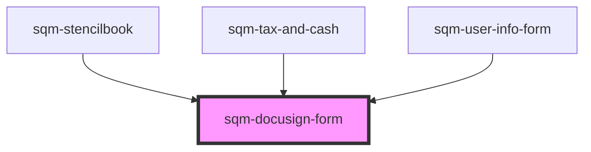

# sqm-docusign-form

<!-- Auto Generated Below -->

## Properties

| Property                                  | Attribute                                     | Description                                                                                          | Type                                                                                                                                                                                                                                                                                                                                                                                                                                                               | Default                                                                                                                                                                                                                              |
| ----------------------------------------- | --------------------------------------------- | ---------------------------------------------------------------------------------------------------- | ------------------------------------------------------------------------------------------------------------------------------------------------------------------------------------------------------------------------------------------------------------------------------------------------------------------------------------------------------------------------------------------------------------------------------------------------------------------ | ------------------------------------------------------------------------------------------------------------------------------------------------------------------------------------------------------------------------------------ |
| `businessEntity`                          | `business-entity`                             | An option for the participant type field. Used to determine which W-8 form is required.              | `string`                                                                                                                                                                                                                                                                                                                                                                                                                                                           | `"I represent a business"`                                                                                                                                                                                                           |
| `demoData`                                | --                                            |                                                                                                      | `{ states?: { step: string; hideSteps: boolean; disabled: boolean; participantTypeDisabled: boolean; loading: boolean; urlLoading: boolean; loadingError: boolean; formState: { participantType: ParticipantType; taxFormExpired: boolean; errors: {}; }; docusignStatus: DocusignStatus; documentType: TaxDocumentType; documentTypeString: string; showExitButton: boolean; showModal: boolean; }; data?: { taxForm: TaxDocumentType; documentUrl: string; }; }` | `undefined`                                                                                                                                                                                                                          |
| `docusignError`                           | `docusign-error`                              | This appears inside the Docusign frame.                                                              | `string`                                                                                                                                                                                                                                                                                                                                                                                                                                                           | `"There was a problem displaying this form. Please refresh the page. If this problem continues, contact our {supportLink}."`                                                                                                         |
| `docusignExpired`                         | `docusign-expired`                            | This appears inside the Docusign frame.                                                              | `string`                                                                                                                                                                                                                                                                                                                                                                                                                                                           | `"For your security and privacy, we automatically end your session after 20 minutes of inactivity. Please refresh and re-enter your tax information to continue."`                                                                   |
| `docusignSessionWarning`                  | `docusign-session-warning`                    | Remind participants their session will time out after 20 minutes of inactivity.                      | `string`                                                                                                                                                                                                                                                                                                                                                                                                                                                           | `"For your security, we automatically end your session when you have not interacted with the form after 20 minutes."`                                                                                                                |
| `exitButton`                              | `exit-button`                                 | Exit button text displayed at the end of the Comply Exchange form flow                               | `string`                                                                                                                                                                                                                                                                                                                                                                                                                                                           | `"Exit"`                                                                                                                                                                                                                             |
| `formStep`                                | `form-step`                                   |                                                                                                      | `string`                                                                                                                                                                                                                                                                                                                                                                                                                                                           | `"Step {step} of {count}"`                                                                                                                                                                                                           |
| `generalErrorDescription`                 | `general-error-description`                   | Part of the alert displayed at the top of the page.                                                  | `string`                                                                                                                                                                                                                                                                                                                                                                                                                                                           | `"Please review your information and try again. If this problem continues, contact our {supportLink}."`                                                                                                                              |
| `generalErrorTitle`                       | `general-error-title`                         | Part of the alert displayed at the top of the page.                                                  | `string`                                                                                                                                                                                                                                                                                                                                                                                                                                                           | `"There was a problem submitting your information"`                                                                                                                                                                                  |
| `individualParticipant`                   | `individual-participant`                      | An option for the participant type field. Used to determine which W-8 form is required.              | `string`                                                                                                                                                                                                                                                                                                                                                                                                                                                           | `"I am an individual participant"`                                                                                                                                                                                                   |
| `loadingErrorAlertDescription`            | `loading-error-alert-description`             | Part of the alert displayed at the top of the page.                                                  | `string`                                                                                                                                                                                                                                                                                                                                                                                                                                                           | `"Please refresh the page and try again. If this problem continues, contact our {supportLink}."`                                                                                                                                     |
| `loadingErrorAlertHeader`                 | `loading-error-alert-header`                  | Part of the alert displayed at the top of the page.                                                  | `string`                                                                                                                                                                                                                                                                                                                                                                                                                                                           | `"There was a problem loading your form"`                                                                                                                                                                                            |
| `modalButtonText`                         | `modal-button-text`                           |                                                                                                      | `string`                                                                                                                                                                                                                                                                                                                                                                                                                                                           | `"I understand"`                                                                                                                                                                                                                     |
| `modalDescription`                        | `modal-description`                           |                                                                                                      | `string`                                                                                                                                                                                                                                                                                                                                                                                                                                                           | `"Ensure the name you enter in your tax form matches the name on your bank account, also known as the beneficiary name.{br}{br}Otherwise you will have to resubmit your form again and there will be delays receiving your payout."` |
| `modalTitle`                              | `modal-title`                                 |                                                                                                      | `string`                                                                                                                                                                                                                                                                                                                                                                                                                                                           | `"Important Note"`                                                                                                                                                                                                                   |
| `participantType`                         | `participant-type`                            |                                                                                                      | `string`                                                                                                                                                                                                                                                                                                                                                                                                                                                           | `"Participant type"`                                                                                                                                                                                                                 |
| `refreshButton`                           | `refresh-button`                              |                                                                                                      | `string`                                                                                                                                                                                                                                                                                                                                                                                                                                                           | `"Refresh Page"`                                                                                                                                                                                                                     |
| `supportLink`                             | `support-link`                                |                                                                                                      | `string`                                                                                                                                                                                                                                                                                                                                                                                                                                                           | `"support team"`                                                                                                                                                                                                                     |
| `taxAndPayoutsDescription`                | `tax-and-payouts-description`                 | Displayed at the top of the page on all set up steps.                                                | `string`                                                                                                                                                                                                                                                                                                                                                                                                                                                           | `"Submit your tax documents and add your banking information to receive your rewards."`                                                                                                                                              |
| `taxForm`                                 | `tax-form`                                    |                                                                                                      | `string`                                                                                                                                                                                                                                                                                                                                                                                                                                                           | `"Tax form"`                                                                                                                                                                                                                         |
| `taxFormDescription`                      | `tax-form-description`                        | Displayed at the top of the page to participants based in the US.                                    | `string`                                                                                                                                                                                                                                                                                                                                                                                                                                                           | `"Participants based in the US need to submit a {documentType} form."`                                                                                                                                                               |
| `taxFormDescriptionBusinessEntity`        | `tax-form-description-business-entity`        | Displayed at the top of the page to participants representing a business.                            | `string`                                                                                                                                                                                                                                                                                                                                                                                                                                                           | `"Participants residing outside of the US who represent a business entity need to submit a {documentType} form."`                                                                                                                    |
| `taxFormDescriptionIndividualParticipant` | `tax-form-description-individual-participant` | Displayed at the top of the page to individuals joining a US program who reside outside the country. | `string`                                                                                                                                                                                                                                                                                                                                                                                                                                                           | `"Participants residing outside of the US, joining the referral program of a US-based company, need to submit a {documentType} form."`                                                                                               |
| `taxFormLabel`                            | `tax-form-label`                              | Display the type of tax form that the participant must submit.                                       | `string`                                                                                                                                                                                                                                                                                                                                                                                                                                                           | `"{documentType} Tax Form"`                                                                                                                                                                                                          |

## Dependencies

### Used by

 - [sqm-stencilbook](../../sqm-stencilbook)
 - [sqm-tax-and-cash](../sqm-tax-and-cash)
 - [sqm-user-info-form](../sqm-user-info-form)

### Graph

----------------------------------------------

*Built with [StencilJS](https://stenciljs.com/)*
