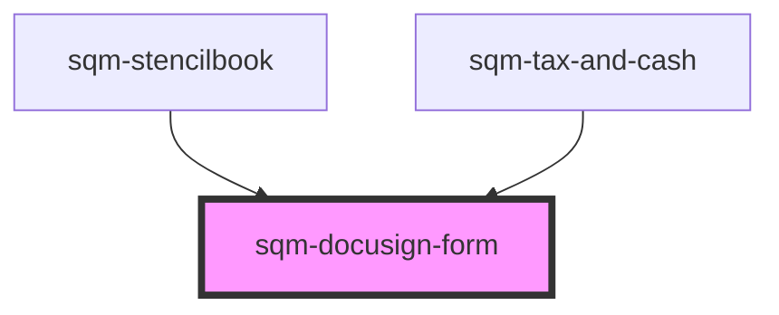

# sqm-docusign-form

<!-- Auto Generated Below -->

## Properties

| Property                                  | Attribute                                     | Description                                                                                                | Type                                                                                                                                                                                                                                                                                                                                                                                                         | Default                                                                                                                                                            |
| ----------------------------------------- | --------------------------------------------- | ---------------------------------------------------------------------------------------------------------- | ------------------------------------------------------------------------------------------------------------------------------------------------------------------------------------------------------------------------------------------------------------------------------------------------------------------------------------------------------------------------------------------------------------ | ------------------------------------------------------------------------------------------------------------------------------------------------------------------ |
| `backButton`                              | `back-button`                                 | Text shown inside of back button                                                                           | `string`                                                                                                                                                                                                                                                                                                                                                                                                     | `"Back"`                                                                                                                                                           |
| `banner`                                  | `banner`                                      | Text shown in the banner above the document                                                                | `string`                                                                                                                                                                                                                                                                                                                                                                                                     | `"For your security, we automatically end your session when you have not interacted with the form after 20 minutes."`                                              |
| `businessEntity`                          | `business-entity`                             | Label text for the business entity radio button                                                            | `string`                                                                                                                                                                                                                                                                                                                                                                                                     | `"I represent a company"`                                                                                                                                          |
| `checkboxDescription`                     | `checkbox-description`                        | Label text for the form submission checkbox                                                                | `string`                                                                                                                                                                                                                                                                                                                                                                                                     | `"I have completed and submitted my tax form"`                                                                                                                     |
| `checkboxLabel`                           | `checkbox-label`                              | Heading text for the form submission checkbox                                                              | `string`                                                                                                                                                                                                                                                                                                                                                                                                     | `"Form submission"`                                                                                                                                                |
| `demoData`                                | --                                            |                                                                                                            | `{ states?: { hideSteps: boolean; disabled: boolean; participantTypeDisabled: boolean; submitDisabled: boolean; loading: boolean; formState: { participantType: ParticipantType; completedTaxForm: boolean; taxFormExpired: boolean; errors: {}; }; docusignStatus: DocusignStatus; documentType: TaxDocumentType; hideBackButton: boolean; }; data?: { taxForm: TaxDocumentType; documentUrl: string; }; }` | `undefined`                                                                                                                                                        |
| `docusignCompleted`                       | `docusign-completed`                          | Text inside iframe when Docusign form is compelted                                                         | `string`                                                                                                                                                                                                                                                                                                                                                                                                     | `"Your document has been completed and submitted."`                                                                                                                |
| `docusignError`                           | `docusign-error`                              | Text inside iframe when Docusign form throws error                                                         | `string`                                                                                                                                                                                                                                                                                                                                                                                                     | `"There was a problem displaying this form. Please refresh the page. If this problem continues, contact Support."`                                                 |
| `docusignExpired`                         | `docusign-expired`                            | Text inside iframe when Docusign expires                                                                   | `string`                                                                                                                                                                                                                                                                                                                                                                                                     | `"For your security and privacy, we automatically end your session after 20 minutes of inactivity. Please refresh and re-enter your tax information to continue."` |
| `formStep`                                | `form-step`                                   | Sub text shown at the top of the page, used to show the current step of the tax form.                      | `string`                                                                                                                                                                                                                                                                                                                                                                                                     | `"Step 3 of 4"`                                                                                                                                                    |
| `formSubmissionError`                     | `form-submission-error`                       | The error message shown at the bottom of the page if the user has not checked the form submission checkbox | `string`                                                                                                                                                                                                                                                                                                                                                                                                     | `"This field is required"`                                                                                                                                         |
| `generalErrorDescription`                 | `general-error-description`                   | The error message shown at the top of the page in an error banner                                          | `string`                                                                                                                                                                                                                                                                                                                                                                                                     | `"Please review your information and try again. If this problem continues, contact Support."`                                                                      |
| `generalErrorTitle`                       | `general-error-title`                         | The title for error message shown at the top of the page in an error banner                                | `string`                                                                                                                                                                                                                                                                                                                                                                                                     | `"There was a problem submitting your information"`                                                                                                                |
| `individualParticipant`                   | `individual-participant`                      | Label text for the individual participant radio button                                                     | `string`                                                                                                                                                                                                                                                                                                                                                                                                     | `"I am an individual participant"`                                                                                                                                 |
| `notBasedInUS`                            | `not-based-in-u-s`                            | Text shown in the link to the form for non US residents                                                    | `string`                                                                                                                                                                                                                                                                                                                                                                                                     | `"Not based in the US?"`                                                                                                                                           |
| `participantType`                         | `participant-type`                            | Heading text for the participant type radio buttons                                                        | `string`                                                                                                                                                                                                                                                                                                                                                                                                     | `"Participant type"`                                                                                                                                               |
| `refreshButton`                           | `refresh-button`                              | Text shown inside of refresh button                                                                        | `string`                                                                                                                                                                                                                                                                                                                                                                                                     | `"Refresh Page"`                                                                                                                                                   |
| `submitButton`                            | `submit-button`                               | Text shown inside of submit button                                                                         | `string`                                                                                                                                                                                                                                                                                                                                                                                                     | `"Continue"`                                                                                                                                                       |
| `taxForm`                                 | `tax-form`                                    | Heading text shown at the top of the page                                                                  | `string`                                                                                                                                                                                                                                                                                                                                                                                                     | `"Tax form"`                                                                                                                                                       |
| `taxFormDescription`                      | `tax-form-description`                        | Subtext shown at the top of the page next to the document type text                                        | `string`                                                                                                                                                                                                                                                                                                                                                                                                     | `"Participants based in the US and partnering with US-based brands need to submit a {documentType} form."`                                                         |
| `taxFormDescriptionBusinessEntity`        | `tax-form-description-business-entity`        | Subtext shown at the top of the page next to the document type text for business entities                  | `string`                                                                                                                                                                                                                                                                                                                                                                                                     | `"Participants residing outside of the US who represent a business entity need to submit a {documentType} form."`                                                  |
| `taxFormDescriptionIndividualParticipant` | `tax-form-description-individual-participant` | Subtext shown at the top of the page next to the document type text for individual participants            | `string`                                                                                                                                                                                                                                                                                                                                                                                                     | `"Participants residing outside of the US, joining the referral program of a US-based company, need to submit a {documentType} form."`                             |
| `taxFormLabel`                            | `tax-form-label`                              | Text shown at the top of the page next to the document type text                                           | `string`                                                                                                                                                                                                                                                                                                                                                                                                     | `"{documentType} Tax Form"`                                                                                                                                        |

## Dependencies

### Used by

 - [sqm-stencilbook](../../sqm-stencilbook)
 - [sqm-tax-and-cash](../sqm-tax-and-cash)

### Graph

----------------------------------------------

*Built with [StencilJS](https://stenciljs.com/)*
