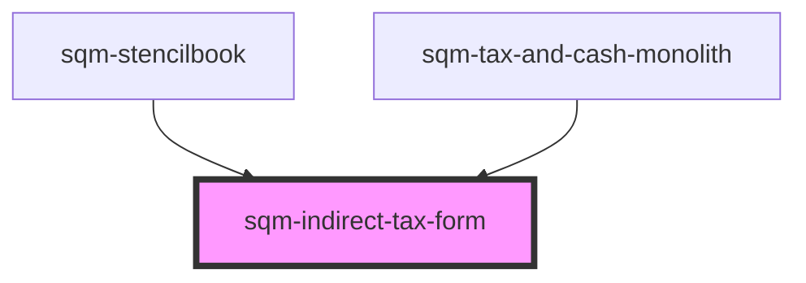

# sqm-indirect-tax-form

<!-- Auto Generated Below -->

## Properties

| Property                        | Attribute                          | Description                                                                           | Type                                                                                                                                                                                                                                                                                                                               | Default                                                                                                                                                                     |
| ------------------------------- | ---------------------------------- | ------------------------------------------------------------------------------------- | ---------------------------------------------------------------------------------------------------------------------------------------------------------------------------------------------------------------------------------------------------------------------------------------------------------------------------------- | --------------------------------------------------------------------------------------------------------------------------------------------------------------------------- |
| `backButton`                    | `back-button`                      | Text shown inside of back button                                                      | `string`                                                                                                                                                                                                                                                                                                                           | `"Back"`                                                                                                                                                                    |
| `demoData`                      | --                                 |                                                                                       | `{ states?: { disabled: boolean; loading: boolean; isPartner: boolean; errors: {}; formState: { checked: "hstCanada" \| "otherRegion" \| "notRegistered"; }; }; data?: { countries: { countryCode: string; displayName: string; }[]; }; refs?: { formRef: Ref<HTMLFormElement>; }; slotProps?: { formState: { errors: {}; }; }; }` | `undefined`                                                                                                                                                                 |
| `formStep`                      | `form-step`                        | Sub text shown at the top of the page, used to show the current step of the tax form. | `string`                                                                                                                                                                                                                                                                                                                           | `"Step 2 of 4"`                                                                                                                                                             |
| `generalErrorDescription`       | `general-error-description`        | The error message shown at the top of the page in an error banner                     | `string`                                                                                                                                                                                                                                                                                                                           | `"Please review your information and try again. If this problem continues, contact Support."`                                                                               |
| `generalErrorTitle`             | `general-error-title`              | The title for error message shown at the top of the page in an error banner           | `string`                                                                                                                                                                                                                                                                                                                           | `"There was a problem submitting your information"`                                                                                                                         |
| `hstCanada`                     | `hst-canada`                       | Label text for the HST Canada radio button                                            | `string`                                                                                                                                                                                                                                                                                                                           | `"I am registered for HST in Canada"`                                                                                                                                       |
| `indirectTax`                   | `indirect-tax`                     | Heading text shown at the top of the page                                             | `string`                                                                                                                                                                                                                                                                                                                           | `"Indirect Tax"`                                                                                                                                                            |
| `indirectTaxDescription`        | `indirect-tax-description`         | Subtext shown at the top of the page                                                  | `string`                                                                                                                                                                                                                                                                                                                           | `"Indirect Taxes (e.g. VAT, HST, GST) are transactional based taxes that are required to be levied by service providers by most tax authorities."`                          |
| `indirectTaxDetails`            | `indirect-tax-details`             | Heading text shown above the tax details radio buttons                                | `string`                                                                                                                                                                                                                                                                                                                           | `"Indirect Tax Details"`                                                                                                                                                    |
| `indirectTaxDetailsDescription` | `indirect-tax-details-description` | Sub text shown above the tax details radio buttons                                    | `string`                                                                                                                                                                                                                                                                                                                           | `"Not sure if you are registered for indirect tax? Contact our Support team to find out more."`                                                                             |
| `indirectTaxNumber`             | `indirect-tax-number`              | Label text for the Indirect Tax Number input                                          | `string`                                                                                                                                                                                                                                                                                                                           | `"Indirect Tax"`                                                                                                                                                            |
| `indirectTaxNumberError`        | `indirect-tax-number-error`        | Error text shown below the Indirect Tax Number select input                           | `string`                                                                                                                                                                                                                                                                                                                           | `"Indirect Tax is required"`                                                                                                                                                |
| `isPartnerAlertDescription`     | `is-partner-alert-description`     | Alert description text shown in alert if user is already a registered partner         | `string`                                                                                                                                                                                                                                                                                                                           | `"If you don’t recognize this referral program provider or believe this is a mistake, please contact Support or sign up for this referral program with a different email."` |
| `isPartnerAlertHeader`          | `is-partner-alert-header`          | Alert header text shown in alert if user is already a registered partner              | `string`                                                                                                                                                                                                                                                                                                                           | `"An account with this email already exists with our referral program provider, impact.com"`                                                                                |
| `notRegistered`                 | `not-registered`                   | Label text for the not registered radio button                                        | `string`                                                                                                                                                                                                                                                                                                                           | `"I am not registered for Indirect Tax"`                                                                                                                                    |
| `otherRegion`                   | `other-region`                     | Label text for the other region radio button                                          | `string`                                                                                                                                                                                                                                                                                                                           | `"I am registered for Indirect Tax in a different Country / Region"`                                                                                                        |
| `province`                      | `province`                         | Label text for the Province select input                                              | `string`                                                                                                                                                                                                                                                                                                                           | `"Province"`                                                                                                                                                                |
| `provinceError`                 | `province-error`                   | Error text shown below the Selected Region select input                               | `string`                                                                                                                                                                                                                                                                                                                           | `"Province is required"`                                                                                                                                                    |
| `selectedRegion`                | `selected-region`                  | Label text for the Selected Region select input                                       | `string`                                                                                                                                                                                                                                                                                                                           | `"Country / Region of Indirect Tax"`                                                                                                                                        |
| `selectedRegionError`           | `selected-region-error`            | Error text shown below the Selected Region select input                               | `string`                                                                                                                                                                                                                                                                                                                           | `"Country is required"`                                                                                                                                                     |
| `submitButton`                  | `submit-button`                    | Text shown inside of submit button                                                    | `string`                                                                                                                                                                                                                                                                                                                           | `"Continue"`                                                                                                                                                                |
| `taxDetailsError`               | `tax-details-error`                | Error text shown below the tax details radio buttons                                  | `string`                                                                                                                                                                                                                                                                                                                           | `"This field is required"`                                                                                                                                                  |
| `vatNumber`                     | `vat-number`                       | Label text for the VAT Number input                                                   | `string`                                                                                                                                                                                                                                                                                                                           | `"VAT number"`                                                                                                                                                              |
| `vatNumberError`                | `vat-number-error`                 | Error text shown below the VAT Number input                                           | `string`                                                                                                                                                                                                                                                                                                                           | `"VAT number is required"`                                                                                                                                                  |

## Dependencies

### Used by

 - [sqm-stencilbook](../../sqm-stencilbook)
 - [sqm-tax-and-cash-monolith](../../sqm-tax-and-cash-monolith)

### Graph

----------------------------------------------

*Built with [StencilJS](https://stenciljs.com/)*
