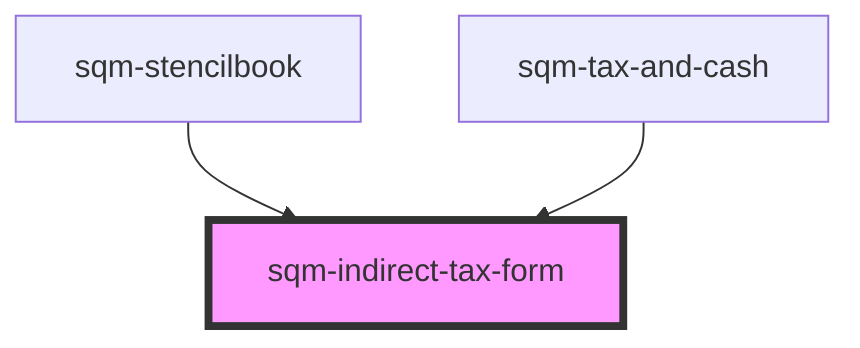

# sqm-indirect-tax-form

<!-- Auto Generated Below -->

## Properties

| Property                         | Attribute                             | Description                                                                                        | Type                                                                                                                                                                                                                                                                                                                                                                                                                                                                                                                                                                                                                                                                                            | Default                                                                                                                                                                                                                  |
| -------------------------------- | ------------------------------------- | -------------------------------------------------------------------------------------------------- | ----------------------------------------------------------------------------------------------------------------------------------------------------------------------------------------------------------------------------------------------------------------------------------------------------------------------------------------------------------------------------------------------------------------------------------------------------------------------------------------------------------------------------------------------------------------------------------------------------------------------------------------------------------------------------------------------- | ------------------------------------------------------------------------------------------------------------------------------------------------------------------------------------------------------------------------ |
| `backButton`                     | `back-button`                         | Text for the back button in the form                                                               | `string`                                                                                                                                                                                                                                                                                                                                                                                                                                                                                                                                                                                                                                                                                        | `"Back"`                                                                                                                                                                                                                 |
| `cannotChangeInfoAlert`          | `cannot-change-info-alert`            | Alert text indicating participant cannot change info after it has been submitted                   | `string`                                                                                                                                                                                                                                                                                                                                                                                                                                                                                                                                                                                                                                                                                        | `"Changes to your personal information and indirect tax can only be made through our Support team after you complete this step. Ensure these are correct before continuing."`                                            |
| `demoData`                       | --                                    |                                                                                                    | `{ states?: { hideSteps: boolean; disabled: boolean; loading: boolean; isPartner: boolean; formState: { checked: "hstCanada" \| "otherRegion" \| "notRegistered"; errors: {}; }; }; data?: { esRegions: { regionCode: string; taxType: string; displayName: string; }[]; countries: TaxCountry[]; provinces: { provinceCode: string; taxType: string; displayName: string; }[]; }; refs?: { formRef: Ref<HTMLFormElement>; }; slotProps?: { formState: { selectedRegion?: string; subRegion?: string; subRegionTaxNumber?: string; qstNumber?: string; province?: string; indirectTaxNumber?: number; hasQst?: boolean; hasSubRegionTaxNumber?: boolean; errors?: any; error?: string; }; }; }` | `undefined`                                                                                                                                                                                                              |
| `formStep`                       | `form-step`                           | Subtext shown at the top of the page, used to show the current step of the tax form.               | `string`                                                                                                                                                                                                                                                                                                                                                                                                                                                                                                                                                                                                                                                                                        | `"Step 2 of 4"`                                                                                                                                                                                                          |
| `generalErrorDescription`        | `general-error-description`           | Description text for a general form submission error                                               | `string`                                                                                                                                                                                                                                                                                                                                                                                                                                                                                                                                                                                                                                                                                        | `"Please review your information and try again. If this problem continues, contact Support."`                                                                                                                            |
| `generalErrorTitle`              | `general-error-title`                 | Title text for a general form submission error                                                     | `string`                                                                                                                                                                                                                                                                                                                                                                                                                                                                                                                                                                                                                                                                                        | `"There was a problem submitting your information"`                                                                                                                                                                      |
| `indirectTax`                    | `indirect-tax`                        | Heading text shown at the top of the page                                                          | `string`                                                                                                                                                                                                                                                                                                                                                                                                                                                                                                                                                                                                                                                                                        | `"Indirect Tax"`                                                                                                                                                                                                         |
| `indirectTaxDescription`         | `indirect-tax-description`            | Text shown at the top of the page below to the indirect tax header                                 | `string`                                                                                                                                                                                                                                                                                                                                                                                                                                                                                                                                                                                                                                                                                        | `"Indirect taxes (e.g. VAT, HST, GST) are transactional based taxes collected by business and retailers on behalf of governments. Any rewards you receive may be subject to indirect taxes based on your country."`      |
| `indirectTaxDetails`             | `indirect-tax-details`                | Heading text for the indirect tax details section                                                  | `string`                                                                                                                                                                                                                                                                                                                                                                                                                                                                                                                                                                                                                                                                                        | `"Indirect Tax Details"`                                                                                                                                                                                                 |
| `indirectTaxDetailsDescription`  | `indirect-tax-details-description`    | Text shown below the indirect tax details heading text                                             | `string`                                                                                                                                                                                                                                                                                                                                                                                                                                                                                                                                                                                                                                                                                        | `"If you represent a business entity, you may be registered for indirect tax. If you are based in the US you are most likely not registered. Not sure if you’re registered? Contact our Support team to find out more."` |
| `indirectTaxNumber`              | `indirect-tax-number`                 | Label text for the indirect tax number input with a dynamic placeholder based on tax type          | `string`                                                                                                                                                                                                                                                                                                                                                                                                                                                                                                                                                                                                                                                                                        | `"{taxType, select, GST {GST Number} HST {HST Number} VAT {VAT Number} CT {CT Number} SST {SST Number} GENERAL {Indirect Tax Number}}"`                                                                                  |
| `indirectTaxNumberError`         | `indirect-tax-number-error`           | Error message for the indirect tax number input field with a dynamic placeholder based on tax type | `string`                                                                                                                                                                                                                                                                                                                                                                                                                                                                                                                                                                                                                                                                                        | `"{taxType, select, GST {GST Number} HST {HST Number} VAT {VAT Number} CT {CT Number} SST {SST Number} GENERAL {Indirect Tax Number}} is required"`                                                                      |
| `isPartnerAlertDescription`      | `is-partner-alert-description`        | Description text for the alert when the user is identified as a partner                            | `string`                                                                                                                                                                                                                                                                                                                                                                                                                                                                                                                                                                                                                                                                                        | `"If you don’t recognize this referral program provider or believe this is a mistake, please contact Support or sign up for this referral program with a different email."`                                              |
| `isPartnerAlertHeader`           | `is-partner-alert-header`             | Header text for the alert when the user is identified as a partner                                 | `string`                                                                                                                                                                                                                                                                                                                                                                                                                                                                                                                                                                                                                                                                                        | `"An account with this email already exists with our referral program provider, impact.com"`                                                                                                                             |
| `isRegisteredQST`                | `is-registered-q-s-t`                 | Text for the option indicating registration for QST tax                                            | `string`                                                                                                                                                                                                                                                                                                                                                                                                                                                                                                                                                                                                                                                                                        | `"I am registered for QST Tax"`                                                                                                                                                                                          |
| `isRegisteredSubRegionIncomeTax` | `is-registered-sub-region-income-tax` | Text for the option indicating registration for sub-region income tax                              | `string`                                                                                                                                                                                                                                                                                                                                                                                                                                                                                                                                                                                                                                                                                        | `"I am an individual registered for Income Tax purposes in Spain, and withholding tax will apply to any payments made to me."`                                                                                           |
| `notRegistered`                  | `not-registered`                      | Text for the option indicating not being registered for indirect tax                               | `string`                                                                                                                                                                                                                                                                                                                                                                                                                                                                                                                                                                                                                                                                                        | `"I am not registered for Indirect Tax"`                                                                                                                                                                                 |
| `otherRegion`                    | `other-region`                        | Text for the option indicating registration for indirect tax in a different region                 | `string`                                                                                                                                                                                                                                                                                                                                                                                                                                                                                                                                                                                                                                                                                        | `"I am registered for Indirect Tax in a different Country / Region"`                                                                                                                                                     |
| `province`                       | `province`                            | Label text for the province input                                                                  | `string`                                                                                                                                                                                                                                                                                                                                                                                                                                                                                                                                                                                                                                                                                        | `"Province"`                                                                                                                                                                                                             |
| `provinceError`                  | `province-error`                      | Error message for the province input field                                                         | `string`                                                                                                                                                                                                                                                                                                                                                                                                                                                                                                                                                                                                                                                                                        | `"Province is required"`                                                                                                                                                                                                 |
| `qstNumber`                      | `qst-number`                          | Label text for the QST number input field                                                          | `string`                                                                                                                                                                                                                                                                                                                                                                                                                                                                                                                                                                                                                                                                                        | `"QST Number"`                                                                                                                                                                                                           |
| `qstTaxNumberError`              | `qst-tax-number-error`                | Error message for the QST tax number input field                                                   | `string`                                                                                                                                                                                                                                                                                                                                                                                                                                                                                                                                                                                                                                                                                        | `"QST Number is required"`                                                                                                                                                                                               |
| `selectedRegion`                 | `selected-region`                     | Label text for the country/region select input                                                     | `string`                                                                                                                                                                                                                                                                                                                                                                                                                                                                                                                                                                                                                                                                                        | `"Country / Region of Indirect Tax"`                                                                                                                                                                                     |
| `selectedRegionError`            | `selected-region-error`               | Error message for the selected region input field                                                  | `string`                                                                                                                                                                                                                                                                                                                                                                                                                                                                                                                                                                                                                                                                                        | `"Country is required"`                                                                                                                                                                                                  |
| `subRegion`                      | `sub-region`                          | Label text for the sub-region input field                                                          | `string`                                                                                                                                                                                                                                                                                                                                                                                                                                                                                                                                                                                                                                                                                        | `"Sub-region"`                                                                                                                                                                                                           |
| `subRegionError`                 | `sub-region-error`                    | Error message for the sub-region input field                                                       | `string`                                                                                                                                                                                                                                                                                                                                                                                                                                                                                                                                                                                                                                                                                        | `"Sub-region is required"`                                                                                                                                                                                               |
| `subRegionTaxNumberError`        | `sub-region-tax-number-error`         | Error message for the sub-region tax number input field                                            | `string`                                                                                                                                                                                                                                                                                                                                                                                                                                                                                                                                                                                                                                                                                        | `"Income Tax Number is required"`                                                                                                                                                                                        |
| `subRegionTaxNumberLabel`        | `sub-region-tax-number-label`         | Label text for the sub-region tax number input field                                               | `string`                                                                                                                                                                                                                                                                                                                                                                                                                                                                                                                                                                                                                                                                                        | `"Income Tax Number"`                                                                                                                                                                                                    |
| `submitButton`                   | `submit-button`                       | Text for the continue button in the form                                                           | `string`                                                                                                                                                                                                                                                                                                                                                                                                                                                                                                                                                                                                                                                                                        | `"Continue"`                                                                                                                                                                                                             |
| `taxDetailsError`                | `tax-details-error`                   | Error message for the tax details input field                                                      | `string`                                                                                                                                                                                                                                                                                                                                                                                                                                                                                                                                                                                                                                                                                        | `"This field is required"`                                                                                                                                                                                               |

## Dependencies

### Used by

 - [sqm-stencilbook](../../sqm-stencilbook)
 - [sqm-tax-and-cash](../sqm-tax-and-cash)

### Graph

----------------------------------------------

*Built with [StencilJS](https://stenciljs.com/)*
