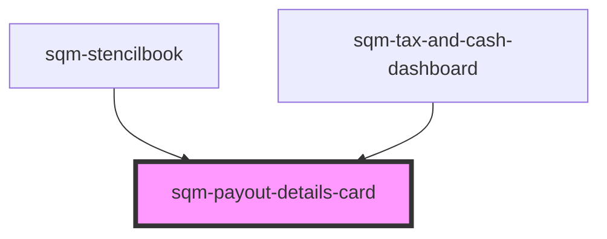

# sqm-payout-details-card

<!-- Auto Generated Below -->

## Properties

| Property                | Attribute                  | Description | Type                                      | Default     |
| ----------------------- | -------------------------- | ----------- | ----------------------------------------- | ----------- |
| `demoData`              | --                         |             | `{ [x: string]: any; [x: number]: any; }` | `undefined` |
| `nextPayoutBalanceText` | `next-payout-balance-text` |             | `"Next payout occurs when balance is"`    | `undefined` |

## Dependencies

### Used by

 - [sqm-stencilbook](../../sqm-stencilbook)
 - [sqm-tax-and-cash-dashboard](../sqm-tax-and-cash-dashboard)

### Graph

----------------------------------------------

*Built with [StencilJS](https://stenciljs.com/)*
