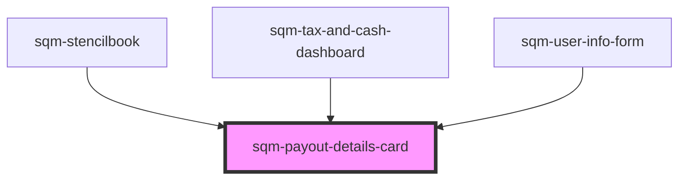

# sqm-payout-details-card

<!-- Auto Generated Below -->

## Properties

| Property               | Attribute                | Description                                                                  | Type                                      | Default                                                                                                                                                                                                                                             |
| ---------------------- | ------------------------ | ---------------------------------------------------------------------------- | ----------------------------------------- | --------------------------------------------------------------------------------------------------------------------------------------------------------------------------------------------------------------------------------------------------- |
| `accountText`          | `account-text`           | Text shown before account number                                             | `string`                                  | `"Account"`                                                                                                                                                                                                                                         |
| `demoData`             | --                       |                                                                              | `{ [x: string]: any; [x: number]: any; }` | `undefined`                                                                                                                                                                                                                                         |
| `errorDescriptionText` | `error-description-text` | Error alert description shown above payout details card                      | `string`                                  | `"If you’ve recently added your payout information, please wait while we verify your information. If it’s still on hold after a few days, please contact Support or check your inbox for an email from our referral program provider, impact.com."` |
| `errorTitleText`       | `error-title-text`       | Error alert header shown above payout details card                           | `string`                                  | `"Your payout is on hold "`                                                                                                                                                                                                                         |
| `statusBadgeText`      | `status-badge-text`      | Badge text indicating payout status                                          | `string`                                  | `"{badgeText, select, payoutToday {Payout Today} nextPayout {Next Payout} }"`                                                                                                                                                                       |
| `thresholdPayoutText`  | `threshold-payout-text`  | Text shown above current balance indicating required balance for next payout | `string`                                  | `"Next payout occurs when balance is {thresholdBalance}"`                                                                                                                                                                                           |

## Dependencies

### Used by

 - [sqm-stencilbook](../../sqm-stencilbook)
 - [sqm-tax-and-cash-dashboard](../sqm-tax-and-cash-dashboard)
 - [sqm-user-info-form](../sqm-user-info-form)

### Graph

----------------------------------------------

*Built with [StencilJS](https://stenciljs.com/)*
