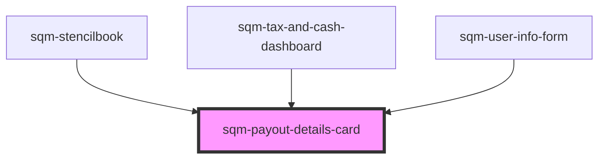

# sqm-payout-details-card

<!-- Auto Generated Below -->

## Properties

| Property                       | Attribute                         | Description                                                                                                                    | Type                                      | Default                                                                       |
| ------------------------------ | --------------------------------- | ------------------------------------------------------------------------------------------------------------------------------ | ----------------------------------------- | ----------------------------------------------------------------------------- |
| `accountText`                  | `account-text`                    | Shown before the participant’s bank account information.                                                                       | `string`                                  | `"Account"`                                                                   |
| `demoData`                     | --                                |                                                                                                                                | `{ [x: string]: any; [x: number]: any; }` | `undefined`                                                                   |
| `payoutMissingInformationText` | `payout-missing-information-text` | Text displayed for existing publishers that do not have saved banking information.                                             | `string`                                  | `"Missing banking information, go to Impact.com to resolve."`                 |
| `statusBadgeText`              | `status-badge-text`               | Badge text indicating payout status                                                                                            | `string`                                  | `"{badgeText, select, payoutToday {Payout Today} nextPayout {Next Payout} }"` |
| `thresholdPayoutText`          | `threshold-payout-text`           | Display participants' payout preference on the payout information card, indicating the balance at which they want to get paid. | `string`                                  | `"Next payout occurs when balance is {thresholdBalance}"`                     |

## Dependencies

### Used by

 - [sqm-stencilbook](../../sqm-stencilbook)
 - [sqm-tax-and-cash-dashboard](../sqm-tax-and-cash-dashboard)
 - [sqm-user-info-form](../sqm-user-info-form)

### Graph

----------------------------------------------

*Built with [StencilJS](https://stenciljs.com/)*
