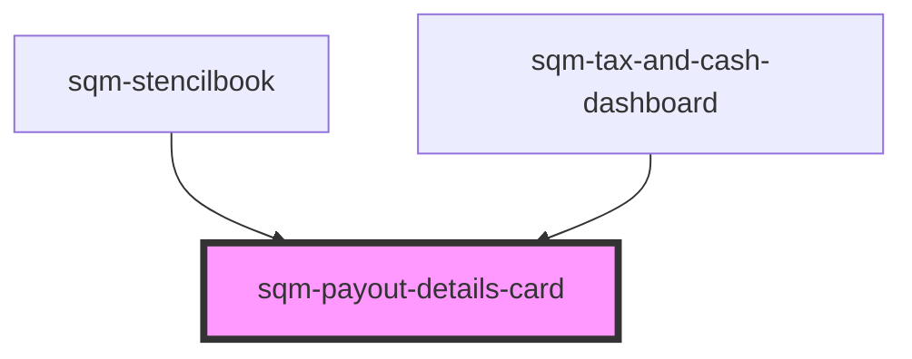

# sqm-payout-details-card

<!-- Auto Generated Below -->

## Properties

| Property               | Attribute                | Description | Type                                                                                              | Default     |
| ---------------------- | ------------------------ | ----------- | ------------------------------------------------------------------------------------------------- | ----------- |
| `accountText`          | `account-text`           |             | `"Account"`                                                                                       | `undefined` |
| `demoData`             | --                       |             | `{ [x: string]: any; [x: number]: any; }`                                                         | `undefined` |
| `errorDescriptionText` | `error-description-text` |             | `"Please ensure your payout information is correct. If this problem continues, contact Support."` | `undefined` |
| `errorTitleText`       | `error-title-text`       |             | `"There was an error with your payout infomation"`                                                | `undefined` |
| `otherCurrenciesText`  | `other-currencies-text`  |             | `"other currencies"`                                                                              | `undefined` |
| `statusBadgeText`      | `status-badge-text`      |             | `"{badgeText, select, payoutToday {Payout Today} nextPayout {Next Payout} }"`                     | `undefined` |
| `thresholdPayoutText`  | `threshold-payout-text`  |             | `"Next payout occurs when balance is"`                                                            | `undefined` |
| `w9PendingText`        | `w-9-pending-text`       |             | `"Awaiting W-9 tax form"`                                                                         | `undefined` |

## Dependencies

### Used by

 - [sqm-stencilbook](../../sqm-stencilbook)
 - [sqm-tax-and-cash-dashboard](../sqm-tax-and-cash-dashboard)

### Graph

----------------------------------------------

*Built with [StencilJS](https://stenciljs.com/)*
