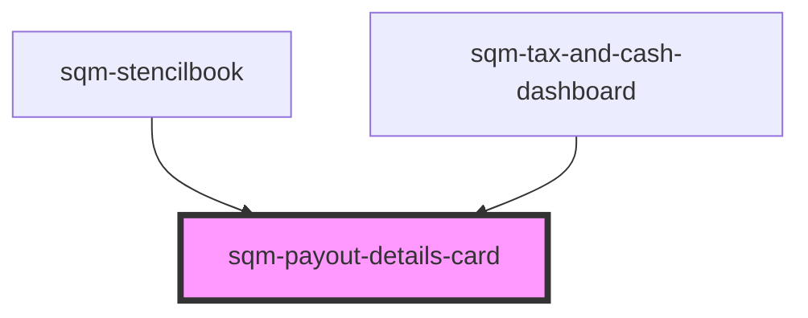

# sqm-payout-details-card

<!-- Auto Generated Below -->

## Properties

| Property               | Attribute                | Description | Type                                      | Default                                                                                           |
| ---------------------- | ------------------------ | ----------- | ----------------------------------------- | ------------------------------------------------------------------------------------------------- |
| `accountText`          | `account-text`           |             | `string`                                  | `"Account"`                                                                                       |
| `demoData`             | --                       |             | `{ [x: string]: any; [x: number]: any; }` | `undefined`                                                                                       |
| `errorDescriptionText` | `error-description-text` |             | `string`                                  | `"Please ensure your payout information is correct. If this problem continues, contact Support."` |
| `errorTitleText`       | `error-title-text`       |             | `string`                                  | `"There was an error with your payout infomation"`                                                |
| `statusBadgeText`      | `status-badge-text`      |             | `string`                                  | `"{badgeText, select, payoutToday {Payout Today} nextPayout {Next Payout} }"`                     |
| `thresholdPayoutText`  | `threshold-payout-text`  |             | `string`                                  | `"Next payout occurs when balance is {thresholdBalance}"`                                         |

## Dependencies

### Used by

 - [sqm-stencilbook](../../sqm-stencilbook)
 - [sqm-tax-and-cash-dashboard](../sqm-tax-and-cash-dashboard)

### Graph

----------------------------------------------

*Built with [StencilJS](https://stenciljs.com/)*
