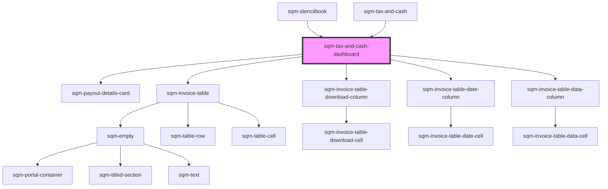

# sqm-tax-document-submitted

<!-- Auto Generated Below -->

## Properties

| Property                                  | Attribute                                    | Description                                                                                                                    | Type                                                                                                                                                                                                                                                                                                                                                                                                                                                                                                                                                                                               | Default                                                                                                                                                                                                                   |
| ----------------------------------------- | -------------------------------------------- | ------------------------------------------------------------------------------------------------------------------------------ | -------------------------------------------------------------------------------------------------------------------------------------------------------------------------------------------------------------------------------------------------------------------------------------------------------------------------------------------------------------------------------------------------------------------------------------------------------------------------------------------------------------------------------------------------------------------------------------------------- | ------------------------------------------------------------------------------------------------------------------------------------------------------------------------------------------------------------------------- |
| `accountText`                             | `account-text`                               | Shown before the participant’s bank account information.                                                                       | `string`                                                                                                                                                                                                                                                                                                                                                                                                                                                                                                                                                                                           | `"Account"`                                                                                                                                                                                                               |
| `badgeTextAwaitingReview`                 | `badge-text-awaiting-review`                 | Additional text displayed next to the tax form's status badge.                                                                 | `string`                                                                                                                                                                                                                                                                                                                                                                                                                                                                                                                                                                                           | `"Awaiting review. Submitted on {dateSubmitted}."`                                                                                                                                                                        |
| `badgeTextSubmittedOn`                    | `badge-text-submitted-on`                    | Additional text displayed next to the tax form's status badge                                                                  | `string`                                                                                                                                                                                                                                                                                                                                                                                                                                                                                                                                                                                           | `"Submitted on {dateSubmitted}."`                                                                                                                                                                                         |
| `badgeTextSubmittedOnW8`                  | `badge-text-submitted-on-w-8`                | Additional text displayed next to the tax form's status badge.                                                                 | `string`                                                                                                                                                                                                                                                                                                                                                                                                                                                                                                                                                                                           | `"Submitted on {dateSubmitted}. Valid for three years after submission."`                                                                                                                                                 |
| `bankingInformationSectionHeader`         | `banking-information-section-header`         |                                                                                                                                | `string`                                                                                                                                                                                                                                                                                                                                                                                                                                                                                                                                                                                           | `"Payout information"`                                                                                                                                                                                                    |
| `cancelButton`                            | `cancel-button`                              |                                                                                                                                | `string`                                                                                                                                                                                                                                                                                                                                                                                                                                                                                                                                                                                           | `"Cancel"`                                                                                                                                                                                                                |
| `dateColumnTitle`                         | `date-column-title`                          | Part of the Invoice table displayed at the bottom of the page.                                                                 | `string`                                                                                                                                                                                                                                                                                                                                                                                                                                                                                                                                                                                           | `"Date"`                                                                                                                                                                                                                  |
| `demoData`                                | --                                           |                                                                                                                                | `{ states?: { status?: string; documentType: TaxDocumentType; documentTypeString: string; canEditPayoutInfo: boolean; disabled?: boolean; dateSubmitted?: string; noFormNeeded?: boolean; indirectTaxType?: string; qstNumber?: string; subRegionTaxNumber?: string; subRegion?: string; indirectTaxNumber?: string; province?: string; country?: string; notRegistered?: boolean; isBusinessEntity?: boolean; loading?: boolean; loadingError?: boolean; showNewFormDialog: boolean; hasHold: boolean; payoutStatus: PayoutStatus; veriffLoading: boolean; errors?: { general?: boolean; }; }; }` | `undefined`                                                                                                                                                                                                               |
| `earningsAfterTaxColumnTitle`             | `earnings-after-tax-column-title`            | Part of the Invoice table displayed at the bottom of the page.                                                                 | `string`                                                                                                                                                                                                                                                                                                                                                                                                                                                                                                                                                                                           | `"Earnings after tax"`                                                                                                                                                                                                    |
| `earningsColumnTitle`                     | `earnings-column-title`                      | Part of the Invoice table displayed at the bottom of the page.                                                                 | `string`                                                                                                                                                                                                                                                                                                                                                                                                                                                                                                                                                                                           | `"Earnings"`                                                                                                                                                                                                              |
| `editPaymentInformationButton`            | `edit-payment-information-button`            |                                                                                                                                | `string`                                                                                                                                                                                                                                                                                                                                                                                                                                                                                                                                                                                           | `"Edit Payout Information"`                                                                                                                                                                                               |
| `generalErrorDescription`                 | `general-error-description`                  | Part of the alert displayed at the top of the page.                                                                            | `string`                                                                                                                                                                                                                                                                                                                                                                                                                                                                                                                                                                                           | `"Please review your information and try again. If this problem continues, contact our {supportLink}."`                                                                                                                   |
| `generalErrorTitle`                       | `general-error-title`                        | Part of the alert displayed at the top of the page.                                                                            | `string`                                                                                                                                                                                                                                                                                                                                                                                                                                                                                                                                                                                           | `"There was a problem submitting your information"`                                                                                                                                                                       |
| `indirectTaxColumnTitle`                  | `indirect-tax-column-title`                  | Part of the Invoice table displayed at the bottom of the page.                                                                 | `string`                                                                                                                                                                                                                                                                                                                                                                                                                                                                                                                                                                                           | `"Indirect tax"`                                                                                                                                                                                                          |
| `indirectTaxDetails`                      | `indirect-tax-details`                       | Displayed to participants who have submitted their indirect tax information.                                                   | `string`                                                                                                                                                                                                                                                                                                                                                                                                                                                                                                                                                                                           | `"{indirectTaxType} number: {indirectTaxNumber}"`                                                                                                                                                                         |
| `indirectTaxInfoCanada`                   | `indirect-tax-info-canada`                   | If the participant is registered for indirect tax in Canada, display the province they’re registered in.                       | `string`                                                                                                                                                                                                                                                                                                                                                                                                                                                                                                                                                                                           | `"Registered in {province}, {country}"`                                                                                                                                                                                   |
| `indirectTaxInfoOtherCountry`             | `indirect-tax-info-other-country`            | If the participant is registered for indirect tax, display the country they’re registered in.                                  | `string`                                                                                                                                                                                                                                                                                                                                                                                                                                                                                                                                                                                           | `"Registered in {country}"`                                                                                                                                                                                               |
| `indirectTaxInfoSectionHeader`            | `indirect-tax-info-section-header`           |                                                                                                                                | `string`                                                                                                                                                                                                                                                                                                                                                                                                                                                                                                                                                                                           | `"Indirect tax"`                                                                                                                                                                                                          |
| `indirectTaxInfoSpain`                    | `indirect-tax-info-spain`                    | If the participant is registered for indirect tax in Spain, display the region they’re registered in.                          | `string`                                                                                                                                                                                                                                                                                                                                                                                                                                                                                                                                                                                           | `"Registered in {country}, {subRegion}"`                                                                                                                                                                                  |
| `indirectTaxTooltipSupport`               | `indirect-tax-tooltip-support`               |                                                                                                                                | `string`                                                                                                                                                                                                                                                                                                                                                                                                                                                                                                                                                                                           | `"To make changes to your indirect tax information, please contact our Support team."`                                                                                                                                    |
| `invalidForm`                             | `invalid-form`                               | Additional text displayed next to the tax form's status badge.                                                                 | `string`                                                                                                                                                                                                                                                                                                                                                                                                                                                                                                                                                                                           | `"Make sure your information is correct and submit new form."`                                                                                                                                                            |
| `invoiceColumnTitle`                      | `invoice-column-title`                       | Part of the Invoice table displayed at the bottom of the page.                                                                 | `string`                                                                                                                                                                                                                                                                                                                                                                                                                                                                                                                                                                                           | `"Invoice"`                                                                                                                                                                                                               |
| `invoiceDescription`                      | `invoice-description`                        |                                                                                                                                | `string`                                                                                                                                                                                                                                                                                                                                                                                                                                                                                                                                                                                           | `"View and download your invoices to report your earnings and stay tax compliant."`                                                                                                                                       |
| `invoiceEmptyStateHeader`                 | `invoice-empty-state-header`                 |                                                                                                                                | `string`                                                                                                                                                                                                                                                                                                                                                                                                                                                                                                                                                                                           | `"View your invoice details"`                                                                                                                                                                                             |
| `invoiceEmptyStateText`                   | `invoice-empty-state-text`                   |                                                                                                                                | `string`                                                                                                                                                                                                                                                                                                                                                                                                                                                                                                                                                                                           | `"Refer a friend to view the status of your invoices and rewards earned"`                                                                                                                                                 |
| `invoiceHeader`                           | `invoice-header`                             |                                                                                                                                | `string`                                                                                                                                                                                                                                                                                                                                                                                                                                                                                                                                                                                           | `"Invoices"`                                                                                                                                                                                                              |
| `invoiceMoreLabel`                        | `invoice-more-label`                         |                                                                                                                                | `string`                                                                                                                                                                                                                                                                                                                                                                                                                                                                                                                                                                                           | `"Next"`                                                                                                                                                                                                                  |
| `invoicePrevLabel`                        | `invoice-prev-label`                         |                                                                                                                                | `string`                                                                                                                                                                                                                                                                                                                                                                                                                                                                                                                                                                                           | `"Prev"`                                                                                                                                                                                                                  |
| `loadingErrorAlertDescription`            | `loading-error-alert-description`            | Part of the alert displayed at the top of the page.                                                                            | `string`                                                                                                                                                                                                                                                                                                                                                                                                                                                                                                                                                                                           | `"Please refresh the page and try again. If this problem continues, contact our {supportLink}."`                                                                                                                          |
| `loadingErrorAlertHeader`                 | `loading-error-alert-header`                 | Part of the alert displayed at the top of the page.                                                                            | `string`                                                                                                                                                                                                                                                                                                                                                                                                                                                                                                                                                                                           | `"There was a problem loading your form"`                                                                                                                                                                                 |
| `newFormButton`                           | `new-form-button`                            |                                                                                                                                | `string`                                                                                                                                                                                                                                                                                                                                                                                                                                                                                                                                                                                           | `"Submit new form"`                                                                                                                                                                                                       |
| `noFormNeededSubtext`                     | `no-form-needed-subtext`                     | No other statuses or badges will be displayed in the tax form section in this case.                                            | `string`                                                                                                                                                                                                                                                                                                                                                                                                                                                                                                                                                                                           | `"Tax documents are only required if you are based in the US or joining the referral program of a US based brand."`                                                                                                       |
| `notRegisteredForTax`                     | `not-registered-for-tax`                     |                                                                                                                                | `string`                                                                                                                                                                                                                                                                                                                                                                                                                                                                                                                                                                                           | `"Not registered for indirect tax. If you’ve previously registered with your tax authority, contact our {supportLink} to add your information to stay tax compliant."`                                                    |
| `payoutFromImpact`                        | `payout-from-impact`                         | Displayed under the payout details card.                                                                                       | `string`                                                                                                                                                                                                                                                                                                                                                                                                                                                                                                                                                                                           | `"Your balance may take up to 24 hours to update. Payouts will be sent from our referral program provider, impact.com."`                                                                                                  |
| `payoutHoldAlertDescription`              | `payout-hold-alert-description`              | Part of the alert displayed at the top of the page when there’s been an issue preventing payouts.                              | `string`                                                                                                                                                                                                                                                                                                                                                                                                                                                                                                                                                                                           | `"Please contact our {supportLink} or check your inbox for an email from our referral program provider, impact.com."`                                                                                                     |
| `payoutHoldAlertHeader`                   | `payout-hold-alert-header`                   | Part of the alert displayed at the top of the page when there’s been an issue preventing payouts.                              | `string`                                                                                                                                                                                                                                                                                                                                                                                                                                                                                                                                                                                           | `"Your payout is on hold"`                                                                                                                                                                                                |
| `payoutMissingInformationText`            | `payout-missing-information-text`            | Text displayed for existing publishers that do not have saved banking information.                                             | `string`                                                                                                                                                                                                                                                                                                                                                                                                                                                                                                                                                                                           | `"Missing banking information, go to Impact.com to resolve."`                                                                                                                                                             |
| `qstNumber`                               | `qst-number`                                 | Displayed to participants registered in Quebec, Canada.                                                                        | `string`                                                                                                                                                                                                                                                                                                                                                                                                                                                                                                                                                                                           | `"QST number: {qstNumber}"`                                                                                                                                                                                               |
| `replaceTaxFormModalBodyText`             | `replace-tax-form-modal-body-text`           |                                                                                                                                | `string`                                                                                                                                                                                                                                                                                                                                                                                                                                                                                                                                                                                           | `"Submitting a new tax form will remove your existing form. Make sure to sign and complete your new tax form to prevent any issues with your next payout."`                                                               |
| `replaceTaxFormModalHeader`               | `replace-tax-form-modal-header`              |                                                                                                                                | `string`                                                                                                                                                                                                                                                                                                                                                                                                                                                                                                                                                                                           | `"Replace existing tax form"`                                                                                                                                                                                             |
| `statusBadgeText`                         | `status-badge-text`                          |                                                                                                                                | `string`                                                                                                                                                                                                                                                                                                                                                                                                                                                                                                                                                                                           | `"{badgeText, select, payoutToday {Payout Today} nextPayout {Next Payout} }"`                                                                                                                                             |
| `statusTextActive`                        | `status-text-active`                         |                                                                                                                                | `string`                                                                                                                                                                                                                                                                                                                                                                                                                                                                                                                                                                                           | `"Active"`                                                                                                                                                                                                                |
| `statusTextNotActive`                     | `status-text-not-active`                     |                                                                                                                                | `string`                                                                                                                                                                                                                                                                                                                                                                                                                                                                                                                                                                                           | `"Invalid Tax Form"`                                                                                                                                                                                                      |
| `statusTextNotVerified`                   | `status-text-not-verified`                   | Displayed when the participant submitted their form but it is awaiting review.                                                 | `string`                                                                                                                                                                                                                                                                                                                                                                                                                                                                                                                                                                                           | `"Not Verified"`                                                                                                                                                                                                          |
| `subRegionTaxNumber`                      | `sub-region-tax-number`                      |                                                                                                                                | `string`                                                                                                                                                                                                                                                                                                                                                                                                                                                                                                                                                                                           | `"Income tax number: {subRegionTaxNumber}"`                                                                                                                                                                               |
| `supportLink`                             | `support-link`                               |                                                                                                                                | `string`                                                                                                                                                                                                                                                                                                                                                                                                                                                                                                                                                                                           | `"support team"`                                                                                                                                                                                                          |
| `taxAlertHeaderNotActiveW8`               | `tax-alert-header-not-active-w-8`            | Part of the alert displayed at the top of the page.                                                                            | `string`                                                                                                                                                                                                                                                                                                                                                                                                                                                                                                                                                                                           | `"{documentType} tax form is invalid"`                                                                                                                                                                                    |
| `taxAlertHeaderNotActiveW9`               | `tax-alert-header-not-active-w-9`            | Part of the alert displayed at the top of the page.                                                                            | `string`                                                                                                                                                                                                                                                                                                                                                                                                                                                                                                                                                                                           | `"Your W9 tax form has personal information that doesn’t match your profile"`                                                                                                                                             |
| `taxAlertNotActiveMessageW8`              | `tax-alert-not-active-message-w-8`           | Part of the alert displayed at the top of the page.                                                                            | `string`                                                                                                                                                                                                                                                                                                                                                                                                                                                                                                                                                                                           | `"Your tax form may have expired or has personal information that doesn’t match your profile. Please submit a new {documentType} form."`                                                                                  |
| `taxAlertNotActiveMessageW9`              | `tax-alert-not-active-message-w-9`           | Part of the alert displayed at the top of the page.                                                                            | `string`                                                                                                                                                                                                                                                                                                                                                                                                                                                                                                                                                                                           | `"Please resubmit a new {documentType} form."`                                                                                                                                                                            |
| `taxAndPayoutsDescription`                | `tax-and-payouts-description`                | Displayed at the top of the page on all set up steps and on the dashboard.                                                     | `string`                                                                                                                                                                                                                                                                                                                                                                                                                                                                                                                                                                                           | `"Submit your tax documents and add your banking information to receive your rewards."`                                                                                                                                   |
| `taxDocumentSectionHeader`                | `tax-document-section-header`                |                                                                                                                                | `string`                                                                                                                                                                                                                                                                                                                                                                                                                                                                                                                                                                                           | `"Tax documents"`                                                                                                                                                                                                         |
| `taxDocumentSectionSubHeader`             | `tax-document-section-sub-header`            | Displayed under the tax document section header.                                                                               | `string`                                                                                                                                                                                                                                                                                                                                                                                                                                                                                                                                                                                           | `"{documentType} tax form"`                                                                                                                                                                                               |
| `thresholdPayoutText`                     | `threshold-payout-text`                      | Display participants' payout preference on the payout information card, indicating the balance at which they want to get paid. | `string`                                                                                                                                                                                                                                                                                                                                                                                                                                                                                                                                                                                           | `"Next payout occurs when balance is {thresholdBalance}"`                                                                                                                                                                 |
| `verificationFailedInternalDescription`   | `verification-failed-internal-description`   |                                                                                                                                | `string`                                                                                                                                                                                                                                                                                                                                                                                                                                                                                                                                                                                           | `"Identity verification has failed. Our team is reviewing the report and will contact you with further information. If you don't hear from us contact our {supportLink}."`                                                |
| `verificationFailedInternalHeader`        | `verification-failed-internal-header`        |                                                                                                                                | `string`                                                                                                                                                                                                                                                                                                                                                                                                                                                                                                                                                                                           | `"Identity Verification Unsuccessful"`                                                                                                                                                                                    |
| `verificationRequiredButtonText`          | `verification-required-button-text`          | Part of the alert displayed at the top of the page when the user needs to verify their identity.                               | `string`                                                                                                                                                                                                                                                                                                                                                                                                                                                                                                                                                                                           | `"Start Verification"`                                                                                                                                                                                                    |
| `verificationRequiredDescription`         | `verification-required-description`          | Part of the alert displayed at the top of the page when the user needs to verify their identity                                | `string`                                                                                                                                                                                                                                                                                                                                                                                                                                                                                                                                                                                           | `"Complete your verification to start receiving your cash rewards. It should only take a few minutes verify. If you run in to an issue verifying your identity contact our {supportLink}."`                               |
| `verificationRequiredHeader`              | `verification-required-header`               | Part of the alert displayed at the top of the page when the user needs to verify their identity.                               | `string`                                                                                                                                                                                                                                                                                                                                                                                                                                                                                                                                                                                           | `"Verify your identity"`                                                                                                                                                                                                  |
| `verificationRequiredInternalDescription` | `verification-required-internal-description` |                                                                                                                                | `string`                                                                                                                                                                                                                                                                                                                                                                                                                                                                                                                                                                                           | `"Identity verification submission has been received. Our system is currently performing additional checks and analyzing the results. You will be updated shortly. If you don't hear from us contact our {supportLink}."` |
| `verificationRequiredInternalHeader`      | `verification-required-internal-header`      |                                                                                                                                | `string`                                                                                                                                                                                                                                                                                                                                                                                                                                                                                                                                                                                           | `"Identity Verification in Progress"`                                                                                                                                                                                     |
| `verificationReviewInternalDescription`   | `verification-review-internal-description`   |                                                                                                                                | `string`                                                                                                                                                                                                                                                                                                                                                                                                                                                                                                                                                                                           | `"Identity verification requires further review due to a potential error. Our team is reviewing the information and will update you shortly. If you don't hear from us contact our {supportLink}."`                       |
| `verificationReviewInternalHeader`        | `verification-review-internal-header`        |                                                                                                                                | `string`                                                                                                                                                                                                                                                                                                                                                                                                                                                                                                                                                                                           | `"Identity Verification Under Review"`                                                                                                                                                                                    |

## Dependencies

### Used by

 - [sqm-stencilbook](../../sqm-stencilbook)
 - [sqm-tax-and-cash](../sqm-tax-and-cash)

### Depends on

- [sqm-payout-details-card](../sqm-payout-details-card)
- [sqm-invoice-table](../../sqm-invoice-table)
- [sqm-invoice-table-download-column](../../sqm-invoice-table/columns)
- [sqm-invoice-table-date-column](../../sqm-invoice-table/columns)
- [sqm-invoice-table-data-column](../../sqm-invoice-table/columns)

### Graph

----------------------------------------------

*Built with [StencilJS](https://stenciljs.com/)*
