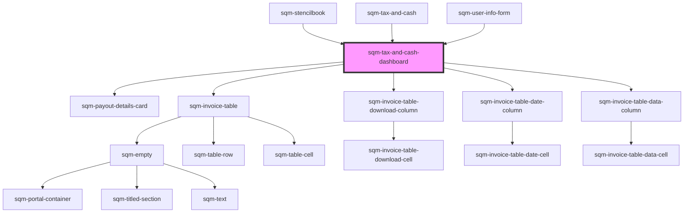

# sqm-tax-document-submitted

<!-- Auto Generated Below -->

## Properties

| Property                          | Attribute                            | Description                                                                            | Type                                                                                                                                                                                                                                                                                                                                                                                                                                                                                                                                                                                     | Default                                                                                                                                                                                                                                             |
| --------------------------------- | ------------------------------------ | -------------------------------------------------------------------------------------- | ---------------------------------------------------------------------------------------------------------------------------------------------------------------------------------------------------------------------------------------------------------------------------------------------------------------------------------------------------------------------------------------------------------------------------------------------------------------------------------------------------------------------------------------------------------------------------------------- | --------------------------------------------------------------------------------------------------------------------------------------------------------------------------------------------------------------------------------------------------- |
| `accountText`                     | `account-text`                       | Label text account heading text                                                        | `string`                                                                                                                                                                                                                                                                                                                                                                                                                                                                                                                                                                                 | `"Account"`                                                                                                                                                                                                                                         |
| `badgeTextAwaitingReview`         | `badge-text-awaiting-review`         | Description text which appears beside badge showing the form is awaiting review        | `string`                                                                                                                                                                                                                                                                                                                                                                                                                                                                                                                                                                                 | `"Awaiting review. Submitted on {dateSubmitted}."`                                                                                                                                                                                                  |
| `badgeTextSubmittedOn`            | `badge-text-submitted-on`            | Description text which appears beside badge showing when the form was submitted        | `string`                                                                                                                                                                                                                                                                                                                                                                                                                                                                                                                                                                                 | `"Submitted on {dateSubmitted}."`                                                                                                                                                                                                                   |
| `badgeTextSubmittedOnW8`          | `badge-text-submitted-on-w-8`        | Description text for W8 which appears beside badge showing when the form was submitted | `string`                                                                                                                                                                                                                                                                                                                                                                                                                                                                                                                                                                                 | `"Submitted on {dateSubmitted}. Valid for three years after submission."`                                                                                                                                                                           |
| `bankingInformationSectionHeader` | `banking-information-section-header` | Header text displayed above the banking information card                               | `string`                                                                                                                                                                                                                                                                                                                                                                                                                                                                                                                                                                                 | `"Payout information"`                                                                                                                                                                                                                              |
| `dateColumnTitle`                 | `date-column-title`                  | Invoice table Date column title                                                        | `string`                                                                                                                                                                                                                                                                                                                                                                                                                                                                                                                                                                                 | `"Date"`                                                                                                                                                                                                                                            |
| `demoData`                        | --                                   |                                                                                        | `{ states?: { status?: string; documentType: TaxDocumentType; documentTypeString: string; canEditPayoutInfo: boolean; disabled?: boolean; dateSubmitted?: string; dateExpired?: string; expiresSoon?: boolean; noFormNeeded?: boolean; indirectTaxType?: string; qstNumber?: string; subRegionTaxNumber?: string; subRegion?: string; indirectTaxNumber?: string; province?: string; country?: string; notRegistered?: boolean; isBusinessEntity?: boolean; loading?: boolean; loadingError?: boolean; errors?: { general?: boolean; }; }; slots?: { payoutDetailsCardSlot: VNode; }; }` | `undefined`                                                                                                                                                                                                                                         |
| `earningsAfterTaxColumnTitle`     | `earnings-after-tax-column-title`    | Invoice table Earnings after tax column title                                          | `string`                                                                                                                                                                                                                                                                                                                                                                                                                                                                                                                                                                                 | `"Earnings after tax"`                                                                                                                                                                                                                              |
| `earningsColumnTitle`             | `earnings-column-title`              | Invoice table Earnings column title                                                    | `string`                                                                                                                                                                                                                                                                                                                                                                                                                                                                                                                                                                                 | `"Earnings"`                                                                                                                                                                                                                                        |
| `editPaymentInformationButton`    | `edit-payment-information-button`    | Text displayed in the edit Payment Information button                                  | `string`                                                                                                                                                                                                                                                                                                                                                                                                                                                                                                                                                                                 | `"Edit Payout Information"`                                                                                                                                                                                                                         |
| `errorDescriptionText`            | `error-description-text`             |                                                                                        | `string`                                                                                                                                                                                                                                                                                                                                                                                                                                                                                                                                                                                 | `"If you’ve recently added your payout information, please wait while we verify your information. If it’s still on hold after a few days, please contact Support or check your inbox for an email from our referral program provider, impact.com."` |
| `errorTitleText`                  | `error-title-text`                   |                                                                                        | `string`                                                                                                                                                                                                                                                                                                                                                                                                                                                                                                                                                                                 | `"Your payout is on hold "`                                                                                                                                                                                                                         |
| `generalErrorDescription`         | `general-error-description`          | The error message shown at the top of the page in an error banner                      | `string`                                                                                                                                                                                                                                                                                                                                                                                                                                                                                                                                                                                 | `"Please review your information and try again. If this problem continues, contact Support."`                                                                                                                                                       |
| `generalErrorTitle`               | `general-error-title`                | The title for error message shown at the top of the page in an error banner            | `string`                                                                                                                                                                                                                                                                                                                                                                                                                                                                                                                                                                                 | `"There was a problem submitting your information"`                                                                                                                                                                                                 |
| `indirectTaxDetails`              | `indirect-tax-details`               | Indirect tax number/type details                                                       | `string`                                                                                                                                                                                                                                                                                                                                                                                                                                                                                                                                                                                 | `"{indirectTaxType} number: {indirectTaxNumber}"`                                                                                                                                                                                                   |
| `indirectTaxInfoCanada`           | `indirect-tax-info-canada`           | Country/Province description text of indirect tax                                      | `string`                                                                                                                                                                                                                                                                                                                                                                                                                                                                                                                                                                                 | `"Registered in {province}, {country}"`                                                                                                                                                                                                             |
| `indirectTaxInfoOtherCountry`     | `indirect-tax-info-other-country`    | Other country description text of indirect tax                                         | `string`                                                                                                                                                                                                                                                                                                                                                                                                                                                                                                                                                                                 | `"Registered in {country}"`                                                                                                                                                                                                                         |
| `indirectTaxInfoSectionHeader`    | `indirect-tax-info-section-header`   | Header text displayed above the indirect tax preview section                           | `string`                                                                                                                                                                                                                                                                                                                                                                                                                                                                                                                                                                                 | `"Indirect tax"`                                                                                                                                                                                                                                    |
| `indirectTaxInfoSpain`            | `indirect-tax-info-spain`            | Spain/Region description text of indirect tax                                          | `string`                                                                                                                                                                                                                                                                                                                                                                                                                                                                                                                                                                                 | `"Registered in {country}, {subRegion}"`                                                                                                                                                                                                            |
| `indirectTaxTooltipSupport`       | `indirect-tax-tooltip-support`       | Indirect tax tooltip text for support                                                  | `string`                                                                                                                                                                                                                                                                                                                                                                                                                                                                                                                                                                                 | `"To make changes to your indirect tax information, please contact Support."`                                                                                                                                                                       |
| `invalidForm`                     | `invalid-form`                       | Description text displayed next to the badge in the tax documents status               | `string`                                                                                                                                                                                                                                                                                                                                                                                                                                                                                                                                                                                 | `"Make sure your information is correct and submit new form."`                                                                                                                                                                                      |
| `invoiceColumnTitle`              | `invoice-column-title`               | Invoice table Invoice column title                                                     | `string`                                                                                                                                                                                                                                                                                                                                                                                                                                                                                                                                                                                 | `"Invoice"`                                                                                                                                                                                                                                         |
| `loadingErrorAlertDescription`    | `loading-error-alert-description`    | Alert description shown if there is a problem loading a form                           | `string`                                                                                                                                                                                                                                                                                                                                                                                                                                                                                                                                                                                 | `"Please refresh the page and try again. If this problem continues, contact Support."`                                                                                                                                                              |
| `loadingErrorAlertHeader`         | `loading-error-alert-header`         | Alert header shown if there is a problem loading a form                                | `string`                                                                                                                                                                                                                                                                                                                                                                                                                                                                                                                                                                                 | `"There was a problem loading your form"`                                                                                                                                                                                                           |
| `newFormButton`                   | `new-form-button`                    | Text displayed in the submit new document button at the bottom of the page             | `string`                                                                                                                                                                                                                                                                                                                                                                                                                                                                                                                                                                                 | `"Submit New Form"`                                                                                                                                                                                                                                 |
| `noFormNeededSubtext`             | `no-form-needed-subtext`             | Subtext displayed at the bottom of the page if there are no tax documents to show      | `string`                                                                                                                                                                                                                                                                                                                                                                                                                                                                                                                                                                                 | `"Tax documents are only required if you are based in the US or joining the referral program of a US based brand."`                                                                                                                                 |
| `notRegisteredForTax`             | `not-registered-for-tax`             | Text displayed when partner is not registered for Indirect Tax                         | `string`                                                                                                                                                                                                                                                                                                                                                                                                                                                                                                                                                                                 | `"Not registered. Participants representing a company in countries that enforce indirect tax (e.g. GST, HST, VAT) must add their indirect tax information."`                                                                                        |
| `payoutFromImpact`                | `payout-from-impact`                 | Sub text describing how payouts are provided from impact.com                           | `string`                                                                                                                                                                                                                                                                                                                                                                                                                                                                                                                                                                                 | `"Your balance may take up to 24 hours to update. Payouts will be sent from our referral program provider, impact.com."`                                                                                                                            |
| `qstNumber`                       | `qst-number`                         | Label text for the QST number                                                          | `string`                                                                                                                                                                                                                                                                                                                                                                                                                                                                                                                                                                                 | `"QST number: {qstNumber}"`                                                                                                                                                                                                                         |
| `statusBadgeText`                 | `status-badge-text`                  | Label text for next payout status badge                                                | `string`                                                                                                                                                                                                                                                                                                                                                                                                                                                                                                                                                                                 | `"{badgeText, select, payoutToday {Payout Today} nextPayout {Next Payout} }"`                                                                                                                                                                       |
| `statusTextActive`                | `status-text-active`                 | Status text displayed in badge when tax document is Active                             | `string`                                                                                                                                                                                                                                                                                                                                                                                                                                                                                                                                                                                 | `"Active"`                                                                                                                                                                                                                                          |
| `statusTextNotActive`             | `status-text-not-active`             | Status text displayed in badge when tax document is Not Active                         | `string`                                                                                                                                                                                                                                                                                                                                                                                                                                                                                                                                                                                 | `"Invalid Tax Form"`                                                                                                                                                                                                                                |
| `statusTextNotVerified`           | `status-text-not-verified`           | Status text displayed in badge when tax document is Not Verified                       | `string`                                                                                                                                                                                                                                                                                                                                                                                                                                                                                                                                                                                 | `"Not Verified"`                                                                                                                                                                                                                                    |
| `subRegionTaxNumber`              | `sub-region-tax-number`              | Label text for the sub-region tax number                                               | `string`                                                                                                                                                                                                                                                                                                                                                                                                                                                                                                                                                                                 | `"Income tax number: {subRegionTaxNumber}"`                                                                                                                                                                                                         |
| `taxAlertHeaderNotActiveW8`       | `tax-alert-header-not-active-w-8`    | Header displayed in not active W9 alert header at the top of the page.                 | `string`                                                                                                                                                                                                                                                                                                                                                                                                                                                                                                                                                                                 | `"{documentType} tax form is invalid"`                                                                                                                                                                                                              |
| `taxAlertHeaderNotActiveW9`       | `tax-alert-header-not-active-w-9`    | Header displayed in not active W9 alert header at the top of the page.                 | `string`                                                                                                                                                                                                                                                                                                                                                                                                                                                                                                                                                                                 | `"Your W9 tax form has personal information that doesn’t match your profile"`                                                                                                                                                                       |
| `taxAlertNotActiveMessageW8`      | `tax-alert-not-active-message-w-8`   | Description text displayed in W8 alert body at the top of the page.                    | `string`                                                                                                                                                                                                                                                                                                                                                                                                                                                                                                                                                                                 | `"Your tax form may have expired or has personal information that doesn’t match your profile. Please submit a new {documentType} form."`                                                                                                            |
| `taxAlertNotActiveMessageW9`      | `tax-alert-not-active-message-w-9`   | Description text displayed in W9 alert body at the top of the page.                    | `string`                                                                                                                                                                                                                                                                                                                                                                                                                                                                                                                                                                                 | `"Please resubmit a new {documentType} form."`                                                                                                                                                                                                      |
| `taxDocumentSectionHeader`        | `tax-document-section-header`        | Header text displayed above the tax documents status                                   | `string`                                                                                                                                                                                                                                                                                                                                                                                                                                                                                                                                                                                 | `"Tax documents"`                                                                                                                                                                                                                                   |
| `taxDocumentSectionSubHeader`     | `tax-document-section-sub-header`    | Sub header text displayed above the tax documents status                               | `string`                                                                                                                                                                                                                                                                                                                                                                                                                                                                                                                                                                                 | `"{documentType} tax form"`                                                                                                                                                                                                                         |
| `taxedAmountColumnTitle`          | `taxed-amount-column-title`          | Invoice table Taxed Amount column title                                                | `string`                                                                                                                                                                                                                                                                                                                                                                                                                                                                                                                                                                                 | `"Taxed Amount"`                                                                                                                                                                                                                                    |
| `thresholdPayoutText`             | `threshold-payout-text`              | Label text for the next payout based on balance                                        | `string`                                                                                                                                                                                                                                                                                                                                                                                                                                                                                                                                                                                 | `"Next payout occurs when balance is {thresholdBalance}"`                                                                                                                                                                                           |

## Dependencies

### Used by

 - [sqm-stencilbook](../../sqm-stencilbook)
 - [sqm-tax-and-cash](../sqm-tax-and-cash)
 - [sqm-user-info-form](../sqm-user-info-form)

### Depends on

- [sqm-payout-details-card](../sqm-payout-details-card)
- [sqm-invoice-table](../../sqm-invoice-table)
- [sqm-invoice-table-download-column](../../sqm-invoice-table/columns)
- [sqm-invoice-table-date-column](../../sqm-invoice-table/columns)
- [sqm-invoice-table-data-column](../../sqm-invoice-table/columns)

### Graph

----------------------------------------------

*Built with [StencilJS](https://stenciljs.com/)*
