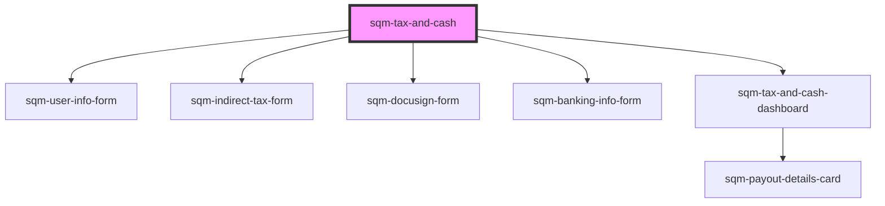

# sqm-tax-and-cash-monolith

<!-- Auto Generated Below -->

## Properties

| Property                                        | Attribute                                            | Description                                                                                                | Type                                                                                                                 | Default                                                                                                                                                                       |
| ----------------------------------------------- | ---------------------------------------------------- | ---------------------------------------------------------------------------------------------------------- | -------------------------------------------------------------------------------------------------------------------- | ----------------------------------------------------------------------------------------------------------------------------------------------------------------------------- |
| `dashboard_badgeTextAwaitingReview`             | `dashboard_badge-text-awaiting-review`               | Description text which appears beside badge showing the form is awaiting review                            | `string`                                                                                                             | `"Awaiting review. Submitted on {dateSubmitted}."`                                                                                                                            |
| `dashboard_badgeTextSubmittedOn`                | `dashboard_badge-text-submitted-on`                  | Description text which appears beside badge showing when the form was submitted                            | `string`                                                                                                             | `"Submitted on {dateSubmitted}"`                                                                                                                                              |
| `dashboard_badgeTextSubmittedOnW8`              | `dashboard_badge-text-submitted-on-w-8`              | Description text for W8 which appears beside badge showing when the form was submitted                     | `string`                                                                                                             | `"Submitted on {dateSubmitted}. Valid for three years after submission."`                                                                                                     |
| `dashboard_bankingInformationSectionHeader`     | `dashboard_banking-information-section-header`       | Header text displayed above the banking information card                                                   | `string`                                                                                                             | `"Banking Information"`                                                                                                                                                       |
| `dashboard_editPaymentInformationButton`        | `dashboard_edit-payment-information-button`          | Text displayed in the edit Payment Information button                                                      | `string`                                                                                                             | `"Edit Payout Information"`                                                                                                                                                   |
| `dashboard_generalErrorDescription`             | `dashboard_general-error-description`                | The error message shown at the top of the page in an error banner                                          | `string`                                                                                                             | `"Please review your information and try again. If this problem continues, contact Support."`                                                                                 |
| `dashboard_generalErrorTitle`                   | `dashboard_general-error-title`                      | The title for error message shown at the top of the page in an error banner                                | `string`                                                                                                             | `"There was a problem submitting your information"`                                                                                                                           |
| `dashboard_indirectTaxDetails`                  | `dashboard_indirect-tax-details`                     | Indirect tax number/type details                                                                           | `string`                                                                                                             | `"{indirectTaxType} number: {indirectTaxNumber}"`                                                                                                                             |
| `dashboard_indirectTaxInfoCanada`               | `dashboard_indirect-tax-info-canada`                 | Country/Province description text of indirect tax                                                          | `string`                                                                                                             | `"Registered in {province}, {country}"`                                                                                                                                       |
| `dashboard_indirectTaxInfoOtherCountry`         | `dashboard_indirect-tax-info-other-country`          | Other country description text of indirect tax                                                             | `string`                                                                                                             | `"Registered in {country}"`                                                                                                                                                   |
| `dashboard_indirectTaxInfoSectionHeader`        | `dashboard_indirect-tax-info-section-header`         | Header text displayed above the indirect tax preview section                                               | `string`                                                                                                             | `"Indirect Tax"`                                                                                                                                                              |
| `dashboard_indirectTaxInfoSpain`                | `dashboard_indirect-tax-info-spain`                  | Spain/Region description text of indirect tax                                                              | `string`                                                                                                             | `"Registered in {country}, {subRegion}"`                                                                                                                                      |
| `dashboard_indirectTaxTooltipSupport`           | `dashboard_indirect-tax-tooltip-support`             | Indirect tax tooltip text for support                                                                      | `string`                                                                                                             | `"To make changes to your indirect tax information, please contact Support."`                                                                                                 |
| `dashboard_invalidForm`                         | `dashboard_invalid-form`                             | Description text displayed next to the badge in the tax documents status                                   | `string`                                                                                                             | `"Ensure your information matches your profile and resubmit a new document."`                                                                                                 |
| `dashboard_newFormButton`                       | `dashboard_new-form-button`                          | Text displayed in the submit new document button at the bottom of the page                                 | `string`                                                                                                             | `"Submit New Form"`                                                                                                                                                           |
| `dashboard_noFormNeededSubtext`                 | `dashboard_no-form-needed-subtext`                   | Subtext displayed at the bottom of the page if there are no tax documents to show                          | `string`                                                                                                             | `"Tax documents are only required if you are based in the US. If your country of residence has changed, please contact Support."`                                             |
| `dashboard_notRegisteredForTax`                 | `dashboard_not-registered-for-tax`                   | Text displayed when partner is not registered for Indirect Tax                                             | `string`                                                                                                             | `"Not registered. Participants representing a company in countries that enforce indirect tax (e.g. GST, HST, VAT) must add their indirect tax information."`                  |
| `dashboard_qstNumber`                           | `dashboard_qst-number`                               | Label text for the QST number                                                                              | `string`                                                                                                             | `"QST Number: {qstNumber}"`                                                                                                                                                   |
| `dashboard_statusTextActive`                    | `dashboard_status-text-active`                       | Status text displayed in badge when tax document is Active                                                 | `string`                                                                                                             | `"Active"`                                                                                                                                                                    |
| `dashboard_statusTextNotActive`                 | `dashboard_status-text-not-active`                   | Status text displayed in badge when tax document is Not Active                                             | `string`                                                                                                             | `"Invalid Tax Form"`                                                                                                                                                          |
| `dashboard_statusTextNotVerified`               | `dashboard_status-text-not-verified`                 | Status text displayed in badge when tax document is Not Verified                                           | `string`                                                                                                             | `"Not Verified"`                                                                                                                                                              |
| `dashboard_subRegionTaxNumber`                  | `dashboard_sub-region-tax-number`                    | Label text for the sub-region tax number                                                                   | `string`                                                                                                             | `"Income Tax Number: {incomeTaxNumber}"`                                                                                                                                      |
| `dashboard_taxAlertHeaderNotActiveW8`           | `dashboard_tax-alert-header-not-active-w-8`          | Header displayed in not active W9 alert header at the top of the page.                                     | `string`                                                                                                             | `"{documentType} tax form is invalid"`                                                                                                                                        |
| `dashboard_taxAlertHeaderNotActiveW9`           | `dashboard_tax-alert-header-not-active-w-9`          | Header displayed in not active W9 alert header at the top of the page.                                     | `string`                                                                                                             | `"Your W9 tax form has personal information that doesn’t match your profile"`                                                                                                 |
| `dashboard_taxAlertNotActiveMessageW8`          | `dashboard_tax-alert-not-active-message-w-8`         | Description text displayed in W8 alert body at the top of the page.                                        | `string`                                                                                                             | `"Your tax form may have expired or has personal information that doesn’t match your profile. Please submit a new W8-BEN form."`                                              |
| `dashboard_taxAlertNotActiveMessageW9`          | `dashboard_tax-alert-not-active-message-w-9`         | Description text displayed in W9 alert body at the top of the page.                                        | `string`                                                                                                             | `"Please resubmit a new {documentType} form."`                                                                                                                                |
| `dashboard_taxDocumentSectionHeader`            | `dashboard_tax-document-section-header`              | Header text displayed above the tax documents status                                                       | `string`                                                                                                             | `"Tax documents"`                                                                                                                                                             |
| `dashboard_taxDocumentSectionSubHeader`         | `dashboard_tax-document-section-sub-header`          | Sub header text displayed above the tax documents status                                                   | `string`                                                                                                             | `"{documentType} Tax Form"`                                                                                                                                                   |
| `demoData`                                      | --                                                   |                                                                                                            | `{ loading?: boolean; step?: string; setStep?: (value: string) => void; context?: TaxContext; namespace?: string; }` | `undefined`                                                                                                                                                                   |
| `notRegisteredSubtext`                          | `not-registered-subtext`                             | Subtext for the option indicating not being registered for indirect tax                                    | `string`                                                                                                             | `"If you’re joining this referral program as an individual or you’re based in the US, then you’re not registered."`                                                           |
| `otherRegionSubtext`                            | `other-region-subtext`                               | Subtext for the option indicating registration for indirect tax in a different region                      | `string`                                                                                                             | `"f you represent a business based outside of the US may be registered. Not sure? Contact our Support team to find out more."`                                                |
| `step1_allowBankingCollection`                  | `step-1_allow-banking-collection`                    | Label text for tax and banking collection checkbox                                                         | `string`                                                                                                             | `"I agree to the terms"`                                                                                                                                                      |
| `step1_allowBankingCollectionError`             | `step-1_allow-banking-collection-error`              | Error text shown at the bottom of the tax and banking collection checkbox                                  | `string`                                                                                                             | `"This field is required"`                                                                                                                                                    |
| `step1_businessEntity`                          | `step-1_business-entity`                             | Label text for the business entity radio button                                                            | `string`                                                                                                             | `"I represent a business entity"`                                                                                                                                             |
| `step1_country`                                 | `step-1_country`                                     | Label text for country input                                                                               | `string`                                                                                                             | `"Country"`                                                                                                                                                                   |
| `step1_countryError`                            | `step-1_country-error`                               | Error text shown at the bottom of the country input                                                        | `string`                                                                                                             | `"Select a country"`                                                                                                                                                          |
| `step1_currency`                                | `step-1_currency`                                    | Label text for currency input                                                                              | `string`                                                                                                             | `"Currency"`                                                                                                                                                                  |
| `step1_currencyError`                           | `step-1_currency-error`                              | Error text shown at the bottom of the currency input                                                       | `string`                                                                                                             | `"Select a currency"`                                                                                                                                                         |
| `step1_email`                                   | `step-1_email`                                       | Label text for email input                                                                                 | `string`                                                                                                             | `"Email"`                                                                                                                                                                     |
| `step1_emailError`                              | `step-1_email-error`                                 | Error text shown at the bottom of the email input                                                          | `string`                                                                                                             | `"Enter a valid email"`                                                                                                                                                       |
| `step1_firstName`                               | `step-1_first-name`                                  | Label text for first name input                                                                            | `string`                                                                                                             | `"First name"`                                                                                                                                                                |
| `step1_firstNameError`                          | `step-1_first-name-error`                            | Error text shown at the bottom of the first name input                                                     | `string`                                                                                                             | `"Enter a first name"`                                                                                                                                                        |
| `step1_formStep`                                | `step-1_form-step`                                   | Sub text shown at the top of the page, used to show the current step of the tax form.                      | `string`                                                                                                             | `"Step 1 of 4"`                                                                                                                                                               |
| `step1_generalErrorDescription`                 | `step-1_general-error-description`                   | The error message shown at the top of the page in an error banner                                          | `string`                                                                                                             | `"Please review your information and try again. If this problem continues, contact Support."`                                                                                 |
| `step1_generalErrorTitle`                       | `step-1_general-error-title`                         | The title for error message shown at the top of the page in an error banner                                | `string`                                                                                                             | `"There was a problem submitting your information"`                                                                                                                           |
| `step1_individualParticipant`                   | `step-1_individual-participant`                      | Label text for the individual participant radio button                                                     | `string`                                                                                                             | `"I am an individual participant"`                                                                                                                                            |
| `step1_isPartnerAlertDescription`               | `step-1_is-partner-alert-description`                | Alert description text shown in alert if user is already a registered partner                              | `string`                                                                                                             | `"If you don’t recognize this referral program provider or believe this is a mistake, please contact Support or sign up for this referral program with a different email."`   |
| `step1_isPartnerAlertHeader`                    | `step-1_is-partner-alert-header`                     | Alert header text shown in alert if user is already a registered partner                                   | `string`                                                                                                             | `"An account with this email already exists with our referral program provider, impact.com"`                                                                                  |
| `step1_lastName`                                | `step-1_last-name`                                   | Label text for last name input                                                                             | `string`                                                                                                             | `"Last name"`                                                                                                                                                                 |
| `step1_lastNameError`                           | `step-1_last-name-error`                             | Error text shown at the bottom of the last name input                                                      | `string`                                                                                                             | `"Enter a last name"`                                                                                                                                                         |
| `step1_participantType`                         | `step-1_participant-type`                            | Heading text for the participant type radio buttons                                                        | `string`                                                                                                             | `"Participant type"`                                                                                                                                                          |
| `step1_participantTypeError`                    | `step-1_participant-type-error`                      | Error text shown at the bottom of the participant type checkbox                                            | `string`                                                                                                             | `"Select a participant type"`                                                                                                                                                 |
| `step1_personalInformation`                     | `step-1_personal-information`                        | Heading text shown above the forms inputs.                                                                 | `string`                                                                                                             | `"Personal Information"`                                                                                                                                                      |
| `step1_submitButton`                            | `step-1_submit-button`                               | Text shown inside of submit button                                                                         | `string`                                                                                                             | `"Continue"`                                                                                                                                                                  |
| `step1_taxAndBankingCollection`                 | `step-1_tax-and-banking-collection`                  | Heading text for the tax and banking collection checkbox                                                   | `string`                                                                                                             | `"Continue"`                                                                                                                                                                  |
| `step2_backButton`                              | `step-2_back-button`                                 | Text shown inside of back button                                                                           | `string`                                                                                                             | `"Back"`                                                                                                                                                                      |
| `step2_cannotChangeInfoAlert`                   | `step-2_cannot-change-info-alert`                    | Alert text indicating participant cannot change info after it has been submitted                           | `string`                                                                                                             | `"Changes to your personal information and indirect tax can only be made through our Support team after you complete this step. Ensure these are correct before continuing."` |
| `step2_formStep`                                | `step-2_form-step`                                   | Sub text shown at the top of the page, used to show the current step of the tax form.                      | `string`                                                                                                             | `"Step 2 of 4"`                                                                                                                                                               |
| `step2_generalErrorDescription`                 | `step-2_general-error-description`                   | The error message shown at the top of the page in an error banner                                          | `string`                                                                                                             | `"Please review your information and try again. If this problem continues, contact Support."`                                                                                 |
| `step2_generalErrorTitle`                       | `step-2_general-error-title`                         | The title for error message shown at the top of the page in an error banner                                | `string`                                                                                                             | `"There was a problem submitting your information"`                                                                                                                           |
| `step2_indirectTax`                             | `step-2_indirect-tax`                                | Heading text shown at the top of the page                                                                  | `string`                                                                                                             | `"Indirect Tax"`                                                                                                                                                              |
| `step2_indirectTaxDescription`                  | `step-2_indirect-tax-description`                    | Subtext shown at the top of the page                                                                       | `string`                                                                                                             | `"Indirect Taxes (e.g. VAT, HST, GST) are transactional based taxes that are required to be levied by service providers by most tax authorities."`                            |
| `step2_indirectTaxDetails`                      | `step-2_indirect-tax-details`                        | Heading text shown above the tax details radio buttons                                                     | `string`                                                                                                             | `"Indirect Tax Details"`                                                                                                                                                      |
| `step2_indirectTaxDetailsDescription`           | `step-2_indirect-tax-details-description`            | Sub text shown above the tax details radio buttons                                                         | `string`                                                                                                             | `"Not sure if you are registered for indirect tax? Contact our Support team to find out more."`                                                                               |
| `step2_indirectTaxNumber`                       | `step-2_indirect-tax-number`                         | Label text for the Indirect Tax Number input                                                               | `string`                                                                                                             | `"{taxType, select, GST {GST Number} HST {HST Number} VAT {VAT Number} CT {CT Number} SST {SST Number} GENERAL {Indirect Tax Number}}"`                                       |
| `step2_indirectTaxNumberError`                  | `step-2_indirect-tax-number-error`                   | Error text shown below the Indirect Tax Number select input                                                | `string`                                                                                                             | `"{taxType, select, GST {GST Number} HST {HST Number} VAT {VAT Number} CT {CT Number} SST {SST Number} GENERAL {Indirect Tax Number}} is required"`                           |
| `step2_isPartnerAlertDescription`               | `step-2_is-partner-alert-description`                | Alert description text shown in alert if user is already a registered partner                              | `string`                                                                                                             | `"If you don’t recognize this referral program provider or believe this is a mistake, please contact Support or sign up for this referral program with a different email."`   |
| `step2_isPartnerAlertHeader`                    | `step-2_is-partner-alert-header`                     | Alert header text shown in alert if user is already a registered partner                                   | `string`                                                                                                             | `"An account with this email already exists with our referral program provider, impact.com"`                                                                                  |
| `step2_isRegisteredQST`                         | `step-2_is-registered-q-s-t`                         | Label text for the QST checkbox                                                                            | `string`                                                                                                             | `"I am registered for QST Tax"`                                                                                                                                               |
| `step2_isRegisteredSubRegionIncomeTax`          | `step-2_is-registered-sub-region-income-tax`         | Label text for Income Tax checkbox                                                                         | `string`                                                                                                             | `"I am an individual registered for Income Tax purposes in Spain, and withholding tax will apply to any payments made to me."`                                                |
| `step2_notRegistered`                           | `step-2_not-registered`                              | Label text for the not registered radio button                                                             | `string`                                                                                                             | `"I am not registered for Indirect Tax"`                                                                                                                                      |
| `step2_otherRegion`                             | `step-2_other-region`                                | Label text for the other region radio button                                                               | `string`                                                                                                             | `"I am registered for Indirect Tax in a different Country / Region"`                                                                                                          |
| `step2_province`                                | `step-2_province`                                    | Label text for the Province select input                                                                   | `string`                                                                                                             | `"Province"`                                                                                                                                                                  |
| `step2_provinceError`                           | `step-2_province-error`                              | Error text shown below the Selected Region select input                                                    | `string`                                                                                                             | `"Province is required"`                                                                                                                                                      |
| `step2_qstNumber`                               | `step-2_qst-number`                                  | Label text for the QST Tax Number input                                                                    | `string`                                                                                                             | `"QST Number"`                                                                                                                                                                |
| `step2_qstTaxNumberError`                       | `step-2_qst-tax-number-error`                        | Error text shown below the QST Tax number input                                                            | `string`                                                                                                             | `"QST Tax Number is required"`                                                                                                                                                |
| `step2_selectedRegion`                          | `step-2_selected-region`                             | Label text for the Selected Region select input                                                            | `string`                                                                                                             | `"Country / Region of Indirect Tax"`                                                                                                                                          |
| `step2_selectedRegionError`                     | `step-2_selected-region-error`                       | Error text shown below the Selected Region select input                                                    | `string`                                                                                                             | `"Country is required"`                                                                                                                                                       |
| `step2_subRegion`                               | `step-2_sub-region`                                  | Label text for Sub-region select                                                                           | `string`                                                                                                             | `"Sub-region"`                                                                                                                                                                |
| `step2_subRegionTaxNumberError`                 | `step-2_sub-region-tax-number-error`                 | Error text shown below the Sub-region Income Tax number input                                              | `string`                                                                                                             | `"Income Tax Number is required"`                                                                                                                                             |
| `step2_subRegionTaxNumberLabel`                 | `step-2_sub-region-tax-number-label`                 | Label text for the Sub-region Income Tax Number input                                                      | `string`                                                                                                             | `"Income Tax Number"`                                                                                                                                                         |
| `step2_submitButton`                            | `step-2_submit-button`                               | Text shown inside of submit button                                                                         | `string`                                                                                                             | `"Continue"`                                                                                                                                                                  |
| `step2_taxDetailsError`                         | `step-2_tax-details-error`                           | Error text shown below the tax details radio buttons                                                       | `string`                                                                                                             | `"This field is required"`                                                                                                                                                    |
| `step3_backButton`                              | `step-3_back-button`                                 | Text shown inside of back button                                                                           | `string`                                                                                                             | `"Back"`                                                                                                                                                                      |
| `step3_banner`                                  | `step-3_banner`                                      | Text shown in the banner above the document                                                                | `string`                                                                                                             | `"For your security, we automatically end your session when you have not interacted with the form after 20 minutes."`                                                         |
| `step3_businessEntity`                          | `step-3_business-entity`                             | Label text for the business entity radio button                                                            | `string`                                                                                                             | `"I represent a company"`                                                                                                                                                     |
| `step3_checkboxDescription`                     | `step-3_checkbox-description`                        | Label text for the form submission checkbox                                                                | `string`                                                                                                             | `"I have completed and submitted my tax form"`                                                                                                                                |
| `step3_checkboxLabel`                           | `step-3_checkbox-label`                              | Heading text for the form submission checkbox                                                              | `string`                                                                                                             | `"Form submission"`                                                                                                                                                           |
| `step3_docusignCompleted`                       | `step-3_docusign-completed`                          | Text inside iframe when Docusign form is completed                                                         | `string`                                                                                                             | `"Your document has been completed and submitted."`                                                                                                                           |
| `step3_docusignError`                           | `step-3_docusign-error`                              | Text inside iframe when Docusign form throws error                                                         | `string`                                                                                                             | `"There was a problem displaying this form. Please refresh the page. If this problem continues, contact Support."`                                                            |
| `step3_docusignExpired`                         | `step-3_docusign-expired`                            | Text shown inside iframe when Docusign form expires                                                        | `string`                                                                                                             | `"For your security and privacy, we automatically end your session after 20 minutes of inactivity. Please refresh and re-enter your tax information to continue."`            |
| `step3_formStep`                                | `step-3_form-step`                                   | Sub text shown at the top of the page, used to show the current step of the tax form.                      | `string`                                                                                                             | `"Step 3 of 4"`                                                                                                                                                               |
| `step3_formSubmissionError`                     | `step-3_form-submission-error`                       | The error message shown at the bottom of the page if the user has not checked the form submission checkbox | `string`                                                                                                             | `"This field is required"`                                                                                                                                                    |
| `step3_generalErrorDescription`                 | `step-3_general-error-description`                   | The error message shown at the top of the page in an error banner                                          | `string`                                                                                                             | `"Please review your information and try again. If this problem continues, contact Support."`                                                                                 |
| `step3_generalErrorTitle`                       | `step-3_general-error-title`                         | The title for error message shown at the top of the page in an error banner                                | `string`                                                                                                             | `"There was a problem submitting your information"`                                                                                                                           |
| `step3_individualParticipant`                   | `step-3_individual-participant`                      | Label text for the individual participant radio button                                                     | `string`                                                                                                             | `"I am an individual participant"`                                                                                                                                            |
| `step3_participantType`                         | `step-3_participant-type`                            | Heading text for the participant type radio buttons                                                        | `string`                                                                                                             | `"Participant type"`                                                                                                                                                          |
| `step3_refreshButton`                           | `step-3_refresh-button`                              | Text shown inside of refresh button                                                                        | `string`                                                                                                             | `"Refresh Page"`                                                                                                                                                              |
| `step3_submitButton`                            | `step-3_submit-button`                               | Text shown inside of submit button                                                                         | `string`                                                                                                             | `"Continue"`                                                                                                                                                                  |
| `step3_taxForm`                                 | `step-3_tax-form`                                    | Heading text shown at the top of the page                                                                  | `string`                                                                                                             | `"Tax form"`                                                                                                                                                                  |
| `step3_taxFormDescription`                      | `step-3_tax-form-description`                        | Subtext shown at the top of the page next to the document type text                                        | `string`                                                                                                             | `"Participants based in the US and partnering with US-based brands need to submit a {documentType} form."`                                                                    |
| `step3_taxFormDescriptionBusinessEntity`        | `step-3_tax-form-description-business-entity`        | Subtext shown at the top of the page next to the document type text for business entities                  | `string`                                                                                                             | `"Participants residing outside of the US who represent a business entity need to submit a {documentType} form."`                                                             |
| `step3_taxFormDescriptionIndividualParticipant` | `step-3_tax-form-description-individual-participant` | Subtext shown at the top of the page next to the document type text for individual participants            | `string`                                                                                                             | `"Participants residing outside of the US, joining the referral program of a US-based company, need to submit a {documentType} form."`                                        |
| `step3_taxFormLabel`                            | `step-3_tax-form-label`                              | Text shown at the top of the page next to the document type text                                           | `string`                                                                                                             | `"{documentType} Tax Form"`                                                                                                                                                   |
| `step4_agencyCodeLabel`                         | `step-4_agency-code-label`                           | Label text for the agency code input field                                                                 | `string`                                                                                                             | `"Agency Code"`                                                                                                                                                               |
| `step4_bankAccountNumberLabel`                  | `step-4_bank-account-number-label`                   | Label text for the bank account number input field                                                         | `string`                                                                                                             | `"Bank Account Number"`                                                                                                                                                       |
| `step4_bankAccountTypeLabel`                    | `step-4_bank-account-type-label`                     | Label text for the bank account type input field                                                           | `string`                                                                                                             | `"Bank Account Type"`                                                                                                                                                         |
| `step4_bankAddressLabel`                        | `step-4_bank-address-label`                          | Label text for the Bank Address input                                                                      | `string`                                                                                                             | `"Bank Address"`                                                                                                                                                              |
| `step4_bankCityLabel`                           | `step-4_bank-city-label`                             | Label text for the Bank City input                                                                         | `string`                                                                                                             | `"Bank City"`                                                                                                                                                                 |
| `step4_bankLocationLabel`                       | `step-4_bank-location-label`                         | Label text for the bank country location input field                                                       | `string`                                                                                                             | `"Bank Country Location"`                                                                                                                                                     |
| `step4_bankNameLabel`                           | `step-4_bank-name-label`                             | Label text for the bank name input field                                                                   | `string`                                                                                                             | `"Bank Name"`                                                                                                                                                                 |
| `step4_bankPostalCodeLabel`                     | `step-4_bank-postal-code-label`                      | Label text for the Bank Postal Code                                                                        | `string`                                                                                                             | `"Bank Postal Code"`                                                                                                                                                          |
| `step4_bankProvinceStateLabel`                  | `step-4_bank-province-state-label`                   | Label text for the Bank Province State input                                                               | `string`                                                                                                             | `"Bank Province State"`                                                                                                                                                       |
| `step4_beneficiaryAccountNameLabel`             | `step-4_beneficiary-account-name-label`              | Label text for the beneficiary account name input field                                                    | `string`                                                                                                             | `"Beneficiary Account Name"`                                                                                                                                                  |
| `step4_branchCodeLabel`                         | `step-4_branch-code-label`                           | Label text for the branch code input field                                                                 | `string`                                                                                                             | `"Branch Code"`                                                                                                                                                               |
| `step4_businessSelectItemLabel`                 | `step-4_business-select-item-label`                  | Label text for the business select item                                                                    | `string`                                                                                                             | `"Business"`                                                                                                                                                                  |
| `step4_cannotChangeInfoAlert`                   | `step-4_cannot-change-info-alert`                    | Alert text indicating participant cannot change info after it has been submitted                           | `string`                                                                                                             | `"Your payout information cannot be changed after saving. Ensure your payout method and schedule are correct before submitting."`                                             |
| `step4_checkingSelectItemLabel`                 | `step-4_checking-select-item-label`                  | Label text for the checking account type select item                                                       | `string`                                                                                                             | `"Checking"`                                                                                                                                                                  |
| `step4_classificationCPFLabel`                  | `step-4_classification-c-p-f-label`                  | Label text for the classification CPF input field                                                          | `string`                                                                                                             | `"Classification CPF"`                                                                                                                                                        |
| `step4_classificationEntityLabel`               | `step-4_classification-entity-label`                 | Label text for the classification entity input field                                                       | `string`                                                                                                             | `"Classification Entity"`                                                                                                                                                     |
| `step4_classificationLabel`                     | `step-4_classification-label`                        | Label text for the classification input field                                                              | `string`                                                                                                             | `"Classification"`                                                                                                                                                            |
| `step4_directlyToBankAccount`                   | `step-4_directly-to-bank-account`                    | Text for the option to receive payments directly to a bank account                                         | `string`                                                                                                             | `"Directly to my bank account"`                                                                                                                                               |
| `step4_foreignSelectItemLabel`                  | `step-4_foreign-select-item-label`                   | Label text for the foreign select item                                                                     | `string`                                                                                                             | `"Foreign"`                                                                                                                                                                   |
| `step4_formStep`                                | `step-4_form-step`                                   | Subtext shown at the top of the page, used to show the current step of the tax form.                       | `string`                                                                                                             | `"Step 4 of 4"`                                                                                                                                                               |
| `step4_generalErrorDescription`                 | `step-4_general-error-description`                   | Description text for a general form submission error                                                       | `string`                                                                                                             | `"Please review your information and try again. If this problem continues, contact Support."`                                                                                 |
| `step4_generalErrorTitle`                       | `step-4_general-error-title`                         | Title text for a general form submission error                                                             | `string`                                                                                                             | `"There was a problem submitting your information"`                                                                                                                           |
| `step4_ibanLabel`                               | `step-4_iban-label`                                  | Label text for the IBAN input field                                                                        | `string`                                                                                                             | `"IBAN"`                                                                                                                                                                      |
| `step4_individualSelectItemLabel`               | `step-4_individual-select-item-label`                | Label text for the individual select item                                                                  | `string`                                                                                                             | `"Individual"`                                                                                                                                                                |
| `step4_isPartnerAlertDescription`               | `step-4_is-partner-alert-description`                | Description text for the alert when the user is identified as a partner                                    | `string`                                                                                                             | `"If you don’t recognize this referral program provider or believe this is a mistake, please contact Support or sign up for this referral program with a different email."`   |
| `step4_isPartnerAlertHeader`                    | `step-4_is-partner-alert-header`                     | Header text for the alert when the user is identified as a partner                                         | `string`                                                                                                             | `"An account with this email already exists with our referral program provider, impact.com"`                                                                                  |
| `step4_patronymicNameLabel`                     | `step-4_patronymic-name-label`                       | Label text for the patronymic name input field                                                             | `string`                                                                                                             | `"Patronymic Name"`                                                                                                                                                           |
| `step4_payPalInputLabel`                        | `step-4_pay-pal-input-label`                         | Label text for the PayPal email input field                                                                | `string`                                                                                                             | `"PayPal Email"`                                                                                                                                                              |
| `step4_paymentDayFifteenthOfMonthLabelText`     | `step-4_payment-day-fifteenth-of-month-label-text`   | Label text for the payment day select option for the fifteenth of the month                                | `string`                                                                                                             | `"15th of the month"`                                                                                                                                                         |
| `step4_paymentDayFirstOfMonthLabelText`         | `step-4_payment-day-first-of-month-label-text`       | Label text for the payment day select option for the first of the month                                    | `string`                                                                                                             | `"1st of the month"`                                                                                                                                                          |
| `step4_paymentDaySelectLabel`                   | `step-4_payment-day-select-label`                    | Label text for the payment day select                                                                      | `string`                                                                                                             | `"Payment Day"`                                                                                                                                                               |
| `step4_paymentMethod`                           | `step-4_payment-method`                              | Heading text for the payment method section                                                                | `string`                                                                                                             | `"Payment Method"`                                                                                                                                                            |
| `step4_paymentMethodSubtext`                    | `step-4_payment-method-subtext`                      | Subtext for the payment method section                                                                     | `string`                                                                                                             | `"Payouts will be sent on the first day of each month from our referral program provider, impact.com."`                                                                       |
| `step4_paymentSchedule`                         | `step-4_payment-schedule`                            | Heading text for the payment schedule section                                                              | `string`                                                                                                             | `"Payment Schedule"`                                                                                                                                                          |
| `step4_paymentScheduleBalanceThreshold`         | `step-4_payment-schedule-balance-threshold`          | Text for the option to receive payments at a specific balance threshold                                    | `string`                                                                                                             | `"Pay me when my balance reaches a threshold"`                                                                                                                                |
| `step4_paymentScheduleFixedDay`                 | `step-4_payment-schedule-fixed-day`                  | Text for the option to receive payments on a specific day of the month                                     | `string`                                                                                                             | `"Pay me on a fixed day of the month"`                                                                                                                                        |
| `step4_paymentThresholdSelectLabel`             | `step-4_payment-threshold-select-label`              | Label text for the payment day select                                                                      | `string`                                                                                                             | `"Payment Threshold"`                                                                                                                                                         |
| `step4_routingCodeLabel`                        | `step-4_routing-code-label`                          | Label text for the routing code input field                                                                | `string`                                                                                                             | `"Routing Code"`                                                                                                                                                              |
| `step4_savingsSelectItemLabel`                  | `step-4_savings-select-item-label`                   | Label text for the savings account type select item                                                        | `string`                                                                                                             | `"Savings"`                                                                                                                                                                   |
| `step4_submitButton`                            | `step-4_submit-button`                               | Text for the save button in the form                                                                       | `string`                                                                                                             | `"Save"`                                                                                                                                                                      |
| `step4_swiftCodeLabel`                          | `step-4_swift-code-label`                            | Label text for the SWIFT code input field                                                                  | `string`                                                                                                             | `"SWIFT Code"`                                                                                                                                                                |
| `step4_taxAndPayouts`                           | `step-4_tax-and-payouts`                             | Heading text shown at the top of the page                                                                  | `string`                                                                                                             | `"Tax and Payouts"`                                                                                                                                                           |
| `step4_taxAndPayoutsDescription`                | `step-4_tax-and-payouts-description`                 | Text shown at the top of the page next to the tax and payouts label text                                   | `string`                                                                                                             | `"Submit your tax documents and add your banking information to receive your rewards."`                                                                                       |
| `step4_taxPayerIdLabel`                         | `step-4_tax-payer-id-label`                          | Label text for the Taxpayer ID input field                                                                 | `string`                                                                                                             | `"Taxpayer ID"`                                                                                                                                                               |
| `step4_toPayPalAccount`                         | `step-4_to-pay-pal-account`                          | Text for the option to receive payments to a PayPal account with processing fee details                    | `string`                                                                                                             | `"PayPal (2% processing fee capped to {feeCap})"`                                                                                                                             |
| `step4_voCodeLabel`                             | `step-4_vo-code-label`                               | Label text for the VO code input field                                                                     | `string`                                                                                                             | `"VO Code"`                                                                                                                                                                   |
| `stop3NotBasedInUS`                             | `stop-3-not-based-in-u-s`                            | Text shown in the link to the form for non US residents                                                    | `string`                                                                                                             | `"Not based in the US?"`                                                                                                                                                      |

## Dependencies

### Depends on

- [sqm-user-info-form](../sqm-user-info-form)
- [sqm-indirect-tax-form](../sqm-indirect-tax-form)
- [sqm-docusign-form](../sqm-docusign-form)
- [sqm-banking-info-form](../sqm-banking-info-form)
- [sqm-tax-and-cash-dashboard](../sqm-tax-and-cash-dashboard)

### Graph

----------------------------------------------

*Built with [StencilJS](https://stenciljs.com/)*
