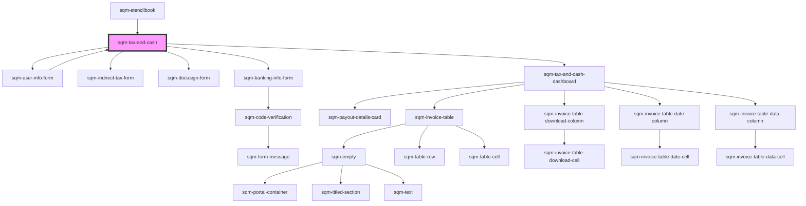

# sqm-tax-and-cash-monolith

<!-- Auto Generated Below -->

## Properties

| Property                                            | Attribute                                              | Description                                                                                                                    | Type                                                                                                                 | Default                                                                                                                                                                                                                               |
| --------------------------------------------------- | ------------------------------------------------------ | ------------------------------------------------------------------------------------------------------------------------------ | -------------------------------------------------------------------------------------------------------------------- | ------------------------------------------------------------------------------------------------------------------------------------------------------------------------------------------------------------------------------------- |
| `backButton`                                        | `back-button`                                          |                                                                                                                                | `string`                                                                                                             | `"Back"`                                                                                                                                                                                                                              |
| `cancelButton`                                      | `cancel-button`                                        |                                                                                                                                | `string`                                                                                                             | `"Cancel"`                                                                                                                                                                                                                            |
| `continueButton`                                    | `continue-button`                                      |                                                                                                                                | `string`                                                                                                             | `"Continue"`                                                                                                                                                                                                                          |
| `dashboard_accountText`                             | `dashboard_account-text`                               | Shown before the participant’s bank account information.                                                                       | `string`                                                                                                             | `"Account"`                                                                                                                                                                                                                           |
| `dashboard_badgeTextAwaitingReview`                 | `dashboard_badge-text-awaiting-review`                 | Additional text displayed next to the tax form's status badge.                                                                 | `string`                                                                                                             | `"Awaiting review. Submitted on {dateSubmitted}."`                                                                                                                                                                                    |
| `dashboard_badgeTextSubmittedOn`                    | `dashboard_badge-text-submitted-on`                    | Additional text displayed next to the tax form's status badge                                                                  | `string`                                                                                                             | `"Submitted on {dateSubmitted}."`                                                                                                                                                                                                     |
| `dashboard_badgeTextSubmittedOnW8`                  | `dashboard_badge-text-submitted-on-w-8`                | Additional text displayed next to the tax form's status badge.                                                                 | `string`                                                                                                             | `"Submitted on {dateSubmitted}. Valid for three years after submission."`                                                                                                                                                             |
| `dashboard_bankingInformationSectionHeader`         | `dashboard_banking-information-section-header`         |                                                                                                                                | `string`                                                                                                             | `"Payout Information"`                                                                                                                                                                                                                |
| `dashboard_dateColumnTitle`                         | `dashboard_date-column-title`                          | Part of the Invoice table displayed at the bottom of the page.                                                                 | `string`                                                                                                             | `"Date"`                                                                                                                                                                                                                              |
| `dashboard_earningsAfterTaxColumnTitle`             | `dashboard_earnings-after-tax-column-title`            | Part of the Invoice table displayed at the bottom of the page.                                                                 | `string`                                                                                                             | `"Earnings after tax"`                                                                                                                                                                                                                |
| `dashboard_earningsColumnTitle`                     | `dashboard_earnings-column-title`                      | Part of the Invoice table displayed at the bottom of the page.                                                                 | `string`                                                                                                             | `"Earnings"`                                                                                                                                                                                                                          |
| `dashboard_editPaymentInformationButton`            | `dashboard_edit-payment-information-button`            |                                                                                                                                | `string`                                                                                                             | `"Edit Payout Information"`                                                                                                                                                                                                           |
| `dashboard_indirectTaxColumnTitle`                  | `dashboard_indirect-tax-column-title`                  | Part of the Invoice table displayed at the bottom of the page.                                                                 | `string`                                                                                                             | `"Indirect tax"`                                                                                                                                                                                                                      |
| `dashboard_indirectTaxDetails`                      | `dashboard_indirect-tax-details`                       | Displayed to participants who have submitted their indirect tax information.                                                   | `string`                                                                                                             | `"{indirectTaxType} number: {indirectTaxNumber}"`                                                                                                                                                                                     |
| `dashboard_indirectTaxInfoCanada`                   | `dashboard_indirect-tax-info-canada`                   | If the participant is registered for indirect tax in Canada, display the province they’re registered in.                       | `string`                                                                                                             | `"Registered in {province}, {country}"`                                                                                                                                                                                               |
| `dashboard_indirectTaxInfoOtherCountry`             | `dashboard_indirect-tax-info-other-country`            | If the participant is registered for indirect tax, display the country they’re registered in.                                  | `string`                                                                                                             | `"Registered in {country}"`                                                                                                                                                                                                           |
| `dashboard_indirectTaxInfoSectionHeader`            | `dashboard_indirect-tax-info-section-header`           |                                                                                                                                | `string`                                                                                                             | `"Indirect tax"`                                                                                                                                                                                                                      |
| `dashboard_indirectTaxInfoSpain`                    | `dashboard_indirect-tax-info-spain`                    | If the participant is registered for indirect tax in Spain, display the region they’re registered in.                          | `string`                                                                                                             | `"Registered in {country}, {subRegion}"`                                                                                                                                                                                              |
| `dashboard_indirectTaxTooltipSupport`               | `dashboard_indirect-tax-tooltip-support`               |                                                                                                                                | `string`                                                                                                             | `"To make changes to your indirect tax information, please contact our {supportLink}."`                                                                                                                                               |
| `dashboard_invalidForm`                             | `dashboard_invalid-form`                               | Additional text displayed next to the tax form's status badge.                                                                 | `string`                                                                                                             | `"Make sure your information is correct and submit new form."`                                                                                                                                                                        |
| `dashboard_invoiceColumnTitle`                      | `dashboard_invoice-column-title`                       | Part of the Invoice table displayed at the bottom of the page.                                                                 | `string`                                                                                                             | `"Invoice"`                                                                                                                                                                                                                           |
| `dashboard_invoiceDescription`                      | `dashboard_invoice-description`                        |                                                                                                                                | `string`                                                                                                             | `"View and download your invoices to report your earnings and stay tax compliant."`                                                                                                                                                   |
| `dashboard_invoiceEmptyStateHeader`                 | `dashboard_invoice-empty-state-header`                 |                                                                                                                                | `string`                                                                                                             | `"View your invoice details"`                                                                                                                                                                                                         |
| `dashboard_invoiceEmptyStateText`                   | `dashboard_invoice-empty-state-text`                   |                                                                                                                                | `string`                                                                                                             | `"Refer a friend to view the status of your invoices and rewards earned"`                                                                                                                                                             |
| `dashboard_invoiceHeader`                           | `dashboard_invoice-header`                             |                                                                                                                                | `string`                                                                                                             | `"Invoices"`                                                                                                                                                                                                                          |
| `dashboard_invoiceMoreLabel`                        | `dashboard_invoice-more-label`                         |                                                                                                                                | `string`                                                                                                             | `"Next"`                                                                                                                                                                                                                              |
| `dashboard_invoicePrevLabel`                        | `dashboard_invoice-prev-label`                         |                                                                                                                                | `string`                                                                                                             | `"Prev"`                                                                                                                                                                                                                              |
| `dashboard_newFormButton`                           | `dashboard_new-form-button`                            |                                                                                                                                | `string`                                                                                                             | `"Submit new form"`                                                                                                                                                                                                                   |
| `dashboard_noFormNeededSubtext`                     | `dashboard_no-form-needed-subtext`                     | No other statuses or badges will be displayed in the tax form section in this case.                                            | `string`                                                                                                             | `"Tax documents are only required if you are based in the US or joining the referral program of a US based brand."`                                                                                                                   |
| `dashboard_notRegisteredForTax`                     | `dashboard_not-registered-for-tax`                     |                                                                                                                                | `string`                                                                                                             | `"Not registered for indirect tax. If you’ve previously registered with your tax authority, contact our {supportLink} to add your information to stay tax compliant."`                                                                |
| `dashboard_payoutFromImpact`                        | `dashboard_payout-from-impact`                         | Displayed under the payout details card.                                                                                       | `string`                                                                                                             | `"Your balance may take up to 24 hours to update. Payouts will be sent from our referral program provider, impact.com."`                                                                                                              |
| `dashboard_payoutHoldAlertDescription`              | `dashboard_payout-hold-alert-description`              | Part of the alert displayed at the top of the page when there’s been an issue preventing payouts.                              | `string`                                                                                                             | `"Please contact our {supportLink} or check your inbox for an email from our referral program provider, impact.com."`                                                                                                                 |
| `dashboard_payoutHoldAlertHeader`                   | `dashboard_payout-hold-alert-header`                   | Part of the alert displayed at the top of the page when there’s been an issue preventing payouts.                              | `string`                                                                                                             | `"Your payout is on hold"`                                                                                                                                                                                                            |
| `dashboard_payoutMissingInformationText`            | `dashboard_payout-missing-information-text`            | Text displayed for existing publishers that do not have saved banking information.                                             | `string`                                                                                                             | `"Missing banking information, go to Impact.com to resolve."`                                                                                                                                                                         |
| `dashboard_qstNumber`                               | `dashboard_qst-number`                                 | Displayed to participants registered in Quebec, Canada.                                                                        | `string`                                                                                                             | `"QST number: {qstNumber}"`                                                                                                                                                                                                           |
| `dashboard_replaceTaxFormModalBodyText`             | `dashboard_replace-tax-form-modal-body-text`           |                                                                                                                                | `string`                                                                                                             | `"Submitting a new tax form will remove your existing form. Make sure to sign and complete your new tax form to prevent any issues with your next payout."`                                                                           |
| `dashboard_replaceTaxFormModalHeader`               | `dashboard_replace-tax-form-modal-header`              |                                                                                                                                | `string`                                                                                                             | `"Replace existing tax form"`                                                                                                                                                                                                         |
| `dashboard_statusBadgeText`                         | `dashboard_status-badge-text`                          |                                                                                                                                | `string`                                                                                                             | `"{badgeText, select, payoutToday {Payout Today} nextPayout {Next Payout} }"`                                                                                                                                                         |
| `dashboard_statusTextActive`                        | `dashboard_status-text-active`                         |                                                                                                                                | `string`                                                                                                             | `"Active"`                                                                                                                                                                                                                            |
| `dashboard_statusTextNotActive`                     | `dashboard_status-text-not-active`                     |                                                                                                                                | `string`                                                                                                             | `"Invalid Tax Form"`                                                                                                                                                                                                                  |
| `dashboard_statusTextNotVerified`                   | `dashboard_status-text-not-verified`                   | Displayed when the participant submitted their form but it is awaiting review.                                                 | `string`                                                                                                             | `"Not Verified"`                                                                                                                                                                                                                      |
| `dashboard_subRegionTaxNumber`                      | `dashboard_sub-region-tax-number`                      |                                                                                                                                | `string`                                                                                                             | `"Income tax number: {subRegionTaxNumber}"`                                                                                                                                                                                           |
| `dashboard_taxAlertHeaderNotActiveW8`               | `dashboard_tax-alert-header-not-active-w-8`            | Part of the alert displayed at the top of the page.                                                                            | `string`                                                                                                             | `"{documentType} tax form is invalid"`                                                                                                                                                                                                |
| `dashboard_taxAlertHeaderNotActiveW9`               | `dashboard_tax-alert-header-not-active-w-9`            | Part of the alert displayed at the top of the page.                                                                            | `string`                                                                                                             | `"Your W9 tax form has personal information that doesn’t match your profile"`                                                                                                                                                         |
| `dashboard_taxAlertNotActiveMessageW8`              | `dashboard_tax-alert-not-active-message-w-8`           | Part of the alert displayed at the top of the page.                                                                            | `string`                                                                                                             | `"Your tax form may have expired or has personal information that doesn’t match your profile. Please submit a new {documentType} form."`                                                                                              |
| `dashboard_taxAlertNotActiveMessageW9`              | `dashboard_tax-alert-not-active-message-w-9`           | Part of the alert displayed at the top of the page.                                                                            | `string`                                                                                                             | `"Please resubmit a new {documentType} form."`                                                                                                                                                                                        |
| `dashboard_taxDocumentSectionHeader`                | `dashboard_tax-document-section-header`                |                                                                                                                                | `string`                                                                                                             | `"Tax documents"`                                                                                                                                                                                                                     |
| `dashboard_taxDocumentSectionSubHeader`             | `dashboard_tax-document-section-sub-header`            | Displayed under the tax document section header.                                                                               | `string`                                                                                                             | `"{documentType} tax form"`                                                                                                                                                                                                           |
| `dashboard_thresholdPayoutText`                     | `dashboard_threshold-payout-text`                      | Display participants' payout preference on the payout information card, indicating the balance at which they want to get paid. | `string`                                                                                                             | `"Next payout occurs when balance is {thresholdBalance}"`                                                                                                                                                                             |
| `dashboard_verificationFailedInternalDescription`   | `dashboard_verification-failed-internal-description`   |                                                                                                                                | `string`                                                                                                             | `"Identity verification has failed. Our team is reviewing the report and will contact you with further information. If you don't hear from us contact our {supportLink}."`                                                            |
| `dashboard_verificationFailedInternalHeader`        | `dashboard_verification-failed-internal-header`        |                                                                                                                                | `string`                                                                                                             | `"Identity Verification Unsuccessful"`                                                                                                                                                                                                |
| `dashboard_verificationRequiredButtonText`          | `dashboard_verification-required-button-text`          | Part of the alert displayed at the top of the page when the user needs to verify their identity.                               | `string`                                                                                                             | `"Start Verification"`                                                                                                                                                                                                                |
| `dashboard_verificationRequiredDescription`         | `dashboard_verification-required-description`          | Part of the alert displayed at the top of the page when the user needs to verify their identity                                | `string`                                                                                                             | `"Complete your verification to start receiving your cash rewards. It should only take a few minutes verify. If you run in to an issue verifying your identity contact our {supportLink}."`                                           |
| `dashboard_verificationRequiredHeader`              | `dashboard_verification-required-header`               | Part of the alert displayed at the top of the page when the user needs to verify their identity.                               | `string`                                                                                                             | `"Verify your identity"`                                                                                                                                                                                                              |
| `dashboard_verificationRequiredInternalDescription` | `dashboard_verification-required-internal-description` |                                                                                                                                | `string`                                                                                                             | `"Identity verification submission has been received. Our system is currently performing additional checks and analyzing the results. You will be updated shortly. If you don't hear from us contact our {supportLink}."`             |
| `dashboard_verificationRequiredInternalHeader`      | `dashboard_verification-required-internal-header`      |                                                                                                                                | `string`                                                                                                             | `"Identity Verification in Progress"`                                                                                                                                                                                                 |
| `dashboard_verificationReviewInternalDescription`   | `dashboard_verification-review-internal-description`   |                                                                                                                                | `string`                                                                                                             | `"Identity verification requires further review due to a potential error. Our team is reviewing the information and will update you shortly. If you don't hear from us contact our {supportLink}."`                                   |
| `dashboard_verificationReviewInternalHeader`        | `dashboard_verification-review-internal-header`        |                                                                                                                                | `string`                                                                                                             | `"Identity Verification Under Review"`                                                                                                                                                                                                |
| `demoData`                                          | --                                                     |                                                                                                                                | `{ loading?: boolean; setStep?: (value: string) => void; step?: string; context?: TaxContext; namespace?: string; }` | `undefined`                                                                                                                                                                                                                           |
| `fieldInvalidError`                                 | `field-invalid-error`                                  | Displayed under a field when it has an invalid entry.                                                                          | `string`                                                                                                             | `"{fieldName} is invalid"`                                                                                                                                                                                                            |
| `fieldRequiredError`                                | `field-required-error`                                 | Displayed under a field that is missing required information.                                                                  | `string`                                                                                                             | `"{fieldName} is required"`                                                                                                                                                                                                           |
| `formStep`                                          | `form-step`                                            |                                                                                                                                | `string`                                                                                                             | `"Step {step} of {count}"`                                                                                                                                                                                                            |
| `generalErrorDescription`                           | `general-error-description`                            | Part of the alert displayed at the top of the page.                                                                            | `string`                                                                                                             | `"Please review your information and try again. If this problem continues, contact our {supportLink}."`                                                                                                                               |
| `generalErrorTitle`                                 | `general-error-title`                                  | Part of the alert displayed at the top of the page.                                                                            | `string`                                                                                                             | `"There was a problem submitting your information"`                                                                                                                                                                                   |
| `invalidCharacterError`                             | `invalid-character-error`                              | Displayed under a field that includes invalid characters (non-ASCII).                                                          | `string`                                                                                                             | `"{fieldName} includes characters that aren't supported."`                                                                                                                                                                            |
| `isPartnerAlertDescription`                         | `is-partner-alert-description`                         | Part of the alert displayed at the top of the page if the participant is already a registered partner on impact.com.           | `string`                                                                                                             | `"If you don’t recognize this referral program provider or believe this is a mistake, please contact our {supportLink} or sign up for this referral program with a different email."`                                                 |
| `isPartnerAlertHeader`                              | `is-partner-alert-header`                              | Part of the alert displayed at the top of the page if the participant is already a registered partner on impact.com.           | `string`                                                                                                             | `"An account with this email already exists with our referral program provider, impact.com"`                                                                                                                                          |
| `loadingErrorAlertDescription`                      | `loading-error-alert-description`                      | Part of the alert displayed at the top of the page.                                                                            | `string`                                                                                                             | `"Please refresh the page and try again. If this problem continues, contact our {supportLink}."`                                                                                                                                      |
| `loadingErrorAlertHeader`                           | `loading-error-alert-header`                           | Part of the alert displayed at the top of the page.                                                                            | `string`                                                                                                             | `"There was a problem loading your form"`                                                                                                                                                                                             |
| `searchForCountryText`                              | `search-for-country-text`                              | Placeholder text displayed in the country search dropdown                                                                      | `string`                                                                                                             | `"Search for country.."`                                                                                                                                                                                                              |
| `step1_address`                                     | `step-1_address`                                       |                                                                                                                                | `string`                                                                                                             | `"Address"`                                                                                                                                                                                                                           |
| `step1_allowBankingCollection`                      | `step-1_allow-banking-collection`                      | Edit the property called terms and conditions text to change what's displayed for {termsAndConditionsLink}.                    | `string`                                                                                                             | `"I have read the {termsAndConditionsLink} and allow impact.com to collect my tax and banking information"`                                                                                                                           |
| `step1_city`                                        | `step-1_city`                                          |                                                                                                                                | `string`                                                                                                             | `"City"`                                                                                                                                                                                                                              |
| `step1_country`                                     | `step-1_country`                                       |                                                                                                                                | `string`                                                                                                             | `"Country"`                                                                                                                                                                                                                           |
| `step1_currency`                                    | `step-1_currency`                                      |                                                                                                                                | `string`                                                                                                             | `"Currency"`                                                                                                                                                                                                                          |
| `step1_currencyHelpText`                            | `step-1_currency-help-text`                            |                                                                                                                                | `string`                                                                                                             | `"Choose your preferred payout currency"`                                                                                                                                                                                             |
| `step1_email`                                       | `step-1_email`                                         |                                                                                                                                | `string`                                                                                                             | `"Email"`                                                                                                                                                                                                                             |
| `step1_firstName`                                   | `step-1_first-name`                                    |                                                                                                                                | `string`                                                                                                             | `"First name"`                                                                                                                                                                                                                        |
| `step1_lastName`                                    | `step-1_last-name`                                     |                                                                                                                                | `string`                                                                                                             | `"Last name"`                                                                                                                                                                                                                         |
| `step1_personalInformation`                         | `step-1_personal-information`                          |                                                                                                                                | `string`                                                                                                             | `"Personal Information"`                                                                                                                                                                                                              |
| `step1_phoneNumber`                                 | `step-1_phone-number`                                  |                                                                                                                                | `string`                                                                                                             | `"Phone number"`                                                                                                                                                                                                                      |
| `step1_postalCode`                                  | `step-1_postal-code`                                   |                                                                                                                                | `string`                                                                                                             | `"Postal code"`                                                                                                                                                                                                                       |
| `step1_province`                                    | `step-1_province`                                      |                                                                                                                                | `string`                                                                                                             | `"Province"`                                                                                                                                                                                                                          |
| `step1_region`                                      | `step-1_region`                                        |                                                                                                                                | `string`                                                                                                             | `"Region"`                                                                                                                                                                                                                            |
| `step1_searchForCurrencyText`                       | `step-1_search-for-currency-text`                      | Placeholder text displayed in the currency search dropdown                                                                     | `string`                                                                                                             | `"Search for currency.."`                                                                                                                                                                                                             |
| `step1_state`                                       | `step-1_state`                                         |                                                                                                                                | `string`                                                                                                             | `"State"`                                                                                                                                                                                                                             |
| `step1_termsAndConditionsLabel`                     | `step-1_terms-and-conditions-label`                    | The link text that appears in the terms and conditions checkbox                                                                | `string`                                                                                                             | `"terms and conditions"`                                                                                                                                                                                                              |
| `step1_termsAndConditionsLink`                      | `step-1_terms-and-conditions-link`                     | The link that appears in the terms and conditions checkbox                                                                     | `string`                                                                                                             | `"https://terms.advocate.impact.com/PayoutTermsAndConditions.html"`                                                                                                                                                                   |
| `step2_cannotChangeInfoAlert`                       | `step-2_cannot-change-info-alert`                      | Communicate that after this step, only Support can change personal and indirect tax information.                               | `string`                                                                                                             | `"Changes to your personal and indirect tax information can only be made through our {supportLink} after you complete this step. Make sure these are correct before continuing."`                                                     |
| `step2_indirectTax`                                 | `step-2_indirect-tax`                                  |                                                                                                                                | `string`                                                                                                             | `"Indirect Tax"`                                                                                                                                                                                                                      |
| `step2_indirectTaxDescription`                      | `step-2_indirect-tax-description`                      | Displayed under the title of this step.                                                                                        | `string`                                                                                                             | `"Indirect taxes (e.g. VAT, HST, GST) are transaction based taxes often applied to goods and services. Service providers are typically required to register with their tax authority and collect these taxes on behalf governments."` |
| `step2_indirectTaxDetails`                          | `step-2_indirect-tax-details`                          | Displayed with indirect tax registration options.                                                                              | `string`                                                                                                             | `"Indirect tax details"`                                                                                                                                                                                                              |
| `step2_indirectTaxNumber`                           | `step-2_indirect-tax-number`                           |                                                                                                                                | `string`                                                                                                             | `"{taxType, select, GST {GST number} HST {HST number} VAT {VAT number} CT {CT number} SST {SST number} GENERAL {Indirect tax number}}"`                                                                                               |
| `step2_indirectTaxNumberError`                      | `step-2_indirect-tax-number-error`                     |                                                                                                                                | `string`                                                                                                             | `"{taxType, select, GST {GST number} HST {HST number} VAT {VAT number} CT {CT number} SST {SST number} GENERAL {Indirect tax number}} is required"`                                                                                   |
| `step2_isRegisteredQST`                             | `step-2_is-registered-q-s-t`                           | Displayed to participants registered for indirect tax in Quebec, Canada.                                                       | `string`                                                                                                             | `"I am registered for QST Tax"`                                                                                                                                                                                                       |
| `step2_isRegisteredSubRegionIncomeTax`              | `step-2_is-registered-sub-region-income-tax`           | Displayed to participants registered for indirect tax in Spain.                                                                | `string`                                                                                                             | `"I am an individual registered for Income Tax purposes in Spain, and withholding tax will apply to any payments made to me."`                                                                                                        |
| `step2_notRegistered`                               | `step-2_not-registered`                                |                                                                                                                                | `string`                                                                                                             | `"Not registered for indirect tax"`                                                                                                                                                                                                   |
| `step2_notRegisteredSubtext`                        | `step-2_not-registered-subtext`                        | Participants based in the US are  considered not registered.                                                                   | `string`                                                                                                             | `"If you’ve never set up indirect tax with your tax authority, then you’re likely not considered registered."`                                                                                                                        |
| `step2_otherRegion`                                 | `step-2_other-region`                                  |                                                                                                                                | `string`                                                                                                             | `"Registered for indirect tax"`                                                                                                                                                                                                       |
| `step2_otherRegionSubtext`                          | `step-2_other-region-subtext`                          | Selecting this option will display fields to enter indirect tax details.                                                       | `string`                                                                                                             | `"If you’ve registered with your tax authority, add your information to stay tax compliant."`                                                                                                                                         |
| `step2_province`                                    | `step-2_province`                                      |                                                                                                                                | `string`                                                                                                             | `"Province"`                                                                                                                                                                                                                          |
| `step2_qstNumber`                                   | `step-2_qst-number`                                    | Displayed to participants registered for QST.                                                                                  | `string`                                                                                                             | `"QST number"`                                                                                                                                                                                                                        |
| `step2_selectedRegion`                              | `step-2_selected-region`                               |                                                                                                                                | `string`                                                                                                             | `"Country / region of indirect tax"`                                                                                                                                                                                                  |
| `step2_subRegion`                                   | `step-2_sub-region`                                    | Displayed to participants registered in Spain.                                                                                 | `string`                                                                                                             | `"Sub-region"`                                                                                                                                                                                                                        |
| `step2_subRegionTaxNumberLabel`                     | `step-2_sub-region-tax-number-label`                   |                                                                                                                                | `string`                                                                                                             | `"Income Tax Number"`                                                                                                                                                                                                                 |
| `step3_businessEntity`                              | `step-3_business-entity`                               | An option for the participant type field. Used to determine which W-8 form is required.                                        | `string`                                                                                                             | `"I represent a business"`                                                                                                                                                                                                            |
| `step3_docusignError`                               | `step-3_docusign-error`                                | This appears inside the Docusign frame.                                                                                        | `string`                                                                                                             | `"There was a problem displaying this form. Please refresh the page. If this problem continues, contact our {supportLink}."`                                                                                                          |
| `step3_docusignExpired`                             | `step-3_docusign-expired`                              | This appears inside the Docusign frame.                                                                                        | `string`                                                                                                             | `"For your security and privacy, we automatically end your session after 20 minutes of inactivity. Please refresh and re-enter your tax information to continue."`                                                                    |
| `step3_docusignSessionWarning`                      | `step-3_docusign-session-warning`                      | Remind participants their session will time out after 20 minutes of inactivity.                                                | `string`                                                                                                             | `"For your security, we automatically end your session when you have not interacted with the form after 20 minutes."`                                                                                                                 |
| `step3_exitButton`                                  | `step-3_exit-button`                                   |                                                                                                                                | `string`                                                                                                             | `"Exit"`                                                                                                                                                                                                                              |
| `step3_individualParticipant`                       | `step-3_individual-participant`                        | An option for the participant type field. Used to determine which W-8 form is required.                                        | `string`                                                                                                             | `"I am an individual participant"`                                                                                                                                                                                                    |
| `step3_participantType`                             | `step-3_participant-type`                              |                                                                                                                                | `string`                                                                                                             | `"Participant type"`                                                                                                                                                                                                                  |
| `step3_refreshButton`                               | `step-3_refresh-button`                                |                                                                                                                                | `string`                                                                                                             | `"Refresh Page"`                                                                                                                                                                                                                      |
| `step3_taxForm`                                     | `step-3_tax-form`                                      |                                                                                                                                | `string`                                                                                                             | `"Tax form"`                                                                                                                                                                                                                          |
| `step3_taxFormDescription`                          | `step-3_tax-form-description`                          | Displayed at the top of the page to participants based in the US.                                                              | `string`                                                                                                             | `"Participants based in the US need to submit a {documentType} form."`                                                                                                                                                                |
| `step3_taxFormDescriptionBusinessEntity`            | `step-3_tax-form-description-business-entity`          | Displayed at the top of the page to participants representing a business.                                                      | `string`                                                                                                             | `"Participants residing outside of the US who represent a business entity need to submit a {documentType} form."`                                                                                                                     |
| `step3_taxFormDescriptionIndividualParticipant`     | `step-3_tax-form-description-individual-participant`   | Displayed at the top of the page to individuals joining a US program who reside outside the country.                           | `string`                                                                                                             | `"Participants residing outside of the US, joining the referral program of a US-based company, need to submit a {documentType} form."`                                                                                                |
| `step3_taxFormLabel`                                | `step-3_tax-form-label`                                | Display the type of tax form that the participant must submit.                                                                 | `string`                                                                                                             | `"{documentType} Tax Form"`                                                                                                                                                                                                           |
| `step4_agencyCodeLabel`                             | `step-4_agency-code-label`                             |                                                                                                                                | `string`                                                                                                             | `"Agency code"`                                                                                                                                                                                                                       |
| `step4_bankAccountNumberLabel`                      | `step-4_bank-account-number-label`                     |                                                                                                                                | `string`                                                                                                             | `"Bank account number"`                                                                                                                                                                                                               |
| `step4_bankAccountTypeLabel`                        | `step-4_bank-account-type-label`                       |                                                                                                                                | `string`                                                                                                             | `"Bank account type"`                                                                                                                                                                                                                 |
| `step4_bankAddressLabel`                            | `step-4_bank-address-label`                            |                                                                                                                                | `string`                                                                                                             | `"Bank address"`                                                                                                                                                                                                                      |
| `step4_bankCityLabel`                               | `step-4_bank-city-label`                               |                                                                                                                                | `string`                                                                                                             | `"Bank city"`                                                                                                                                                                                                                         |
| `step4_bankLocationLabel`                           | `step-4_bank-location-label`                           |                                                                                                                                | `string`                                                                                                             | `"Bank country location"`                                                                                                                                                                                                             |
| `step4_bankNameLabel`                               | `step-4_bank-name-label`                               |                                                                                                                                | `string`                                                                                                             | `"Bank name"`                                                                                                                                                                                                                         |
| `step4_bankPostalCodeLabel`                         | `step-4_bank-postal-code-label`                        |                                                                                                                                | `string`                                                                                                             | `"Bank postal code"`                                                                                                                                                                                                                  |
| `step4_bankStateLabel`                              | `step-4_bank-state-label`                              |                                                                                                                                | `string`                                                                                                             | `"Bank Province / State"`                                                                                                                                                                                                             |
| `step4_beneficiaryAccountNameDescription`           | `step-4_beneficiary-account-name-description`          |                                                                                                                                | `string`                                                                                                             | `"The beneficiary name of your bank account. Ensure this matches the name on your tax form."`                                                                                                                                         |
| `step4_beneficiaryAccountNameLabel`                 | `step-4_beneficiary-account-name-label`                |                                                                                                                                | `string`                                                                                                             | `"Account holder name"`                                                                                                                                                                                                               |
| `step4_branchCodeLabel`                             | `step-4_branch-code-label`                             |                                                                                                                                | `string`                                                                                                             | `"Branch code"`                                                                                                                                                                                                                       |
| `step4_businessSelectItemLabel`                     | `step-4_business-select-item-label`                    | One of three options listed for the classification field                                                                       | `string`                                                                                                             | `"Business"`                                                                                                                                                                                                                          |
| `step4_checkingSelectItemLabel`                     | `step-4_checking-select-item-label`                    |                                                                                                                                | `string`                                                                                                             | `"Checking"`                                                                                                                                                                                                                          |
| `step4_classificationCPFLabel`                      | `step-4_classification-c-p-f-label`                    |                                                                                                                                | `string`                                                                                                             | `"Classification CPF"`                                                                                                                                                                                                                |
| `step4_classificationEntityLabel`                   | `step-4_classification-entity-label`                   |                                                                                                                                | `string`                                                                                                             | `"Classification entity"`                                                                                                                                                                                                             |
| `step4_classificationLabel`                         | `step-4_classification-label`                          | Label text for the classification input field                                                                                  | `string`                                                                                                             | `"Classification"`                                                                                                                                                                                                                    |
| `step4_directlyToBankAccount`                       | `step-4_directly-to-bank-account`                      |                                                                                                                                | `string`                                                                                                             | `"Directly to my bank account"`                                                                                                                                                                                                       |
| `step4_eftWithdrawalLabel`                          | `step-4_eft-withdrawal-label`                          | Default payment method to the participants’ bank account.                                                                      | `string`                                                                                                             | `"EFT Withdrawal (free)"`                                                                                                                                                                                                             |
| `step4_foreignSelectItemLabel`                      | `step-4_foreign-select-item-label`                     | One of three options listed for the classification field                                                                       | `string`                                                                                                             | `"Foreign"`                                                                                                                                                                                                                           |
| `step4_fxWireProcessingFeeLabel`                    | `step-4_fx-wire-processing-fee-label`                  |                                                                                                                                | `string`                                                                                                             | `"FX Wire (Processing Fee {currency}{defaultFxFee}.00)"`                                                                                                                                                                              |
| `step4_ibanLabel`                                   | `step-4_iban-label`                                    |                                                                                                                                | `string`                                                                                                             | `"IBAN"`                                                                                                                                                                                                                              |
| `step4_individualSelectItemLabel`                   | `step-4_individual-select-item-label`                  | One of three options listed for the classification field                                                                       | `string`                                                                                                             | `"Individual"`                                                                                                                                                                                                                        |
| `step4_patronymicNameLabel`                         | `step-4_patronymic-name-label`                         |                                                                                                                                | `string`                                                                                                             | `"Patronymic name"`                                                                                                                                                                                                                   |
| `step4_payPalInputLabel`                            | `step-4_pay-pal-input-label`                           | Displayed to participants who choose PayPal as their payout method                                                             | `string`                                                                                                             | `"PayPal email"`                                                                                                                                                                                                                      |
| `step4_paymentDayFifteenthOfMonthLabelText`         | `step-4_payment-day-fifteenth-of-month-label-text`     | One of two payment day options                                                                                                 | `string`                                                                                                             | `"15th of the month"`                                                                                                                                                                                                                 |
| `step4_paymentDayFirstOfMonthLabelText`             | `step-4_payment-day-first-of-month-label-text`         | One of two payment day options                                                                                                 | `string`                                                                                                             | `"1st of the month"`                                                                                                                                                                                                                  |
| `step4_paymentDaySelectLabel`                       | `step-4_payment-day-select-label`                      | Let the participant choose what day of the month they’ll get paid                                                              | `string`                                                                                                             | `"Payment Day"`                                                                                                                                                                                                                       |
| `step4_paymentMethod`                               | `step-4_payment-method`                                |                                                                                                                                | `string`                                                                                                             | `"Payment method"`                                                                                                                                                                                                                    |
| `step4_paymentMethodSubtext`                        | `step-4_payment-method-subtext`                        |                                                                                                                                | `string`                                                                                                             | `"Payouts will be sent from our referral program provider, impact.com."`                                                                                                                                                              |
| `step4_paymentSchedule`                             | `step-4_payment-schedule`                              |                                                                                                                                | `string`                                                                                                             | `"Payment schedule"`                                                                                                                                                                                                                  |
| `step4_paymentScheduleBalanceThreshold`             | `step-4_payment-schedule-balance-threshold`            |                                                                                                                                | `string`                                                                                                             | `"Pay me when my balance reaches a threshold"`                                                                                                                                                                                        |
| `step4_paymentScheduleFixedDay`                     | `step-4_payment-schedule-fixed-day`                    |                                                                                                                                | `string`                                                                                                             | `"Pay me on a fixed day of the month"`                                                                                                                                                                                                |
| `step4_paymentThresholdSelectLabel`                 | `step-4_payment-threshold-select-label`                | Participant use this field to select the balance at which they want to be paid                                                 | `string`                                                                                                             | `"Payment threshold"`                                                                                                                                                                                                                 |
| `step4_routingCodeLabel`                            | `step-4_routing-code-label`                            |                                                                                                                                | `string`                                                                                                             | `"{bankCountry, select, AU {BSB number} CA {Routing number} CZ {Bank code} HK {Clearing code} SG {Clearing code} US {ABA routing number} NZ {BSB number} ZA {Bank/Branch number} IN {IFSC} CNY {CNAPS} other {Routing code} }"`       |
| `step4_savingsSelectItemLabel`                      | `step-4_savings-select-item-label`                     | Label text for the savings account type select item                                                                            | `string`                                                                                                             | `"Savings"`                                                                                                                                                                                                                           |
| `step4_swiftCodeLabel`                              | `step-4_swift-code-label`                              |                                                                                                                                | `string`                                                                                                             | `"SWIFT code"`                                                                                                                                                                                                                        |
| `step4_taxAndPayouts`                               | `step-4_tax-and-payouts`                               |                                                                                                                                | `string`                                                                                                             | `"Payouts"`                                                                                                                                                                                                                           |
| `step4_taxPayerIdLabel`                             | `step-4_tax-payer-id-label`                            |                                                                                                                                | `string`                                                                                                             | `"Beneficiary INN"`                                                                                                                                                                                                                   |
| `step4_toPayPalAccount`                             | `step-4_to-pay-pal-account`                            |                                                                                                                                | `string`                                                                                                             | `"PayPal (2% processing fee capped to {feeCap})"`                                                                                                                                                                                     |
| `step4_verifyEmailDescriptionText`                  | `step-4_verify-email-description-text`                 |                                                                                                                                | `string`                                                                                                             | `"Verify your email to update your payment settings. Enter the code sent to {email} from our referral provider, impact.com."`                                                                                                         |
| `step4_verifyEmailHeaderText`                       | `step-4_verify-email-header-text`                      |                                                                                                                                | `string`                                                                                                             | `"Verify your email"`                                                                                                                                                                                                                 |
| `step4_voCodeLabel`                                 | `step-4_vo-code-label`                                 |                                                                                                                                | `string`                                                                                                             | `"VO code"`                                                                                                                                                                                                                           |
| `supportLink`                                       | `support-link`                                         | Link text for contacting support team                                                                                          | `string`                                                                                                             | `"support team"`                                                                                                                                                                                                                      |
| `taxAndPayoutsDescription`                          | `tax-and-payouts-description`                          | Displayed at the top of the page on all set up steps.                                                                          | `string`                                                                                                             | `"Submit your tax documents and add your banking information to receive your rewards."`                                                                                                                                               |

## Dependencies

### Used by

 - [sqm-stencilbook](../../sqm-stencilbook)
 - [sqm-user-info-form](../sqm-user-info-form)

### Depends on

- [sqm-user-info-form](../sqm-user-info-form)
- [sqm-indirect-tax-form](../sqm-indirect-tax-form)
- [sqm-docusign-form](../sqm-docusign-form)
- [sqm-banking-info-form](../sqm-banking-info-form)
- [sqm-tax-and-cash-dashboard](../sqm-tax-and-cash-dashboard)

### Graph

----------------------------------------------

*Built with [StencilJS](https://stenciljs.com/)*
