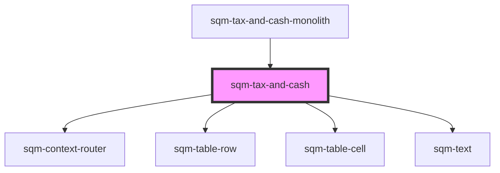

# sqm-sidebar-item

<!-- Auto Generated Below -->

## Properties

| Property   | Attribute | Description | Type                                                              | Default     |
| ---------- | --------- | ----------- | ----------------------------------------------------------------- | ----------- |
| `demoData` | --        |             | `{ loading?: boolean; loadingText?: string; username?: string; }` | `undefined` |

## Dependencies

### Used by

 - [sqm-tax-and-cash-monolith](../../sqm-tax-and-cash-monolith)

### Depends on

- [sqm-context-router](../../sqm-context-router)
- [sqm-table-row](../../sqm-table-row)
- [sqm-table-cell](../../sqm-table-cell)
- [sqm-text](../../sqm-text)

### Graph

----------------------------------------------

*Built with [StencilJS](https://stenciljs.com/)*
