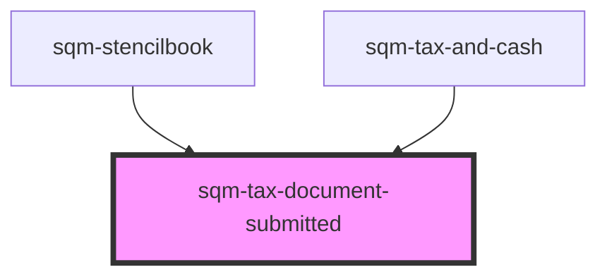

# sqm-tax-document-submitted

<!-- Auto Generated Below -->

## Properties

| Property                           | Attribute                             | Description                                                                       | Type                                                                                                                                                                                                                                                                                                                                                                      | Default                                                                                                                           |
| ---------------------------------- | ------------------------------------- | --------------------------------------------------------------------------------- | ------------------------------------------------------------------------------------------------------------------------------------------------------------------------------------------------------------------------------------------------------------------------------------------------------------------------------------------------------------------------- | --------------------------------------------------------------------------------------------------------------------------------- |
| `badgeTextAwaitingReview`          | `badge-text-awaiting-review`          | Description text which appears beside badge showing the form is awaiting review   | `string`                                                                                                                                                                                                                                                                                                                                                                  | `"Awaiting review. Submitted on {dateSubmitted}."`                                                                                |
| `badgeTextExpiredOn`               | `badge-text-expired-on`               | Description text which appears beside badge showing the form has expired          | `string`                                                                                                                                                                                                                                                                                                                                                                  | `"Expired on {dateExpired}."`                                                                                                     |
| `badgeTextExpiringSoon`            | `badge-text-expiring-soon`            | Description text which appears beside badge showing the form expiring soon        | `string`                                                                                                                                                                                                                                                                                                                                                                  | `", expiring on {dateExpired}."`                                                                                                  |
| `badgeTextSubmittedOn`             | `badge-text-submitted-on`             | Description text which appears beside badge showing when the form was submitted   | `string`                                                                                                                                                                                                                                                                                                                                                                  | `"Submitted on {dateSubmitted}"`                                                                                                  |
| `bankingInformationSectionHeader`  | `banking-information-section-header`  | Header text displayed above the banking information card                          | `string`                                                                                                                                                                                                                                                                                                                                                                  | `"Payout information"`                                                                                                            |
| `demoData`                         | --                                    |                                                                                   | `{ states?: { status?: string; documentType: TaxDocumentType; disabled?: boolean; dateSubmitted?: string; dateExpired?: string; expiresSoon?: boolean; noFormNeeded?: boolean; indirectTaxNumber?: number; province?: string; country?: string; notRegistered?: boolean; isIndirectTaxCanada?: boolean; isBusinessEntity: boolean; loading?: boolean; errors?: any; }; }` | `undefined`                                                                                                                       |
| `editIndirectTaxButton`            | `edit-indirect-tax-button`            | Text displayed in the edit Indirect Tax button                                    | `string`                                                                                                                                                                                                                                                                                                                                                                  | `"Edit Indirect Tax"`                                                                                                             |
| `generalErrorDescription`          | `general-error-description`           | The error message shown at the top of the page in an error banner                 | `string`                                                                                                                                                                                                                                                                                                                                                                  | `"Please review your information and try again. If this problem continues, contact Support."`                                     |
| `generalErrorTitle`                | `general-error-title`                 | The title for error message shown at the top of the page in an error banner       | `string`                                                                                                                                                                                                                                                                                                                                                                  | `"There was a problem submitting your information"`                                                                               |
| `indirectTaxIndividualParticipant` | `indirect-tax-individual-participant` | Indirect tax description text for individual participants                         | `string`                                                                                                                                                                                                                                                                                                                                                                  | `"Not registered. Only applicable to participants representing business entities in countries that enforce indirect tax."`        |
| `indirectTaxInfoCanada`            | `indirect-tax-info-canada`            | Country/Region description text of indirect tax                                   | `string`                                                                                                                                                                                                                                                                                                                                                                  | `"Registered in {province}, {country}"`                                                                                           |
| `indirectTaxInfoOtherCountry`      | `indirect-tax-info-other-country`     | Other country description text of indirect tax                                    | `string`                                                                                                                                                                                                                                                                                                                                                                  | `"Registered in {country}"`                                                                                                       |
| `indirectTaxInfoSectionHeader`     | `indirect-tax-info-section-header`    | Header text displayed above the indirect tax preview section                      | `string`                                                                                                                                                                                                                                                                                                                                                                  | `"Indirect Tax"`                                                                                                                  |
| `indirectTaxTooltipSupport`        | `indirect-tax-tooltip-support`        | Indirect tax tooltip text for support                                             | `string`                                                                                                                                                                                                                                                                                                                                                                  | `"To make changes to your indirect tax information, please contact Support."`                                                     |
| `invalidForm`                      | `invalid-form`                        | Description text displayed next to the badge in the tax documents status          | `string`                                                                                                                                                                                                                                                                                                                                                                  | `"Ensure your information matches your profile and resubmit a new document."`                                                     |
| `newFormButton`                    | `new-form-button`                     | Text displayed in the submit new document button at the bottom of the page        | `string`                                                                                                                                                                                                                                                                                                                                                                  | `"Submit New document"`                                                                                                           |
| `noFormNeededSubtext`              | `no-form-needed-subtext`              | Subtext displayed at the bottom of the page if there are no tax documents to show | `string`                                                                                                                                                                                                                                                                                                                                                                  | `"Tax documents are only required if you are based in the US. If your country of residence has changed, please contact Support."` |
| `notRegisteredForTax`              | `not-registered-for-tax`              | Text displayed when partner is not registered for Indirect Tax                    | `string`                                                                                                                                                                                                                                                                                                                                                                  | `"Not Registered"`                                                                                                                |
| `statusTextActive`                 | `status-text-active`                  | Status text displayed in badge when tax document is Active                        | `string`                                                                                                                                                                                                                                                                                                                                                                  | `"Active"`                                                                                                                        |
| `statusTextExpired`                | `status-text-expired`                 | Status text displayed in badge when tax document is Expired                       | `string`                                                                                                                                                                                                                                                                                                                                                                  | `"Expired"`                                                                                                                       |
| `statusTextNotActive`              | `status-text-not-active`              | Status text displayed in badge when tax document is Not Active                    | `string`                                                                                                                                                                                                                                                                                                                                                                  | `"Invalid Tax Form"`                                                                                                              |
| `statusTextNotVerified`            | `status-text-not-verified`            | Status text displayed in badge when tax document is Not Verified                  | `string`                                                                                                                                                                                                                                                                                                                                                                  | `"Not Verified"`                                                                                                                  |
| `taxAlertHeaderExpiredOn`          | `tax-alert-header-expired-on`         | Header displayed in alert header at the top of the page.                          | `string`                                                                                                                                                                                                                                                                                                                                                                  | `"Your {documentType} tax form has expired."`                                                                                     |
| `taxAlertHeaderExpiringSoon`       | `tax-alert-header-expiring-soon`      | Header displayed in alert header at the top of the page.                          | `string`                                                                                                                                                                                                                                                                                                                                                                  | `"Your {documentType} tax form expires on {dateExpired}"`                                                                         |
| `taxAlertHeaderNotActive`          | `tax-alert-header-not-active`         | Header displayed in alert header at the top of the page.                          | `string`                                                                                                                                                                                                                                                                                                                                                                  | `"Your {documentType} tax form has personal information that doesn't match your profile."`                                        |
| `taxAlertMessage`                  | `tax-alert-message`                   | Description text displayed in alert body at the top of the page.                  | `string`                                                                                                                                                                                                                                                                                                                                                                  | `"Please resubmit a new {documentType} form."`                                                                                    |
| `taxAlertMessageExpiringSoon`      | `tax-alert-message-expiring-soon`     | Description text displayed in alert body at the top of the page.                  | `string`                                                                                                                                                                                                                                                                                                                                                                  | `"Please submit a new {documentType} form to continue receiving your rewards"`                                                    |
| `taxDocumentSectionHeader`         | `tax-document-section-header`         | Header text displayed above the tax documents status                              | `string`                                                                                                                                                                                                                                                                                                                                                                  | `"Tax documents"`                                                                                                                 |
| `taxDocumentSectionSubHeader`      | `tax-document-section-sub-header`     | Sub header text displayed above the tax documents status                          | `string`                                                                                                                                                                                                                                                                                                                                                                  | `"{documentType} Tax Form"`                                                                                                       |

## Dependencies

### Used by

 - [sqm-stencilbook](../../sqm-stencilbook)
 - [sqm-tax-and-cash](../../sqm-tax-and-cash)

### Graph

----------------------------------------------

*Built with [StencilJS](https://stenciljs.com/)*
