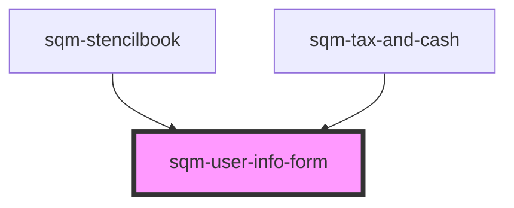

# sqm-user-info-form

<!-- Auto Generated Below -->

## Properties

| Property                      | Attribute                        | Description                                                                           | Type                                                                                                                                                                                                                                                                                                                                                                                                                                                                                                                               | Default                                                                                                                                                                     |
| ----------------------------- | -------------------------------- | ------------------------------------------------------------------------------------- | ---------------------------------------------------------------------------------------------------------------------------------------------------------------------------------------------------------------------------------------------------------------------------------------------------------------------------------------------------------------------------------------------------------------------------------------------------------------------------------------------------------------------------------- | --------------------------------------------------------------------------------------------------------------------------------------------------------------------------- |
| `allowBankingCollection`      | `allow-banking-collection`       | Label text for tax and banking collection checkbox                                    | `string`                                                                                                                                                                                                                                                                                                                                                                                                                                                                                                                           | `"I agree to the terms"`                                                                                                                                                    |
| `allowBankingCollectionError` | `allow-banking-collection-error` | Error text shown at the bottom of the tax and banking collection checkbox             | `string`                                                                                                                                                                                                                                                                                                                                                                                                                                                                                                                           | `"This field is required"`                                                                                                                                                  |
| `businessEntity`              | `business-entity`                | Label text for the business entity radio button                                       | `string`                                                                                                                                                                                                                                                                                                                                                                                                                                                                                                                           | `"I represent a business entity"`                                                                                                                                           |
| `country`                     | `country`                        | Label text for country input                                                          | `string`                                                                                                                                                                                                                                                                                                                                                                                                                                                                                                                           | `"Country"`                                                                                                                                                                 |
| `countryError`                | `country-error`                  | Error text shown at the bottom of the country input                                   | `string`                                                                                                                                                                                                                                                                                                                                                                                                                                                                                                                           | `"Select a country"`                                                                                                                                                        |
| `currency`                    | `currency`                       | Label text for currency input                                                         | `string`                                                                                                                                                                                                                                                                                                                                                                                                                                                                                                                           | `"Currency"`                                                                                                                                                                |
| `currencyError`               | `currency-error`                 | Error text shown at the bottom of the currency input                                  | `string`                                                                                                                                                                                                                                                                                                                                                                                                                                                                                                                           | `"Select a currency"`                                                                                                                                                       |
| `demoData`                    | --                               |                                                                                       | `{ states?: { hideSteps: boolean; disabled: boolean; loading: boolean; isPartner: boolean; formState: { errors: {}; firstName: string; lastName: string; email: string; countryCode: string; currency: string; participantType: string; }; }; data?: { currencies: { displayName: string; currencyCode: string; }[]; countries: TaxCountry[]; }; refs?: { formRef: Ref<HTMLFormElement>; }; step?: string; setStep?: (value: string) => void; onSubmit?: (event: any) => Promise<void>; onRadioClick?: (value: string) => void; }` | `undefined`                                                                                                                                                                 |
| `email`                       | `email`                          | Label text for email input                                                            | `string`                                                                                                                                                                                                                                                                                                                                                                                                                                                                                                                           | `"Email"`                                                                                                                                                                   |
| `emailError`                  | `email-error`                    | Error text shown at the bottom of the email input                                     | `string`                                                                                                                                                                                                                                                                                                                                                                                                                                                                                                                           | `"Enter a valid email"`                                                                                                                                                     |
| `firstName`                   | `first-name`                     | Label text for first name input                                                       | `string`                                                                                                                                                                                                                                                                                                                                                                                                                                                                                                                           | `"First name"`                                                                                                                                                              |
| `firstNameError`              | `first-name-error`               | Error text shown at the bottom of the first name input                                | `string`                                                                                                                                                                                                                                                                                                                                                                                                                                                                                                                           | `"Enter a first name"`                                                                                                                                                      |
| `formStep`                    | `form-step`                      | Sub text shown at the top of the page, used to show the current step of the tax form. | `string`                                                                                                                                                                                                                                                                                                                                                                                                                                                                                                                           | `"Step 1 of 4"`                                                                                                                                                             |
| `generalErrorDescription`     | `general-error-description`      | The error message shown at the top of the page in an error banner                     | `string`                                                                                                                                                                                                                                                                                                                                                                                                                                                                                                                           | `"Please review your information and try again. If this problem continues, contact Support."`                                                                               |
| `generalErrorTitle`           | `general-error-title`            | The title for error message shown at the top of the page in an error banner           | `string`                                                                                                                                                                                                                                                                                                                                                                                                                                                                                                                           | `"There was a problem submitting your information"`                                                                                                                         |
| `individualParticipant`       | `individual-participant`         | Label text for the individual participant radio button                                | `string`                                                                                                                                                                                                                                                                                                                                                                                                                                                                                                                           | `"I am an individual participant"`                                                                                                                                          |
| `isPartnerAlertDescription`   | `is-partner-alert-description`   | Alert description text shown in alert if user is already a registered partner         | `string`                                                                                                                                                                                                                                                                                                                                                                                                                                                                                                                           | `"If you don’t recognize this referral program provider or believe this is a mistake, please contact Support or sign up for this referral program with a different email."` |
| `isPartnerAlertHeader`        | `is-partner-alert-header`        | Alert header text shown in alert if user is already a registered partner              | `string`                                                                                                                                                                                                                                                                                                                                                                                                                                                                                                                           | `"An account with this email already exists with our referral program provider, impact.com"`                                                                                |
| `lastName`                    | `last-name`                      | Label text for last name input                                                        | `string`                                                                                                                                                                                                                                                                                                                                                                                                                                                                                                                           | `"Last name"`                                                                                                                                                               |
| `lastNameError`               | `last-name-error`                | Error text shown at the bottom of the last name input                                 | `string`                                                                                                                                                                                                                                                                                                                                                                                                                                                                                                                           | `"Enter a last name"`                                                                                                                                                       |
| `participantType`             | `participant-type`               | Heading text for the participant type radio buttons                                   | `string`                                                                                                                                                                                                                                                                                                                                                                                                                                                                                                                           | `"Participant type"`                                                                                                                                                        |
| `participantTypeError`        | `participant-type-error`         | Error text shown at the bottom of the participant type checkbox                       | `string`                                                                                                                                                                                                                                                                                                                                                                                                                                                                                                                           | `"Select a participant type"`                                                                                                                                               |
| `personalInformation`         | `personal-information`           | Heading text shown above the forms inputs.                                            | `string`                                                                                                                                                                                                                                                                                                                                                                                                                                                                                                                           | `"Personal Information"`                                                                                                                                                    |
| `submitButton`                | `submit-button`                  | Text shown inside of submit button                                                    | `string`                                                                                                                                                                                                                                                                                                                                                                                                                                                                                                                           | `"Continue"`                                                                                                                                                                |
| `taxAndBankingCollection`     | `tax-and-banking-collection`     | Heading text for the tax and banking collection checkbox                              | `string`                                                                                                                                                                                                                                                                                                                                                                                                                                                                                                                           | `"Continue"`                                                                                                                                                                |

## Dependencies

### Used by

 - [sqm-stencilbook](../../sqm-stencilbook)
 - [sqm-tax-and-cash](../sqm-tax-and-cash)

### Graph

----------------------------------------------

*Built with [StencilJS](https://stenciljs.com/)*
