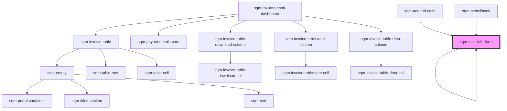

# sqm-user-info-form

<!-- Auto Generated Below -->

## Properties

| Property                       | Attribute                         | Description                                                                                                          | Type                                                                                                                                                                                                                                                                                                                                                                                                                                                                                                                                                                                                                                                                                                                                                                                                                                                                                                                                                           | Default                                                                                                                                                                     |
| ------------------------------ | --------------------------------- | -------------------------------------------------------------------------------------------------------------------- | -------------------------------------------------------------------------------------------------------------------------------------------------------------------------------------------------------------------------------------------------------------------------------------------------------------------------------------------------------------------------------------------------------------------------------------------------------------------------------------------------------------------------------------------------------------------------------------------------------------------------------------------------------------------------------------------------------------------------------------------------------------------------------------------------------------------------------------------------------------------------------------------------------------------------------------------------------------- | --------------------------------------------------------------------------------------------------------------------------------------------------------------------------- |
| `address`                      | `address`                         |                                                                                                                      | `string`                                                                                                                                                                                                                                                                                                                                                                                                                                                                                                                                                                                                                                                                                                                                                                                                                                                                                                                                                       | `"Address"`                                                                                                                                                                 |
| `allowBankingCollection`       | `allow-banking-collection`        | Edit the property called terms and conditions text to change what's displayed for {termsAndConditionsLink}.          | `string`                                                                                                                                                                                                                                                                                                                                                                                                                                                                                                                                                                                                                                                                                                                                                                                                                                                                                                                                                       | `"I have read the {termsAndConditionsLink} and allow impact.com to collect my tax and banking information"`                                                                 |
| `city`                         | `city`                            |                                                                                                                      | `string`                                                                                                                                                                                                                                                                                                                                                                                                                                                                                                                                                                                                                                                                                                                                                                                                                                                                                                                                                       | `"City"`                                                                                                                                                                    |
| `continueButton`               | `continue-button`                 |                                                                                                                      | `string`                                                                                                                                                                                                                                                                                                                                                                                                                                                                                                                                                                                                                                                                                                                                                                                                                                                                                                                                                       | `"Continue"`                                                                                                                                                                |
| `country`                      | `country`                         |                                                                                                                      | `string`                                                                                                                                                                                                                                                                                                                                                                                                                                                                                                                                                                                                                                                                                                                                                                                                                                                                                                                                                       | `"Country"`                                                                                                                                                                 |
| `currency`                     | `currency`                        |                                                                                                                      | `string`                                                                                                                                                                                                                                                                                                                                                                                                                                                                                                                                                                                                                                                                                                                                                                                                                                                                                                                                                       | `"Currency"`                                                                                                                                                                |
| `currencyHelpText`             | `currency-help-text`              |                                                                                                                      | `string`                                                                                                                                                                                                                                                                                                                                                                                                                                                                                                                                                                                                                                                                                                                                                                                                                                                                                                                                                       | `"Choose your preferred payout currency"`                                                                                                                                   |
| `demoData`                     | --                                |                                                                                                                      | `{ states?: { step: string; hideState: boolean; hideSteps: boolean; disabled: boolean; loadingError: boolean; loading: boolean; isPartner: boolean; isUser: boolean; formState: { errors: {}; firstName: string; lastName: string; email: string; phoneNumberCountryCode: string; phoneNumber: string; countryCode: string; currency: string; address: string; city: string; state: string; postalCode: string; }; }; refs?: { formRef: Ref<HTMLFormElement>; currencyRef: Ref<HTMLSelectElement>; phoneCountryRef: Ref<HTMLSelectElement>; }; data?: { currencies: { displayName: string; currencyCode: string; }[]; countries: TaxCountry[]; phoneCountries: TaxCountry[]; allCurrencies: { displayName: string; currencyCode: string; }[]; allCountries: TaxCountry[]; regionLabelEnum: "STATE" \| "PROVINCE" \| "REGION"; regions: { label: string; value: string; }[]; }; setStep?: (value: string) => void; onSubmit?: (event: any) => Promise<void>; }` | `undefined`                                                                                                                                                                 |
| `email`                        | `email`                           |                                                                                                                      | `string`                                                                                                                                                                                                                                                                                                                                                                                                                                                                                                                                                                                                                                                                                                                                                                                                                                                                                                                                                       | `"Email"`                                                                                                                                                                   |
| `fieldRequiredError`           | `field-required-error`            | Displayed under a field that is missing required information.                                                        | `string`                                                                                                                                                                                                                                                                                                                                                                                                                                                                                                                                                                                                                                                                                                                                                                                                                                                                                                                                                       | `"{fieldName} is required"`                                                                                                                                                 |
| `firstName`                    | `first-name`                      |                                                                                                                      | `string`                                                                                                                                                                                                                                                                                                                                                                                                                                                                                                                                                                                                                                                                                                                                                                                                                                                                                                                                                       | `"First name"`                                                                                                                                                              |
| `formStep`                     | `form-step`                       |                                                                                                                      | `string`                                                                                                                                                                                                                                                                                                                                                                                                                                                                                                                                                                                                                                                                                                                                                                                                                                                                                                                                                       | `"Step {step} of {count}"`                                                                                                                                                  |
| `generalErrorDescription`      | `general-error-description`       | Part of the alert displayed at the top of the page.                                                                  | `string`                                                                                                                                                                                                                                                                                                                                                                                                                                                                                                                                                                                                                                                                                                                                                                                                                                                                                                                                                       | `"Please review your information and try again. If this problem continues, contact Support."`                                                                               |
| `generalErrorTitle`            | `general-error-title`             | Part of the alert displayed at the top of the page.                                                                  | `string`                                                                                                                                                                                                                                                                                                                                                                                                                                                                                                                                                                                                                                                                                                                                                                                                                                                                                                                                                       | `"There was a problem submitting your information"`                                                                                                                         |
| `invalidCharacterError`        | `invalid-character-error`         | Displayed under Address or City fields that includes invalid characters (non-ASCII).                                 | `string`                                                                                                                                                                                                                                                                                                                                                                                                                                                                                                                                                                                                                                                                                                                                                                                                                                                                                                                                                       | `"{fieldName} includes characters that aren't supported."`                                                                                                                  |
| `isPartnerAlertDescription`    | `is-partner-alert-description`    | Part of the alert displayed at the top of the page if the participant is already a registered partner on impact.com. | `string`                                                                                                                                                                                                                                                                                                                                                                                                                                                                                                                                                                                                                                                                                                                                                                                                                                                                                                                                                       | `"If you don’t recognize this referral program provider or believe this is a mistake, please contact Support or sign up for this referral program with a different email."` |
| `isPartnerAlertHeader`         | `is-partner-alert-header`         | Part of the alert displayed at the top of the page if the participant is already a registered partner on impact.com. | `string`                                                                                                                                                                                                                                                                                                                                                                                                                                                                                                                                                                                                                                                                                                                                                                                                                                                                                                                                                       | `"An account with this email already exists with our referral program provider, impact.com"`                                                                                |
| `lastName`                     | `last-name`                       |                                                                                                                      | `string`                                                                                                                                                                                                                                                                                                                                                                                                                                                                                                                                                                                                                                                                                                                                                                                                                                                                                                                                                       | `"Last name"`                                                                                                                                                               |
| `loadingErrorAlertDescription` | `loading-error-alert-description` | Part of the alert displayed at the top of the page.                                                                  | `string`                                                                                                                                                                                                                                                                                                                                                                                                                                                                                                                                                                                                                                                                                                                                                                                                                                                                                                                                                       | `"Please refresh the page and try again. If this problem continues, contact Support."`                                                                                      |
| `loadingErrorAlertHeader`      | `loading-error-alert-header`      | Part of the alert displayed at the top of the page.                                                                  | `string`                                                                                                                                                                                                                                                                                                                                                                                                                                                                                                                                                                                                                                                                                                                                                                                                                                                                                                                                                       | `"There was a problem loading your form"`                                                                                                                                   |
| `personalInformation`          | `personal-information`            |                                                                                                                      | `string`                                                                                                                                                                                                                                                                                                                                                                                                                                                                                                                                                                                                                                                                                                                                                                                                                                                                                                                                                       | `"Personal Information"`                                                                                                                                                    |
| `phoneExtension`               | `phone-extension`                 |                                                                                                                      | `string`                                                                                                                                                                                                                                                                                                                                                                                                                                                                                                                                                                                                                                                                                                                                                                                                                                                                                                                                                       | `"Extension"`                                                                                                                                                               |
| `phoneNumber`                  | `phone-number`                    |                                                                                                                      | `string`                                                                                                                                                                                                                                                                                                                                                                                                                                                                                                                                                                                                                                                                                                                                                                                                                                                                                                                                                       | `"Phone number"`                                                                                                                                                            |
| `phoneNumberInvalidError`      | `phone-number-invalid-error`      | Displayed under Phone Number field when it is not a valid phone number.                                              | `string`                                                                                                                                                                                                                                                                                                                                                                                                                                                                                                                                                                                                                                                                                                                                                                                                                                                                                                                                                       | `"Not a valid phone number."`                                                                                                                                               |
| `postalCode`                   | `postal-code`                     |                                                                                                                      | `string`                                                                                                                                                                                                                                                                                                                                                                                                                                                                                                                                                                                                                                                                                                                                                                                                                                                                                                                                                       | `"Postal code"`                                                                                                                                                             |
| `province`                     | `province`                        |                                                                                                                      | `string`                                                                                                                                                                                                                                                                                                                                                                                                                                                                                                                                                                                                                                                                                                                                                                                                                                                                                                                                                       | `"Province"`                                                                                                                                                                |
| `region`                       | `region`                          |                                                                                                                      | `string`                                                                                                                                                                                                                                                                                                                                                                                                                                                                                                                                                                                                                                                                                                                                                                                                                                                                                                                                                       | `"Region"`                                                                                                                                                                  |
| `searchForCountryText`         | `search-for-country-text`         | Placeholder text displayed in the country search dropdown                                                            | `string`                                                                                                                                                                                                                                                                                                                                                                                                                                                                                                                                                                                                                                                                                                                                                                                                                                                                                                                                                       | `"Search for country.."`                                                                                                                                                    |
| `searchForCurrencyText`        | `search-for-currency-text`        | Placeholder text displayed in the currency search dropdown                                                           | `string`                                                                                                                                                                                                                                                                                                                                                                                                                                                                                                                                                                                                                                                                                                                                                                                                                                                                                                                                                       | `"Search for currency.."`                                                                                                                                                   |
| `state`                        | `state`                           |                                                                                                                      | `string`                                                                                                                                                                                                                                                                                                                                                                                                                                                                                                                                                                                                                                                                                                                                                                                                                                                                                                                                                       | `"State"`                                                                                                                                                                   |
| `taxAndPayoutsDescription`     | `tax-and-payouts-description`     | Displayed at the top of the page on all set up steps.                                                                | `string`                                                                                                                                                                                                                                                                                                                                                                                                                                                                                                                                                                                                                                                                                                                                                                                                                                                                                                                                                       | `"Submit your tax documents and add your banking information to receive your rewards."`                                                                                     |
| `termsAndConditionsLabel`      | `terms-and-conditions-label`      | The text link that appears in the terms and conditions checkbox                                                      | `string`                                                                                                                                                                                                                                                                                                                                                                                                                                                                                                                                                                                                                                                                                                                                                                                                                                                                                                                                                       | `"terms and conditions"`                                                                                                                                                    |

## Dependencies

### Used by

 - [sqm-stencilbook](../../sqm-stencilbook)
 - [sqm-tax-and-cash](../sqm-tax-and-cash)
 - [sqm-user-info-form](.)

### Depends on

- [sqm-payout-details-card](../sqm-payout-details-card)
- [sqm-user-info-form](.)
- [sqm-indirect-tax-form](../sqm-indirect-tax-form)
- [sqm-docusign-form](../sqm-docusign-form)
- [sqm-banking-info-form](../sqm-banking-info-form)
- [sqm-tax-and-cash-dashboard](../sqm-tax-and-cash-dashboard)
- [sqm-tax-and-cash](../sqm-tax-and-cash)

### Graph

----------------------------------------------

*Built with [StencilJS](https://stenciljs.com/)*
