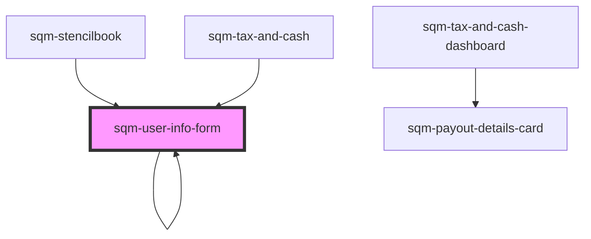

# sqm-user-info-form

<!-- Auto Generated Below -->

## Properties

| Property                    | Attribute                      | Description                                                                           | Type                                                                                                                                                                                                                                                                                                                                                                                                                                                                              | Default                                                                                                                                                                     |
| --------------------------- | ------------------------------ | ------------------------------------------------------------------------------------- | --------------------------------------------------------------------------------------------------------------------------------------------------------------------------------------------------------------------------------------------------------------------------------------------------------------------------------------------------------------------------------------------------------------------------------------------------------------------------------- | --------------------------------------------------------------------------------------------------------------------------------------------------------------------------- |
| `allowBankingCollection`    | `allow-banking-collection`     | Label text for tax and banking collection checkbox                                    | `string`                                                                                                                                                                                                                                                                                                                                                                                                                                                                          | `"I have read the terms and conditions and allow impact.com to collect my tax and banking information"`                                                                     |
| `continueButton`            | `continue-button`              | Text shown inside of submit button                                                    | `string`                                                                                                                                                                                                                                                                                                                                                                                                                                                                          | `"Continue"`                                                                                                                                                                |
| `country`                   | `country`                      | Label text for country input                                                          | `string`                                                                                                                                                                                                                                                                                                                                                                                                                                                                          | `"Country"`                                                                                                                                                                 |
| `currency`                  | `currency`                     | Label text for currency input                                                         | `string`                                                                                                                                                                                                                                                                                                                                                                                                                                                                          | `"Currency"`                                                                                                                                                                |
| `currencyHelpText`          | `currency-help-text`           | Help text shown underneath currency input                                             | `string`                                                                                                                                                                                                                                                                                                                                                                                                                                                                          | `"Choose your preferred payout currency"`                                                                                                                                   |
| `demoData`                  | --                             |                                                                                       | `{ states?: { hideSteps: boolean; disabled: boolean; loading: boolean; isPartner: boolean; isUser: boolean; formState: { errors: {}; firstName: string; lastName: string; email: string; countryCode: string; currency: string; }; }; data?: { currencies: Currencies; countries: TaxCountry[]; }; refs?: { formRef: Ref<HTMLFormElement>; currencyRef: Ref<HTMLSelectElement>; }; step?: string; setStep?: (value: string) => void; onSubmit?: (event: any) => Promise<void>; }` | `undefined`                                                                                                                                                                 |
| `email`                     | `email`                        | Label text for email input                                                            | `string`                                                                                                                                                                                                                                                                                                                                                                                                                                                                          | `"Email"`                                                                                                                                                                   |
| `fieldRequiredError`        | `field-required-error`         | Required error text shown at the bottom of field inputs                               | `string`                                                                                                                                                                                                                                                                                                                                                                                                                                                                          | `"{fieldName} is required"`                                                                                                                                                 |
| `firstName`                 | `first-name`                   | Label text for first name input                                                       | `string`                                                                                                                                                                                                                                                                                                                                                                                                                                                                          | `"First name"`                                                                                                                                                              |
| `formStep`                  | `form-step`                    | Sub text shown at the top of the page, used to show the current step of the tax form. | `string`                                                                                                                                                                                                                                                                                                                                                                                                                                                                          | `"Step {current} of {total}"`                                                                                                                                               |
| `generalErrorDescription`   | `general-error-description`    | The error message shown at the top of the page in an error banner                     | `string`                                                                                                                                                                                                                                                                                                                                                                                                                                                                          | `"Please review your information and try again. If this problem continues, contact Support."`                                                                               |
| `generalErrorTitle`         | `general-error-title`          | The title for error message shown at the top of the page in an error banner           | `string`                                                                                                                                                                                                                                                                                                                                                                                                                                                                          | `"There was a problem submitting your information"`                                                                                                                         |
| `isPartnerAlertDescription` | `is-partner-alert-description` | Alert description text shown in alert if user is already a registered partner         | `string`                                                                                                                                                                                                                                                                                                                                                                                                                                                                          | `"If you don’t recognize this referral program provider or believe this is a mistake, please contact Support or sign up for this referral program with a different email."` |
| `isPartnerAlertHeader`      | `is-partner-alert-header`      | Alert header text shown in alert if user is already a registered partner              | `string`                                                                                                                                                                                                                                                                                                                                                                                                                                                                          | `"An account with this email already exists with our referral program provider, impact.com"`                                                                                |
| `lastName`                  | `last-name`                    | Label text for last name input                                                        | `string`                                                                                                                                                                                                                                                                                                                                                                                                                                                                          | `"Last name"`                                                                                                                                                               |
| `personalInformation`       | `personal-information`         | Heading text shown above the forms inputs.                                            | `string`                                                                                                                                                                                                                                                                                                                                                                                                                                                                          | `"Personal Information"`                                                                                                                                                    |
| `termsAndConditionsLabel`   | `terms-and-conditions-label`   | Label text for terms and conditions                                                   | `string`                                                                                                                                                                                                                                                                                                                                                                                                                                                                          | `"Terms and conditions"`                                                                                                                                                    |

## Dependencies

### Used by

 - [sqm-stencilbook](../../sqm-stencilbook)
 - [sqm-tax-and-cash](../sqm-tax-and-cash)
 - [sqm-user-info-form](.)

### Depends on

- [sqm-user-info-form](.)
- [sqm-indirect-tax-form](../sqm-indirect-tax-form)
- [sqm-docusign-form](../sqm-docusign-form)
- [sqm-banking-info-form](../sqm-banking-info-form)
- [sqm-tax-and-cash-dashboard](../sqm-tax-and-cash-dashboard)

### Graph

----------------------------------------------

*Built with [StencilJS](https://stenciljs.com/)*
